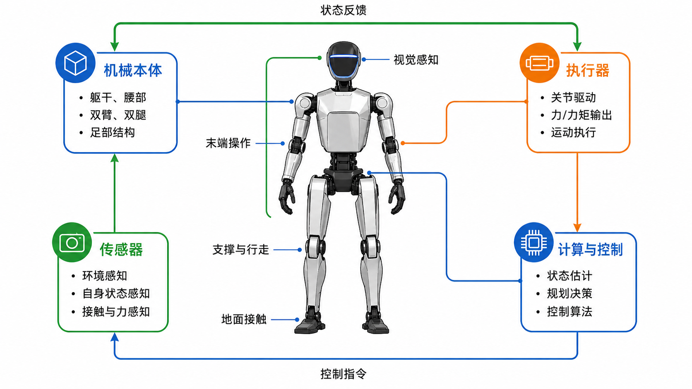

# 1.1 人形机器人是什么

## 先看一个现场问题

在一个人形机器人项目里，机械、嵌入式和算法同学经常会说：

> “机器人已经站起来了。”

但三个人说的可能不是同一件事：

- 机械同学指的是本体结构能够承受自身重量；
- 嵌入式同学指的是电机、驱动器和通信链路已经正常工作；
- 算法同学指的是控制器能够让机器人保持平衡，并对扰动作出反应。

所以，“人形机器人”不能只理解成“外形像人”。我们需要从系统功能来定义它。

## 人形机器人的定义

人形机器人（Humanoid Robot）是一类采用近似人体结构组织方式、能够通过传感器感知环境和自身状态，并通过执行器主动完成运动与任务的机器人系统。[1]

这里有三个关键词：

### 1. 结构接近人体

通常包含：

- 躯干；
- 两条腿；
- 两条手臂；
- 头部或视觉传感器；
- 足部和末端执行器。

“接近人体”不是要求尺寸、外观或关节数量完全一致，而是强调它能够使用为人类设计的空间、工具和操作方式。[1]

### 2. 能够主动运动

机器人不是被动的机械结构。它需要通过电机、减速器、驱动器等执行器主动改变自身姿态和位置。

例如：

- 膝关节主动屈伸；
- 踝关节调整身体姿态；
- 手臂移动到目标位置；
- 手指闭合并保持抓取力。

### 3. 能够形成闭环

机器人需要不断经历以下过程：

```text
感知当前状态
→ 计算下一步动作
→ 驱动执行器
→ 观察动作结果
→ 修正下一步动作
```

如果只有执行器而没有传感器和反馈，它更接近一台按程序运行的机械装置；如果只有感知而不能执行动作，它也不是完整的机器人系统。这里的“闭环”对应反馈控制（Feedback Control）的基本思想：利用测量结果修正后续控制动作。[3]



## 人形机器人的几个基本黑话

### 自由度（DoF）

自由度（Degree of Freedom，DoF）表示描述机器人构型所需的最少独立变量数量；在关节机器人语境中，通常也指可以独立控制的关节运动变量数量。[4]

例如，一个只允许绕单根轴旋转的膝关节，通常可以看作 1 个自由度。自由度越多，机器人能够完成的动作通常越丰富，但建模、控制、通信和安全也会更复杂。

### 执行器（Actuator）

执行器（Actuator）是把能量转换成机械运动或力的部件。人形机器人中最常见的是电机配合减速器组成的关节模组。[2][4]

### 传感器（Sensor）

传感器（Sensor）负责测量机器人自身或环境的信息，并把物理量转换成控制系统可以处理的信号，例如：[2][4]

- 编码器测量关节角度；
- IMU 测量角速度和加速度；
- 足底传感器测量接触和载荷；
- 相机测量环境中的物体和几何信息。

### 浮动基座（Floating Base）

机械臂通常固定在地面上，基座位置可以认为不变；人形机器人站在地面上，身体整体可能移动、倾斜和旋转，因此需要估计躯干或骨盆相对于世界的位姿。这种不固定在地面上的整体基座称为浮动基座（Floating Base），在动力学建模中通常作为具有平移和旋转自由度的基座处理。[5]

### 末端执行器（End Effector）

末端执行器（End Effector）是机器人运动链末端、直接与环境或目标物体交互的部件，例如脚、手掌、夹爪或灵巧手。[2][4]

对于人形机器人：

- 足部是与地面交互的末端执行器；
- 手掌和手指是与物体交互的末端执行器。

## 以 G1 看一台人形机器人

本手册默认使用 Unitree G1 29 DoF 无灵巧手模型作为系统级案例。该模型的自由度分布和带手/锁腰变体以宇树官方 `unitree_rl_gym` 仓库中的描述文件为准。[6]

可以先把它分成四个区域：

| 区域 | 主要作用 | 典型黑话 |
| --- | --- | --- |
| 下肢 | 支撑身体、站立、行走 | 髋、膝、踝、支撑腿、摆动腿 |
| 腰部 | 调整躯干姿态、参与平衡和操作 | 浮动基座、腰部自由度、质心 |
| 上肢 | 将手移动到目标位置 | 肩、肘、腕、末端位姿 |
| 头部 | 获取环境和任务信息 | 相机、深度、视觉坐标系 |

当讨论双臂操作、灵巧手或 VLA 时，再切换到 `g1_29dof_with_hand` 模型。此时机器人不仅要控制手臂末端，还要控制手部关节和抓取动作。

## 不同专业如何理解同一个 G1

同一台 G1，在不同岗位眼中对应不同的问题：

- **机械**：连杆、关节、减速器、刚度、质量、惯量和碰撞几何；
- **电气/嵌入式**：电机、驱动器、编码器、IMU、总线、控制周期和故障状态；
- **算法**：坐标系、运动学、动力学、状态估计、控制器、规划和策略；
- **软件**：URDF/MJCF、ROS 2、DDS、消息、TF、日志和仿真接口；
- **VLA/操作**：相机观测、语言任务、手臂目标、手指动作和安全过滤。

这些说法并不矛盾，它们只是观察同一系统的不同侧面。后续章节会逐步把这些内容串起来，让你看到一台人形机器人如何通过结构、电气、算法和软件协同工作。

## 一个容易造成误解的地方

“人形”不等于“完全按照人体复制”。工程上会根据任务选择自由度、尺寸、传动和传感器配置。例如：

- 有的 G1 模型包含 23 DoF，有的包含 29 DoF；
- 有的模型锁定腰部，有的模型保留腰部自由度；
- 有的模型带灵巧手，有的模型只保留手臂；
- 仿真模型中的刚体和关节，不一定完整反映真实硬件中的柔性、摩擦和热限制。[6]

## 参考资料

[1] Kajita, S., Hirukawa, H., Harada, K., & Yokoi, K. *Introduction to Humanoid Robotics*. Springer, 2014. 机器人学专著。<https://doi.org/10.1007/978-3-642-54536-8>

[2] International Organization for Standardization. *ISO 8373:2021 Robotics — Vocabulary*. 机器人术语标准。<https://www.iso.org/standard/75539.html>

[3] Åström, K. J., & Murray, R. M. *Feedback Systems: An Introduction for Scientists and Engineers*. Princeton University Press, 2008. 反馈控制教材。<https://www.cds.caltech.edu/~murray/books/AM08/>

[4] Lynch, K. M., & Park, F. C. *Modern Robotics: Mechanics, Planning, and Control*. Cambridge University Press, 2017. 机器人学教材及配套课程资料。<https://modernrobotics.northwestern.edu/chapters/chapter2/>

[5] Featherstone, R. *Rigid Body Dynamics Algorithms*. Springer, 2008. 刚体与浮动基座动力学专著。<https://doi.org/10.1007/978-1-4899-7560-7>

[6] Unitree Robotics. *unitree_rl_gym: G1 robot description*. 官方开源模型与仿真资料。<https://github.com/unitreerobotics/unitree_rl_gym/tree/main/resources/robots/g1_description>
