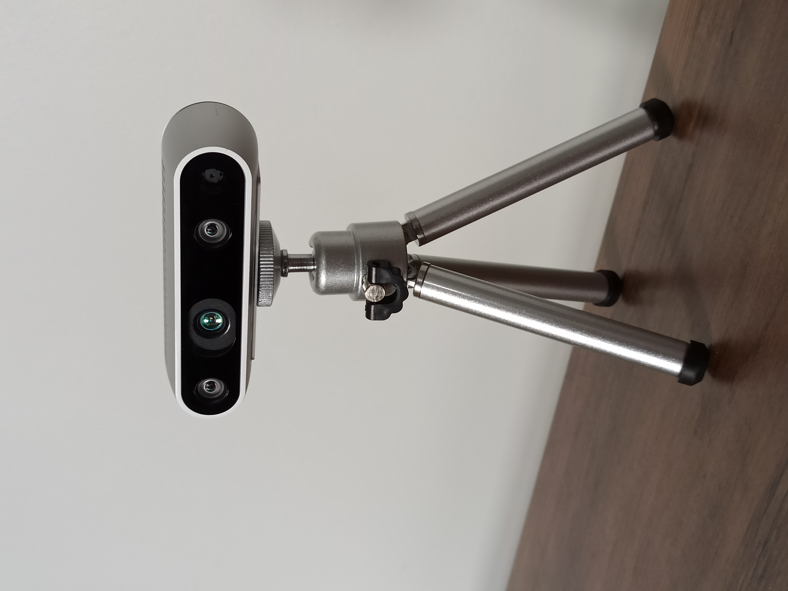
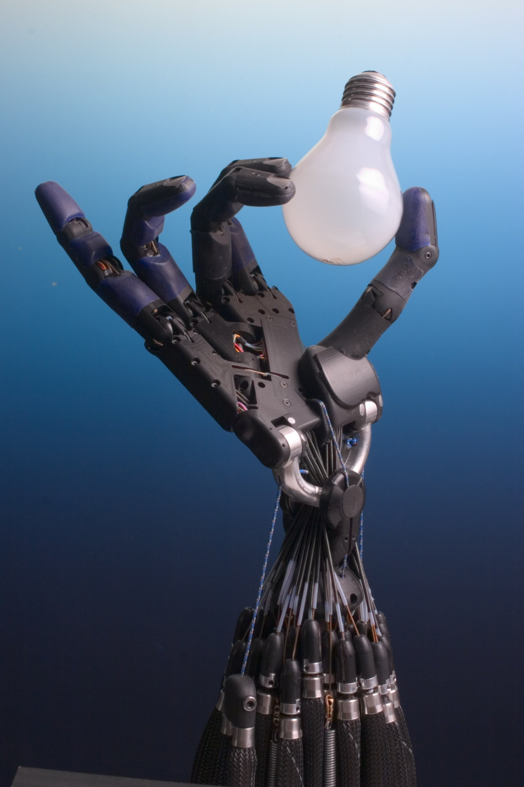

# 1.2 人形机器人：定义、构造与 G1

import DofHingeDemo from '../../../components/DofHingeDemo.astro';
import FloatingBaseDemo from '../../../components/FloatingBaseDemo.astro';
import G1UrdfViewer from '../../../components/G1UrdfViewer.astro';

## 先看一个现场问题

展厅里有一排机器人：圆盘形的扫地机、固定在台面上的六轴机械臂、四轮底盘的送餐车，还有一台身高约一米三、没有五官的宇树 G1。问一个圈外朋友哪台是“人形机器人”，他会毫不犹豫地指向 G1——尽管它没有脸，比小孩还矮。

这个直觉判断很准，但他说不清理由。

> “像人”到底要像到什么程度？为什么脸和身高都不重要，而有两条腿、能主动迈步才是硬标准？

这正是“人形机器人”的定义要回答的问题。

## 人形机器人的定义

人形机器人（Humanoid Robot）是一类采用近似人体结构组织方式、能够通过传感器感知环境和自身状态，并通过执行器主动完成运动与任务的机器人系统。[1]

“形成闭环”的要求继承自 1.1，这里再补充两个只属于“人形”的关键词：

### 1. 结构接近人体

通常包含：

- 躯干；
- 两条腿；
- 两条手臂；
- 头部或视觉传感器；
- 足部和末端执行器。

“接近人体”强调机器人能够使用为人类设计的空间、工具和操作方式；尺寸、外观或关节数量可以根据任务调整。[1]

### 2. 能够主动运动

机器人不是被动的机械结构。它需要通过电机、减速器、驱动器等执行器主动改变自身姿态和位置。

例如：

- 膝关节主动屈伸；
- 踝关节调整身体姿态；
- 手臂移动到目标位置；
- 手指闭合并保持抓取力。

## 人形机器人的几个基本术语

### 自由度（DoF）

自由度（Degree of Freedom，DoF）表示描述机器人构型所需的最少独立变量数量；在关节机器人语境中，通常也指可以独立控制的关节运动变量数量。[2]

例如，一个只允许绕单根轴旋转的膝关节，通常可以看作 1 个自由度。自由度越多，机器人能够完成的动作通常越丰富，但建模、控制、通信和安全也会更复杂。

> **一句话听懂**：看一台机器人的规格书，先数它有多少个能独立动的关节——数字越大，能做的动作越多，但要同时管好的东西（模型、控制、通信、安全）也成倍增加。

<DofHingeDemo />

### 执行器（Actuator）

执行器（Actuator）是把能量转换成机械运动或力的部件。人形机器人中最常见的是电机配合减速器组成的关节模组。[2][3]

### 传感器（Sensor）

传感器（Sensor）负责测量机器人自身或环境的信息，并把物理量转换成控制系统可以处理的信号，例如：[2][3]

- 编码器测量关节角度；
- IMU 测量角速度和加速度；
- 足底传感器测量接触和载荷；
- 相机测量环境中的物体和几何信息。

*图 1.2-1 Intel RealSense D435 深度相机实拍。深度相机可以把环境几何转换为距离或点云，是人形机器人感知系统的常用输入。[6]*

### 浮动基座（Floating Base）

机械臂通常固定在地面上，基座位置可以认为不变；人形机器人站在地面上，身体整体可能移动、倾斜和旋转，因此需要估计躯干或骨盆相对于世界的位姿。这种不固定在地面上的整体基座称为浮动基座（Floating Base），在动力学建模中通常作为具有平移和旋转自由度的基座处理。[4]

> **一句话听懂**：机械臂可以认为“钉”在地上，人形机器人不行——它整体会移动、倾斜、旋转，位姿无法由关节编码器算出，只能靠状态估计，这就是浮动基座。

<FloatingBaseDemo />

### 末端执行器（End Effector）

末端执行器（End Effector）是机器人运动链末端、直接与环境或目标物体交互的部件，例如脚、手掌、夹爪或灵巧手。[2][3]

注意别和**执行器（Actuator）**混了：执行器是出力的部件（电机、减速器和驱动器，见上文与 [2.3 节](../02-mechanics/03-transmission-and-joint-modules.mdx)），末端执行器是运动链末端与环境交互的部件——中文只差一个字，指的不是同一件事。

对于人形机器人：

- 足部是与地面交互的末端执行器；
- 手掌和手指是与物体交互的末端执行器。

*图 1.2-2 Shadow Dexterous Hand 多指灵巧手实拍。相比夹爪，灵巧手通过多个手指关节完成更丰富的接触和抓取动作，是末端执行器的一种典型形态。[7]*

## 以 G1 看一台人形机器人

本手册默认使用 Unitree G1 29 DoF 无灵巧手模型作为系统级案例。该模型的自由度分布和带手/锁腰变体以宇树官方 `unitree_rl_gym` 仓库中的描述文件为准。[5]

<G1UrdfViewer interactive />

你能旋转的这台 G1，在软件里首先是一份**机器人描述文件**（Robot Description File）：一份文本写清楚机器人由哪些刚体（Link）组成、它们怎么连接（Joint）、每个关节能怎样运动。同一份文件，机械同学拿它核对结构与安装，算法同学拿它算运动学与动力学，仿真器拿它生成接触与执行器——它是机械的交付物，也是算法的输入。最常用的两种格式是 URDF（Unified Robot Description Format，偏结构描述与 ROS 生态）和 MJCF（MuJoCo XML Format，把场景、执行器和传感器一起写入），字段细节在 2.5 节展开。点一下模型上的任意部件，右侧会跳到它在 `g1_29dof.urdf` 里定义的那一行——这就是这份契约的样子。

> **一句话听懂**：描述文件是机械、算法和仿真器共用的同一份文本——结构怎么搭、关节怎么动只在这儿写一遍，谁都不用再去猜或另外维护一套。

从结构上，可以先把这台机器人分成四个区域：

| 区域 | 主要作用 | 典型术语 |
| --- | --- | --- |
| 下肢 | 支撑身体、站立、行走 | 髋、膝、踝、支撑腿、摆动腿 |
| 腰部 | 调整躯干姿态、参与平衡和操作 | 浮动基座、腰部自由度、质心 |
| 上肢 | 将手移动到目标位置 | 肩、肘、腕、末端位姿 |
| 头部 | 获取环境和任务信息 | 相机、深度、视觉坐标系 |

当讨论双臂操作、灵巧手或 VLA 时，再切换到 `g1_29dof_with_hand` 模型。此时机器人不仅要控制手臂末端，还要控制手部关节和抓取动作。

## 不同专业如何理解同一个 G1

同一台 G1，在不同岗位眼中对应不同的问题：

- **机械**：连杆、关节、减速器、刚度、质量、惯量和碰撞几何；
- **电气/嵌入式**：电机、驱动器、编码器、IMU、总线、控制周期和故障状态；
- **算法**：坐标系、运动学、动力学、状态估计、控制器、规划和策略；
- **软件**：URDF/MJCF、ROS 2、DDS、消息、TF、日志和仿真接口；
- **VLA/WAM 与操作**：VLA 把相机观测和语言任务转换成手臂、手部动作意图；WAM 进一步预测这些动作会怎样改变世界状态。两类输出都必须经过规划、全身控制和安全过滤，才进入底层执行。

这些说法并不矛盾，它们只是观察同一系统的不同侧面。后续章节会逐步把这些内容串起来，让你看到一台人形机器人如何通过结构、电气、算法和软件协同工作。

## 一个容易造成误解的地方

“人形”不等于“完全按照人体复制”。工程上会根据任务选择自由度、尺寸、传动和传感器配置。例如：

- 有的 G1 模型包含 23 DoF，有的包含 29 DoF；
- 有的模型锁定腰部，有的模型保留腰部自由度；
- 有的模型带灵巧手，有的模型只保留手臂；

| 变体 | 腰部 | 每条手臂 | 手 | 总 DoF |
| --- | --- | --- | --- | --- |
| `g1_23dof` | 1（只保留 yaw） | 5（腕部少 2 个自由度） | 无 | 23 |
| `g1_29dof` | 3 | 7 | 无 | 29 |
| `g1_29dof_with_hand` | 3 | 7 | 每手 7（三指） | 29 + 14 |

差在哪：23 DoF 比 29 DoF 少的是腰部的 roll/pitch 与每条手臂腕部的 2 个自由度；SDK 的索引注释会标出哪些编号在 23dof 上无效。本手册统一用 `g1_29dof`；需要锁腰对比时用 `g1_29dof_lock_waist`，需要操作时用 `g1_29dof_with_hand`。
- 仿真模型中的刚体和关节，不一定完整反映真实硬件中的柔性、摩擦和热限制。[5]

同样，“具身智能”也不等于“人形机器人”。读完本书你会发现，这套词汇体系在四足、轮式和机械臂上同样适用——人形机器人只是其中最复杂、也最适合教学的那一个本体。

## 参考资料

[1] Kajita, S., Hirukawa, H., Harada, K., & Yokoi, K. *Introduction to Humanoid Robotics*. Springer, 2014. 机器人学专著。<https://doi.org/10.1007/978-3-642-54536-8>

[2] Lynch, K. M., & Park, F. C. *Modern Robotics: Mechanics, Planning, and Control*. Cambridge University Press, 2017. 机器人学教材及配套课程资料。<https://modernrobotics.northwestern.edu/chapters/chapter2/>

[3] International Organization for Standardization. *ISO 8373:2021 Robotics — Vocabulary*. 机器人术语标准。<https://www.iso.org/standard/75539.html>

[4] Featherstone, R. *Rigid Body Dynamics Algorithms*. Springer, 2008. 刚体与浮动基座动力学专著。<https://doi.org/10.1007/978-1-4899-7560-7>

[5] Unitree Robotics. *unitree_rl_gym: G1 robot description*. 官方开源模型与仿真资料。<https://github.com/unitreerobotics/unitree_rl_gym/tree/main/resources/robots/g1_description>

[6] Auledas, M. *Intel RealSense D435 深度相机实拍*。图 1.2-1 取自 Wikimedia Commons，作者主页 <https://commons.wikimedia.org/wiki/User:Auledas>，文件页 <https://commons.wikimedia.org/wiki/File:Intel_Realsense_depth_camera_D435.jpg>，许可 CC BY-SA 4.0（相同方式共享）<https://creativecommons.org/licenses/by-sa/4.0/>。

[7] Greenhill, R., & Elias, H.（Shadow Robot Company）. *Shadow Dexterous Hand 多指灵巧手实拍*。图 1.2-2 取自 Wikimedia Commons，文件页 <https://commons.wikimedia.org/wiki/File:Shadow_Hand_Bulb_large.jpg>，许可 CC BY-SA 3.0（相同方式共享）<https://creativecommons.org/licenses/by-sa/3.0/>。
