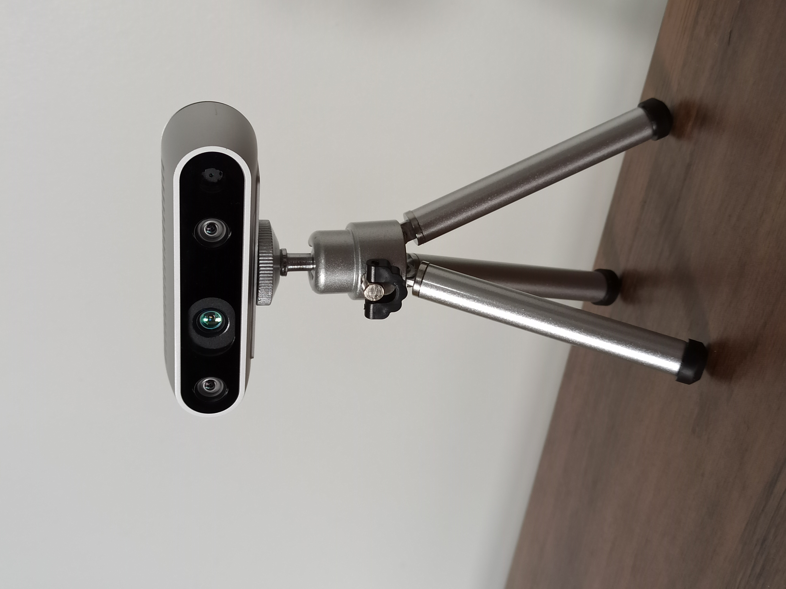
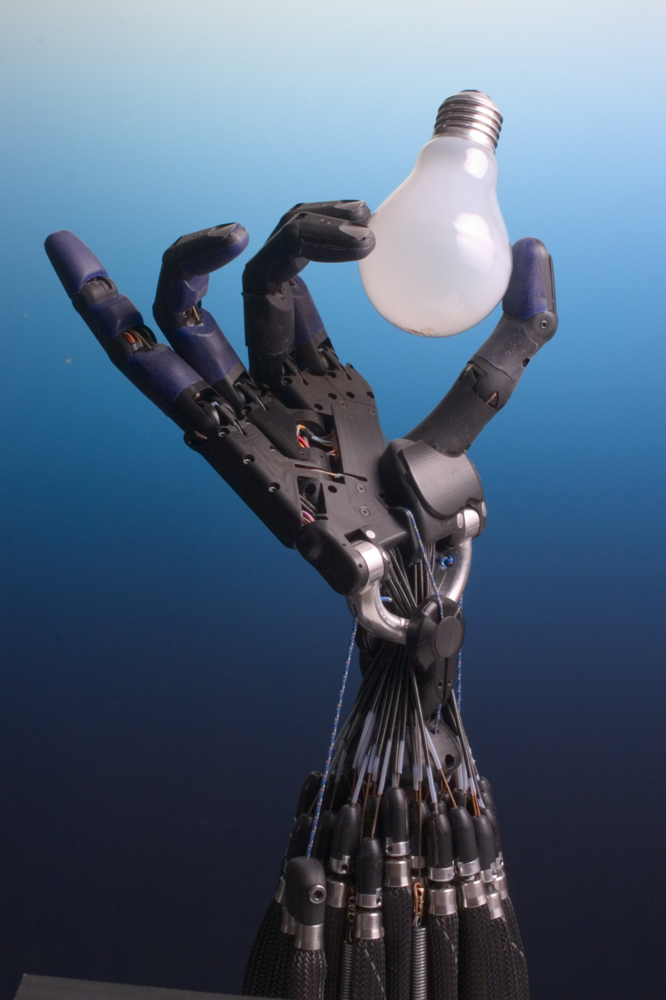

# 1.2 一台人形机器人里面有什么：以 G1 为例

import DofHingeDemo from '../../../components/DofHingeDemo.astro';
import FloatingBaseDemo from '../../../components/FloatingBaseDemo.astro';
import G1UrdfViewer from '../../../components/G1UrdfViewer.astro';
import SectionQA from '../../../components/SectionQA.astro';

## 先看一个现场问题

相信你已经在视频里见过机器人走路、挥手了。但如果把他们的外壳打开，你还能说清里面有什么吗：

> 一台机器人，拆开之后到底由哪些东西组成？

下面就是本节要拆的这台 G1人形机器人。你可以先试着拖拽一下，把它转一圈——你会发现它是一个能独立运动的整体，而不仅仅是几个模块摆在一起。

<G1UrdfViewer interactive />

<SectionQA id="1.2" mode="ask" />

## 本体与关节（Body / Link / Joint）

机器人的身体由若干**连杆**（Link）组成——躯干、两条腿、两条手臂、头部。连杆之间可以相对运动的连接处叫**关节**（Joint）。**自由度**（Degree of Freedom，DoF）指描述构型（也就是姿势）所需的最少独立变量数量；在机器人上，自由度通常体现为可以独立控制的关节运动数量。[1] 自由度是看规格书时第一个该数的东西——数字越大，能摆出的姿态越丰富，越能完成复杂的动作。所以一般来说，机器人需要完成的任务越复杂，需要的自由度也就越多，但代价是模型、控制、通信和安全要同时管好的东西也成倍增加。

<DofHingeDemo />

从结构上，我们先按**位置**把身体分成四个区域。

| 区域 | 主要作用 | 典型术语 |
| --- | --- | --- |
| 下肢 | 支撑身体、站立、行走 | 髋、膝、踝、支撑腿（踩地那条）、摆动腿（迈出那条） |
| 腰部 | 调整躯干姿态、参与平衡和操作 | 腰部自由度、质心（重心） |
| 上肢 | 把手移动到目标位置 | 肩、肘、腕、末端位姿（位置 + 姿态） |
| 头部 | 获取环境和任务信息 | 相机、深度、视觉坐标系 |

> **一句话听懂**：连杆是骨头，关节是能动的连接，自由度是“描述它最少需要几个独立变量”——在关节机器人上就是能独立动的关节数，也是规格书上第一个该看的数字。

还有一个只属于人形的特点：机械臂通常固定在地面上，基座位置可以认为不变；而人形机器人站在地上，身体整体会移动、倾斜、旋转，所以位姿没法由关节编码器单独算出来，只能靠**状态估计**——把 IMU（测姿态和加速度的芯片）、编码器（测关节角）和足底力的信息合起来，推断“我现在在哪、是什么姿态”（[4.4 节](../04-cerebellum-realtime-control/04-state-estimation.mdx)）。这种不固定在地面上的基座叫**浮动基座（Floating Base）**。[3]

<FloatingBaseDemo />

## 执行器（Actuator）

执行器（Actuator）把能量转换成机械运动或力。人形机器人上最常见的形式是电机加减速器组成的**关节模组**，一个关节一套。[1][2] 一般规格书里的力矩与转速就是在描述执行器的性能——本体能搬多重、能跑多快，最终都由它决定。

## 传感器（Sensor）

传感器（Sensor）测量机器人自身或环境的信息，把物理量转换成控制系统能处理的信号。[1][2]

- **测量自己的**：编码器量关节角度，IMU（惯性测量单元）量角速度与加速度，足底传感器量接触和载荷；
- **测量世界的**：相机看物体和几何，激光雷达看距离，触觉感知接触与滑移。

*图 1.2-1 Intel RealSense D435 深度相机实拍。深度相机把环境几何转换成距离或点云，是感知系统的常用输入。[5]*

> **一句话听懂**：传感器分两类——量自己的和量世界的；上层算法拿到的“状态”和“环境”，都从它们来。

## 末端执行器（End Effector）

运动链最末端、直接跟环境接触的部件叫末端执行器（End Effector）：脚掌跟地面打交道，手掌和手指跟物体打交道。[1][2]

*图 1.2-2 Shadow Dexterous Hand 多指灵巧手实拍。相比夹爪，灵巧手用多个手指关节完成更丰富的接触和抓取，是末端执行器的一种典型形态。[6]*

## 电源与通信（Power / Communication）

**电源**（电池、BMS 即电池管理系统、配电板与线束）把电送到每个模组，**通信**（总线＝把很多设备串起来、按规则轮流说话的公共通道，见 [3.4 节](../03-electrical-embedded/04-real-time-communication-and-buses.mdx)；总线之上还有中间的软件层）把消息送到每个模组。它们分别决定“能出多大力、能撑多久”和“指令多快能到、到了算不算数”。[1]

> **一句话听懂**：电源解决“电怎么到每个关节”，通信解决“话怎么到每个关节”。

## 算力（Compute）

机器人身上通常不止一台计算机，而是几块芯片各管一段——快的管手脚，慢的管脑子。这一节只记“有好几台、各有分工”；具体谁跑什么、为什么必须分开，下一节有一张表专门说。

> **在整机里的位置**：这一节给的是物质基础（本体、执行器、传感器、电源、通信、算力）；它们怎么协同工作见 [1.3 节](../01-system-overview/03-humanoid-robot-system-architecture.mdx)。

<SectionQA id="1.2" mode="answer" />

> **到这里，你应该已经能听懂**：别人递给你一份 G1 的规格书，你能一眼分清「执行器」和「末端执行器」，知道传感器分「量自己的」和「量世界的」，也明白「自由度」为什么要和模型、控制、通信一起管。

## 参考资料

[1] Lynch, K. M., & Park, F. C. *Modern Robotics: Mechanics, Planning, and Control*. Cambridge University Press, 2017. 机器人学教材及配套课程资料。<https://modernrobotics.northwestern.edu/chapters/chapter2/>

[2] International Organization for Standardization. *ISO 8373:2021 Robotics — Vocabulary*. 机器人术语标准。<https://www.iso.org/standard/75539.html>

[3] Featherstone, R. *Rigid Body Dynamics Algorithms*. Springer, 2008. 刚体与浮动基座动力学专著。<https://doi.org/10.1007/978-1-4899-7560-7>

[4] Unitree Robotics. *unitree_rl_gym: G1 robot description*. 官方开源模型与仿真资料，本文 G1 视图与自由度分布的来源。<https://github.com/unitreerobotics/unitree_rl_gym/tree/main/resources/robots/g1_description>

[5] Auledas, M. *Intel RealSense D435 深度相机实拍*。图 1.2-1 取自 Wikimedia Commons，作者主页 [https://commons.wikimedia.org/wiki/User:Auledas](https://commons.wikimedia.org/wiki/User:Auledas)，文件页 <https://commons.wikimedia.org/wiki/File:Intel_RealSense_D435.jpg>

[6] Greenhill, R., & Elias, H.（Shadow Robot Company）. *Shadow Dexterous Hand 多指灵巧手实拍*。图 1.2-2 取自 Wikimedia Commons，文件页 <https://commons.wikimedia.org/wiki/File:Shadow_Dexterous_Hand.jpg>
