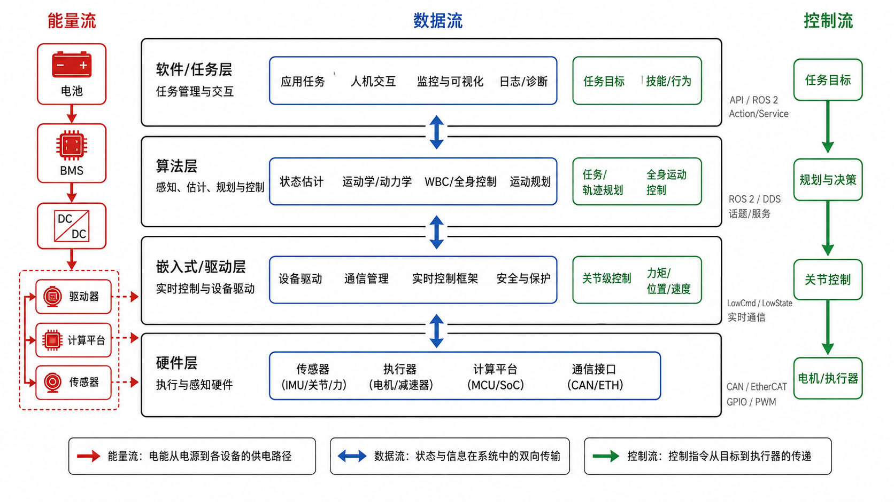

# 1.3 人形机器人系统架构

import SystemLoopMapping from '../../../components/SystemLoopMapping.astro';

## 先看一个现场问题

项目启动会上，四位同学分别画了一张“系统架构图”：

- 机械同学画的是本体、连杆、关节、减速器和传感器的装配关系；
- 电气同学画的是电池、BMS、电源树、CAN 总线和驱动器；
- 算法同学画的是感知 → 状态估计 → 规划 → 控制 → 执行器的闭环；
- 软件同学画的是 ROS 2 节点、Topic、TF 树和仿真接口。

> “所以我们的系统架构到底是哪一张图？”

四张图都对，但它们只画出了同一个系统的不同图层。要让整个团队协同，必须先有一张把机械、电气、算法、软件叠在一起的“总览图”，并且标清楚层与层之间的接口。

## 人形机器人的系统架构是什么

前两节说过，具身智能需要一个身体，人形机器人就是本书选定的那个身体；系统架构则是这个身体的“内部构造图”。人形机器人系统架构（Humanoid Robot System Architecture）描述的是一台人形机器人由哪些功能模块组成、这些模块如何分层、以及能量、数据、控制三条主线如何在模块之间流动。[1][2]

这套分层不是人形机器人独有的：四足、轮式底盘上的具身智能体也按同样的层次组织，只是每层里的具体模块不同——比如把双足平衡控制换成轮式底盘的速度控制。本节用人形机器人把每一层讲透，换成其他本体时你只需要替换对应模块。

这里有三个关键词：

### 1. 分层（Layering）

把人形机器人看成一栋楼，每一层只和上下相邻层打交道：

- **机械与本体层**：本体、连杆、关节模组、传感器与足部接触结构；
- **电气与嵌入式层**：电源、驱动器、伺服环、传感器采集、实时通信、MCU 与故障保护；
- **小脑层**：状态估计、运动学、动力学、基础控制、平衡与全身控制；
- **大脑层**：感知、运动规划、Manipulation、学习控制、VLA 与 WAM；
- **软件与工具链层**：ROS 2、TF、日志、可视化、仿真接口与部署工具。

分层的关键在于明确接口：上层只向下层发“要什么”，下层只向上层汇报“现在是什么”。[3]

### 2. 系统级闭环（System-level Closed Loop）

1.1 已经画过概念上的闭环：感知—决策—行动，再用行动结果修正下一步。这里不重复概念，而是把同一个环铺到刚才的五层上——这是同一条环的两个视图，1.1 回答"什么是闭环"，这里回答"闭环落在哪几层"。左列是 1.1 的抽象环节，右列是它们在整机上的落地环节，按环的运行顺序排列：

<SystemLoopMapping />

同一条环上，各段的更新节奏并不同：大脑层以较低频率更新任务和动作意图，小脑层以更高频率维护平衡和跟踪目标，电气与嵌入式层再把这些目标按固定周期交给执行器。这条频率阶梯是小脑层和大脑层必须分开的工程原因，第 4、5 章会展开。

### 3. 接口（Interface）

接口（Interface）是层与层之间的契约，既包括物理接口（插头、电压、总线），也包括软件接口（消息格式、字段、单位、频率、坐标系）。

例如，小脑层不会直接给电机 PWM；它先发出“关节目标位置、速度、力矩和前馈”的数值，电气与嵌入式层再把这些数值转换成电流环命令。如果上下层对“单位是牛米还是电机百分比”“坐标系是基座还是世界”理解不一致，机器人就会出错。

## 一张分层图

下面这张图用于观察人形机器人常见模块的层级关系，并标出三条主线：能量流、数据流、控制流。本文按五层理解：机械与本体层提供物理能力，电气与嵌入式层负责驱动和实时采集，小脑层负责实时运控，大脑层负责感知和任务智能，软件与工具链层负责连接、调试和部署。



### 机械与本体层（Mechanical / Body Layer）

机械与本体层（Mechanical / Body Layer）是机器人最底层，回答“机器人由什么物理部件组成，身体能完成什么运动”。

典型模块包括：

- **本体（Body / Chassis）**：躯干、骨盆、腿、手臂、头部、足部；
- **关节模组（Joint Module）**：电机、减速器、编码器、驱动器、输出轴和轴承组成的执行单元；[5]
- **传感器（Sensor）**：编码器、IMU、六维力/力矩传感器、足底压力传感器、相机、激光雷达；[5]
- **结构与连接（Structure & Mounting）**：壳体、支架、轴承座、紧固件、线束和传感器安装结构；
- **接触部件（Contact Components）**：足底材料、碰撞几何、限位结构和末端执行器。

机械和结构同学看的“系统架构图”主要落在这一层。它决定机器人的自由度、质量、惯量、刚度、碰撞边界和可用的物理工作空间。

### 电气与嵌入式层（Electrical & Embedded Layer）

电气与嵌入式层（Electrical & Embedded Layer）回答“如何给硬件供电、让电机按指令运动，并把传感器状态按时报上来”。

典型模块包括：

- **电源系统（Power System）**：电池包、BMS、DC-DC、配电板和安全继电器；
- **电机驱动器（Motor Driver）**：把总线命令变成三相电流，跑电流环 / 速度环 / 位置环；
- **传感器采集（Sensor Acquisition）**：读取编码器、IMU、足底压力和温度等信号，并完成时间同步；
- **实时通信（Real-time Communication）**：CAN/EtherCAT/Ethernet/DDS 等链路的收发、校验、周期和延迟管理；
- **MCU 与实时调度（MCU & Real-time Scheduling）**：把控制任务按固定周期调度，保证 500 Hz、1 kHz 等硬实时要求；
- **安全监控（Safety Monitor）**：过流、过压、过温、超速、超位、失联检测，触发保护；

这一层的核心指标是控制频率（Control Frequency）和端到端延迟（End-to-end Latency）。控制频率指控制器每秒钟执行多少次；端到端延迟指“传感器采样 → 总线传输 → 计算 → 执行器响应”的总时间。这两个指标直接决定机器人能不能站稳、能不能及时补偿扰动。[1][6]

### 小脑层（Cerebellum Layer）

小脑层（Cerebellum Layer）回答“已知当前身体和接触状态，下一时刻应该怎样稳定、准确地运动”。

典型模块包括：

- **状态估计（State Estimation）**：用编码器、IMU、足底力估计浮动基座（Floating Base）姿态、速度、位置，以及各关节状态；[7]
- **运动学（Kinematics）**：由关节角算末端位姿，或由末端位姿反求关节角；[4]
- **动力学（Dynamics）**：由关节角、速度、加速度和外力算所需关节力矩；[7]
- **基础控制（Low-level Control）**：PID、阻抗控制（Impedance Control）、力位混合控制；[4][6]
- **平衡与全身控制（Balance & Whole-body Control, WBC）**：维护支撑域、ZMP、质心动量，同时协调腿、腰、手臂；[1][6]

小脑层输入是身体状态和目标轨迹，输出是关节层目标（位置、速度、力矩或加速度）。它不决定机器人要完成什么任务，而是负责让机器人站稳、走稳并跟住目标。

### 大脑层（Brain Layer）

大脑层（Brain Layer）回答“机器人看到了什么、要做什么任务、下一步应该选择什么动作”。

典型模块包括：

- **感知（Perception）**：目标检测、分割、位姿估计、SLAM；
- **运动规划（Motion Planning）**：步态、落脚点、轨迹、避障和任务空间约束；
- **Manipulation 与学习控制（Manipulation & Learning-based Control）**：双臂操作、灵巧手、模仿学习和强化学习；
- **VLA（Vision-Language-Action）**：把自然语言/图像任务翻译成动作意图；
- **WAM（World Action Model）**：预测动作将如何改变世界状态，辅助策略评估和滚动决策；
- **行为决策（Behavior Decision）**：状态机、任务调度、技能调用和失败降级。

大脑层输出的是任务目标、动作意图或短期动作计划，不直接承担毫秒级闭环。它的输出必须经过运动规划、全身控制和安全过滤，才能进入底层执行。

### 软件与工具链层（Software & Toolchain Layer）

软件与工具链层（Software & Toolchain Layer）回答“各层模块如何交换数据、协同运行、被调试和被部署”。

典型模块包括：

- **ROS 2 中间件（Middleware）**：节点（Node）、Topic、Service、Action、Launch、TF 树；[8]
- **仿真接口（Simulation Interface）**：MuJoCo、Isaac Sim、Gazebo，提供与真实硬件对齐的模型和接口；
- **数据记录与可视化（Logging & Visualization）**：rosbag2、Foxglove、RViz 2；
- **配置与部署（Configuration & Deployment）**：参数、版本、构建目标、仿真/实机配置和故障恢复；
- **人机交互（Human-Robot Interface）**：遥控器、调试面板、任务脚本和状态展示。

软件与工具链层不直接决定运动，也不直接控制电机。它负责承载消息、坐标变换、日志、仿真和部署边界，让机械、电气、小脑和大脑能够协同工作。

## 几个基本黑话

### 能量流（Power Flow）

能量流（Power Flow）描述电能如何从电池出发，经过 BMS、DC-DC、配电板，分配到驱动器、计算平台、传感器和安全系统。设计能量流时需要注意：峰值功率、持续功率、压降、热耗、急停切断路径。[3]

### 数据流（Data Flow）

数据流（Data Flow）描述传感器数据如何向上汇聚、高层指令如何向下分发。例如：编码器 → 驱动器 → CAN → 工控机 → 状态估计 → ROS Topic → 规划器 → ROS Topic → 控制器 → CAN → 驱动器 → 电机。[2][8]

### 控制流（Control Flow）

控制流（Control Flow）描述“任务目标 → 轨迹 → 全身控制 → 关节控制 → 电流环”的逐层分解。每一层都把上一层的抽象目标翻译成下一层更具体的命令。[1][6]

### 坐标系与单位（Coordinate Frames & Units）

坐标系与单位（Coordinate Frames & Units）是系统架构中最容易被忽略、却最容易出错的接口约定。典型坐标系包括世界坐标系（World Frame）、基座坐标系（Base Frame / Pelvis Frame）、传感器坐标系（Sensor Frame）和末端坐标系（End-effector Frame）。[4]

所有算法、消息、日志必须统一：长度单位（米）、角度单位（弧度）、力单位（牛顿）、力矩单位（牛米）、时间戳（秒或纳秒）。一旦混用度/弧度、毫米/米、电机单位/物理单位，仿真和实机都会出现系统性偏差。

### 安全状态机（Safety State Machine）

安全状态机（Safety State Machine）描述机器人从初始化、正常运行、故障、降级到急停的完整状态转移。它由一套状态定义和转移条件组成：检测到超速就降扭矩，检测到通信超时就进入保持姿态，检测到急停就切断电源。[3][6]

## 以 G1 看一条指令的旅程

用 G1 的 `g1_29dof` 模型可以把上面的抽象架构变成一条具体链路：

```text
外部任务：ROS 2 / Python 脚本发布一个“向前走 0.5 米”的目标
→ 大脑层：行为状态机选择“行走”技能，调用步态规划器
→ 大脑层：规划器输出未来若干步的足底目标、躯干姿态、质心轨迹
→ 小脑层：全身控制器把躯干/足底任务映射成 29 个关节的位置/速度/力矩目标
→ 软件与工具链层：ROS 2 Topic 或 DDS rt/lowcmd 消息封装成 LowCmd
→ 电气与嵌入式层：控制线程按设定周期发布 LowCmd（官方 G1 低层示例使用 2 ms，即 500 Hz）
→ 电气与嵌入式层：电机驱动器解析 LowCmd，跑电流环，驱动 29 个关节模组
→ 机械与本体层：机器人本体运动，编码器和 IMU 测量新状态
→ 数据流：LowState 返回 MotorState、IMUState 等状态
→ 小脑层：状态估计更新浮动基座和关节状态
→ 闭环完成
```

其中 `LowCmd` 和 `LowState` 是 G1 低层通信接口的核心消息。[9][10] 在 SDK2 的 G1 消息定义中，[`LowCmd_`](https://github.com/unitreerobotics/unitree_sdk2/blob/9754cd153af3da471b0fe5f3aa535e426fb11db3/include/unitree/idl/hg/LowCmd_.hpp) 包含 `mode_pr`、`mode_machine`、`motor_cmd`、`reserve` 和 `crc`；每个 [`MotorCmd_`](https://github.com/unitreerobotics/unitree_sdk2/blob/9754cd153af3da471b0fe5f3aa535e426fb11db3/include/unitree/idl/hg/MotorCmd_.hpp) 再包含 `mode`、`q`（目标位置）、`dq`（目标速度）、`tau`（前馈力矩）、`kp`、`kd`。对应的 [`LowState_`](https://github.com/unitreerobotics/unitree_sdk2/tree/9754cd153af3da471b0fe5f3aa535e426fb11db3/include/unitree/idl/hg) 包含版本、模式、时间戳、`IMUState_`、电机状态数组、遥控器数据和 CRC；每个 [`MotorState_`](https://github.com/unitreerobotics/unitree_sdk2/tree/9754cd153af3da471b0fe5f3aa535e426fb11db3/include/unitree/idl/hg) 提供 `q`、`dq`、`ddq`、`tau_est`、温度、电压和状态码。消息定义的数组容量为 35，但[官方 G1 低层示例](https://github.com/unitreerobotics/unitree_sdk2/blob/9754cd153af3da471b0fe5f3aa535e426fb11db3/example/g1/low_level/g1_ankle_swing_example.cpp)按 29 个电机索引使用。[10]

需要区分“消息类型存在”和“消息是否嵌套在 `LowState_` 中”：[`PressSensorState_`](https://github.com/unitreerobotics/unitree_sdk2/blob/9754cd153af3da471b0fe5f3aa535e426fb11db3/include/unitree/idl/hg/PressSensorState_.hpp) 用于压力传感器状态，[`BmsState_`](https://github.com/unitreerobotics/unitree_sdk2/blob/9754cd153af3da471b0fe5f3aa535e426fb11db3/include/unitree/idl/hg/BmsState_.hpp) 用于电池管理状态，它们在 SDK2 中是独立的 IDL 类型，不能简单写成 `LowState_` 的直接字段。[10] 同样，官方示例中的 500 Hz（2 ms）是该示例控制线程的配置，不代表所有 G1 工作模式或所有整机通信链路都固定使用这个频率；传输介质也应以具体硬件和驱动实现为准。

G1 的 URDF 中还固定了 `d435_link` 和 `mid360_link`，分别对应 RGB-D 相机和激光雷达的安装位姿。它们目前在仿真中可能没有实际传感器数据，但在软件与工具链层已经预留了视觉/激光感知的坐标系接口。

## 参考资料

[1] Kajita, S., Hirukawa, H., Harada, K., & Yokoi, K. *Introduction to Humanoid Robotics*. Springer, 2014. 人形机器人系统架构与平衡控制专著。<https://doi.org/10.1007/978-3-642-54536-8>

[2] Siciliano, B., & Khatib, O. (Eds.). *Springer Handbook of Robotics* (2nd ed.). Springer, 2016. 机器人学综合手册，涵盖硬件、软件与控制架构。<https://link.springer.com/referencework/10.1007/978-3-319-32552-1>

[3] International Organization for Standardization. *ISO 8373:2021 Robotics — Vocabulary*. 机器人术语与安全标准。<https://www.iso.org/standard/75539.html>

[4] Lynch, K. M., & Park, F. C. *Modern Robotics: Mechanics, Planning, and Control*. Cambridge University Press, 2017. 机器人学教材，含坐标系、运动学、控制基础。<https://modernrobotics.northwestern.edu/chapters/chapter2/>

[5] International Organization for Standardization. *ISO 8373:2021 Robotics — Vocabulary*. 传感器、执行器术语标准。<https://www.iso.org/standard/75539.html>

[6] Åström, K. J., & Murray, R. M. *Feedback Systems: An Introduction for Scientists and Engineers*. Princeton University Press, 2008. 反馈控制、控制频率与延迟教材。<https://www.cds.caltech.edu/~murray/books/AM08/>

[7] Featherstone, R. *Rigid Body Dynamics Algorithms*. Springer, 2008. 浮动基座、动力学与状态估计专著。<https://doi.org/10.1007/978-1-4899-7560-7>

[8] Open Robotics. *ROS 2 Documentation*. ROS 2 官方文档，节点、Topic、TF 与中间件说明。<https://docs.ros.org/en/humble/>

[9] Unitree Robotics. *unitree_rl_gym: G1 robot description*. 官方开源模型与仿真资料，含 G1 URDF/MJCF。本文使用的版本为 `276801e46c5d433564f24658bac64f254b7d2d4b`，对应目录：<https://github.com/unitreerobotics/unitree_rl_gym/tree/276801e46c5d433564f24658bac64f254b7d2d4b/resources/robots/g1_description>

[10] Unitree Robotics. *unitree_sdk2: Unitree robot SDK version 2*. 官方 SDK 仓库。本文使用的版本为 `9754cd153af3da471b0fe5f3aa535e426fb11db3`，对应源码路径包括 `include/unitree/idl/hg/` 和 `example/g1/low_level/g1_ankle_swing_example.cpp`；其中可核对 `rt/lowcmd`、`rt/lowstate`、29 电机索引和 2 ms 控制循环。<https://github.com/unitreerobotics/unitree_sdk2/tree/9754cd153af3da471b0fe5f3aa535e426fb11db3>
