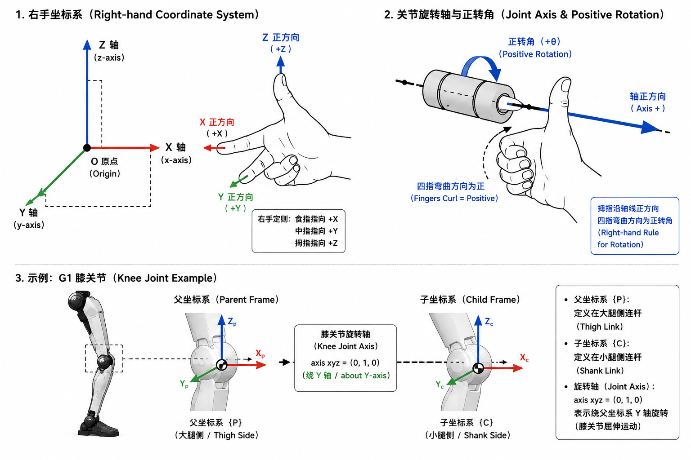
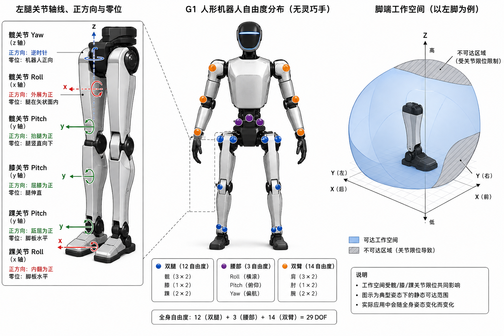

# 2.1 机构、关节与自由度

import RigidBodyForceDemo from '../../../components/RigidBodyForceDemo.astro';
import UrdfLinkJointSnippet from '../../../components/UrdfLinkJointSnippet.astro';
import FourBarDeadCenterDemo from '../../../components/FourBarDeadCenterDemo.astro';
import DofCountingSnippet from '../../../components/DofCountingSnippet.astro';
import ParallelAnkleDemo from '../../../components/ParallelAnkleDemo.astro';

## 先看一个现场问题

算法同学在仿真里让 G1“把左脚尖抬高 5 厘米”，一切正常；同一组指令跑到实机上，脚尖却多抬了两厘米，方向还有点偏。排查发现两件事：模型里的连杆长度和实物不符，机械同学上周标定的零位（Zero Position）也没有写回模型。

这个现场说明一件事：

> 运动学计算的前提，是模型里的连杆长度、关节轴线（Joint Axis）、零位和限位（Joint Limit）与真实机构一致——任何一项对不上，同一组指令在仿真和实机上就是两个动作。

至于调试中更吓人的现象，比如换个零件后机器人开始抖，那是 2.2 节刚柔性和第 4 章控制要回答的问题，本节先把“模型与实物一致”这件事讲清楚。
## 机构

机器人机构（Mechanism）是由连杆（Link）和关节（Joint）组成、用来传递运动和力的结构。在经典机械原理中，关节属于运动副（Kinematic Pair）：它规定两个连杆之间“允许怎样动”；连杆则把这些关节按一定顺序连接起来。骨盆、大腿、小腿和足部通过髋、膝、踝关节连接，就是一条下肢运动链（Kinematic Chain）；肩、上臂、前臂和手部也构成一条上肢运动链。[1][2]

为了便于计算，我们通常把连杆先近似成刚体，再给它补充质量、质心和转动惯量。“刚体”描述的是连杆的一种理想化建模状态，连杆和刚体处在不同的概念层级。

### 刚体（Rigid Body）

现场把 G1 的大腿外壳换成更薄的 3D 打印件后，控制器参数没有改，机器人却出现明显振动。这个现象提醒我们：连杆的质量、刚度和形变会改变整条运动链的动力学特性，所以在继续调 PID 之前，要先确认当前零件是否仍然可以近似成刚体。

刚体（Rigid Body）是理想化模型：物体内部任意两点之间的距离保持不变。在机器人建模中，连杆和壳体通常先按刚体处理，再把质量、质心和转动惯量写入模型。真实结构会发生弹性变形；如果零件明显变软或振动明显，刚体模型就不够用了，需要进一步分析结构柔性和固有振动。[2][3]

刚体假设还有一个常被忽略的推论：因为物体不变形，力在刚体上可以沿作用线滑移，任意力系都能向任选一点简化——得到一个主矢（Resultant Force）和一个主矩（Resultant Moment）。主矢与简化中心无关，主矩随简化中心改变。下面的演示可以亲手验证这一点；到三维情形，主矢和主矩合起来就是力螺旋（Wrench），2.4 节足底六维力传感器输出的正是它。

<RigidBodyForceDemo />

### 连杆（Link）与关节（Joint）

现场调试时，日志里写的是 `left_knee_joint`，机械图纸上标的是“小腿组件”，两边却在讨论同一个对象。为了沟通，需要把“零件”和“运动关系”分开：

- 连杆（Link）是近似刚体的结构件，例如骨盆、大腿、小腿和足部；
- 关节（Joint）描述两个连杆之间允许的相对运动，例如转动关节（Revolute Joint）或移动关节（Prismatic Joint）；
- 运动链（Kinematic Chain）是从基座到末端，按关节连接起来的一串连杆。

在 URDF 中，`link` 描述结构和惯性，`joint` 描述父子连杆、运动类型、轴线、范围和零位。G1 29 DoF 描述文件中的 `left_hip_pitch_joint`、`left_knee_joint` 等名称，就是这种“关节对象”的软件标识。[4] 下面是从本书使用的 G1 URDF 中截取的真实定义，高亮行就是上面提到的属性：

<UrdfLinkJointSnippet />

### 四连杆机构与死点

算法同学给一个带连杆传动的关节发送匀速指令，输入轴还在转，输出端却在某个姿态附近几乎不动；再往前推，输出方向甚至可能突然反过来。此时如果只检查电机速度或软件限位，很容易误以为是控制器“卡住了”。

四连杆机构（Four-bar Linkage）是四根杆件首尾铰接成的闭合平面机构，四根杆件角色不同：

- **机架**（Frame）：固定不动；
- **输入杆**（曲柄，Crank）：绕机架转动，接收电机输入；
- **输出杆**（摇杆，Rocker）：绕机架另一端摆动，输出运动；
- **连杆**（Coupler）：不接触机架、只负责传力的浮动杆件——注意它特指四连杆里的中间杆，和前面泛指一切刚体杆件的“连杆（Link）”不是一回事。

四个转动副（Revolute Pair, 4R）把它们首尾连接起来，在理想平面模型中只剩 1 个独立自由度：给定输入杆角度，其他杆件的姿态由几何约束共同决定。[1][2][6]

先玩一下，再读定义。下面的演示里：灰色底座是机架，蓝色曲柄是输入（默认恒速旋转，你可以拖动接管，松手恢复恒速），中间的灰色杆件是连杆，青色摇杆是输出；右边是同一个机构的输入输出曲线：

<FourBarDeadCenterDemo />

把曲柄拖到与连杆接近共线的位置——演示中红色标出的构型——就是死点（Dead Center）。此时输入继续转动，输出却几乎不动；越过死点，输出方向还会反转（拖过死点就能看到摇杆掉头）。

死点附近一段“输出响应很差、难以控制”的输入区间，工程上称为死区（Dead Zone）。在演示里两者各有对应画面：死点是曲柄与连杆共线的那个构型（红色瞬间）；死区是曲线上斜率接近零的那一段输入区间（淡色带）。严格说两者不要混用。

刚才红色时刻发生的一切，两个专业各有自己的说法：

- **机构语言**：死点是传动角（Transmission Angle，连杆与摇杆的夹角）趋近 0° 或 180° 的构型——连杆传来的力几乎沿摇杆轴线，形不成绕铰点的力矩，驱动力因此无法变成输出运动；
- **算法语言**：同一个构型让约束方程的雅可比矩阵（Jacobian）接近奇异（Singular），dθ<sub>out</sub>/dθ<sub>in</sub> 趋零——想让输出维持速度，输入速度就得冲向极端，逆运动学（Inverse Kinematics, IK）和轨迹优化因此变得病态。雅可比矩阵的完整定义和奇异位形的量化指标见 [4.2 节"雅可比：速度和力的局部映射"](../04-cerebellum-realtime-control/02-kinematics.md#雅可比速度和力的局部映射)。[1][2][6]

这会影响多个上下游环节：

- 规划器需要避开死点附近的不可行姿态，或显式加入传动角、速度和力矩约束；
- 逆运动学不能只检查关节位置限位，还要检查雅可比条件数和输出速度；
- 控制器需要限制目标变化率，避免在死点附近用过大的电机指令“硬顶”；
- 机械设计需要通过杆长、轴线和限位位置改善传力方向，而不是只提高电机额定力矩。


## 自由度到底是什么

### 自由度（Degree of Freedom, DoF）

同学拿到 G1 的 URDF 数了一遍：“这里面的 `joint` 标签远不止 29 个，G1 不是 29 DoF 吗？”

自由度的定义 1.2 节已经给过：描述构型所需的最少独立变量数量。这个问题真正想问的是：拿到一份描述文件，**怎么数**。规则只有三条：

- 绕固定轴旋转的转动关节贡献 1 个；
- 固定关节贡献 0 个——URDF 里多出来的 `joint` 标签大多是它，比如传感器安装关节，只描述安装位置，不产生运动；
- 浮动基座（Floating Base）不是关节，不计入这 29 个，但描述它需要 6 个广义坐标（3 平移 + 3 旋转），状态估计和动力学模型里会见到。[1][2]

三条规则在 G1 模型文件里都有原文对应：

<DofCountingSnippet />

按这套规则数一遍 G1 无手模型，正好对上账：双腿 12 + 腰部 3 + 双臂 14 = 29。再看变体：锁腰模型把腰部关节固定，按规则贡献 0；带手模型增加手指关节，总数相应增加。所以“G1 有多少 DoF”没有脱离模型文件和版本的答案，确认时以具体描述文件为准。[4]

数出来的每个 DoF，在算法里都对应广义坐标 `q` 的一个分量——这就是下一小节。

### 广义坐标（Generalized Coordinates）

在算法里，机器人姿态通常写成向量 `q`。`q` 表示整台机器人所有独立构型变量组成的广义坐标（Generalized Coordinates）向量；对应地，`dq` 表示广义速度，`ddq` 表示广义加速度。[2][3]

对固定基座机械臂，`q` 常常只包含关节角；对站立的人形机器人，`q` 还可能包含浮动基座的位置和姿态。因此同一个“29 个关节”的 G1，在不同软件中可能看到不同长度的状态向量：有的只记录 29 个驱动关节，有的还把浮动基座的 6 个变量加入状态估计或动力学模型。

## 关节轴线、方向和零位

### 关节轴线（Joint Axis）

同学把左腿膝关节角度改成 `+0.2`，结果仿真中膝盖向后弯，实机却向前顶。问题通常出在关节轴线方向或坐标系约定没有对齐。

关节轴线（Joint Axis）定义关节允许运动的方向。转动关节的轴线写在 URDF 的 `axis xyz` 中；轴线方向一旦取反，同一个角度数值就会对应相反的转动方向。父子坐标变换和软件中的关节索引也必须与这条轴线保持一致。[4]

### 右手坐标系（Right-handed Coordinate System）

同学在纸上画坐标轴时把 `x`、`y`、`z` 依次排好，写入程序后却发现叉乘方向和仿真结果相反。排查这类问题时，先确认项目采用的坐标系是不是右手坐标系，以及每根轴的正方向是否写清楚。

右手坐标系（Right-handed Coordinate System）规定三根坐标轴的方向关系：右手食指指向 `x` 轴正方向，中指指向 `y` 轴正方向，拇指指向 `z` 轴正方向。对转动关节，也常用“右手拇指指向关节轴正方向，四指弯曲方向定义正转角”来判断正负号。旋转矩阵、叉乘、角速度和力矩方向都依赖这一约定。[1][2]

在 G1 的腿部模型中，关节轴线、骨盆坐标系、足端坐标系和 IMU 坐标系需要统一采用同一套轴向约定。只要有一个坐标系的轴交换、翻转或单位不一致，正运动学、逆运动学和控制器就可能出现方向相反的结果。



图：右手坐标系、关节正转方向和 G1 膝关节坐标系示意。

### 零位（Zero Position）与限位（Joint Limits）

现场把所有关节目标设为 0，机器人没有站成“标准姿态”，甚至出现一条腿略微弯曲。常见原因是“编码器读数为 0”“模型关节角为 0”和“机械装配零位”使用了不同的基准。工程上需要通过标定偏置把这些基准对齐。

关节限位（Joint Limits）包括位置、速度和力矩等约束。位置限位限制关节角范围，速度限位限制变化速度，力矩限位限制输出能力。限位既来自机械止挡，也来自驱动器、控制器和软件安全层；任何一层更严格的约束都可能成为最终有效范围。

## 工作空间与运动范围

### 工作空间（Workspace）

当规划器说“手臂目标不可达”时，通常表示目标位姿落在该运动链工作空间（Workspace）之外。工作空间是末端在关节范围和机构几何约束下能够到达的位置集合；如果同时考虑末端姿态，则还要讨论任务空间（Task Space）中的位姿可达性。[1][2]

工作空间受以下因素共同影响：

- 连杆长度和安装偏置；
- 关节轴线的相对方向；
- 关节位置、速度和力矩限位；
- 自碰撞、环境碰撞和线缆干涉；
- 浮动基座、接触约束和当前支撑姿态。

所以，“增加一个自由度”通常会扩大可达动作范围，但不保证所有方向都同样容易到达，也不保证目标附近的数值求解稳定。

## 用 G1 串起这些概念

### 29 DoF、锁腰与带手模型

G1 的无手 29 DoF 模型适合先学习下肢、腰部和双臂的整体运动链。锁腰模型把腰部若干关节固定，适合只关注腿部行走或减少仿真变量的场景；带手模型增加手部运动链，适合后续 manipulation 和 VLA 章节。模型文件、网格和关节名称可从 [Unitree `unitree_rl_gym` 的 G1 描述目录](https://github.com/unitreerobotics/unitree_rl_gym/tree/276801e46c5d433564f24658bac64f254b7d2d4b/resources/robots/g1_description)核对。



图：G1 自由度分布、左腿关节轴线和脚端工作空间示意。

### 踝关节的 PR/AB 命名

在 G1 低层示例中，踝关节索引旁边会看到 `PR` 和 `AB` 两种模式名称。这里的 PR（Pitch/Roll）与 AB（A/B）是驱动控制模式的命名，不应直接当作“踝关节多了两个 DoF”。G1 模型中的踝关节仍按 pitch 和 roll 两个独立转动关节建模；模式含义和索引可在 [Unitree SDK2 的 G1 低层示例](https://github.com/unitreerobotics/unitree_sdk2/blob/9754cd153af3da471b0fe5f3aa535e426fb11db3/example/g1/low_level/g1_ankle_swing_example.cpp)中核对。

真实硬件上，踝由两个电机经连杆并联驱动 pitch 和 roll。并联传动同样存在接近奇异的构型：上面平面演示里“死点附近速度映射病态”的结论，在踝上表现为某些姿态组合下 pitch/roll 的控制变得病态。G1 公开模型没有包含踝部的连杆几何，本书不展开它的内部结构；下面用一个第三方开源项目的 G1 简化踝模型（作者声明为个人装配参数），把平面四连杆的死区推广到二维姿态平面上看看：

<ParallelAnkleDemo />

### 从关节角到脚端位置

给 G1 左腿一组关节角 `q_leg` 后，正运动学（Forward Kinematics, FK）根据髋、膝、踝的连杆变换计算脚端位姿；反过来，逆运动学（IK）根据期望脚端位姿求一组可能的关节角。多个 IK 解、关节限位和自碰撞检查，决定规划器最终是否接受这组解。[1][2]

```text
关节角 q_leg
→ 连杆变换与关节轴线
→ 左脚位姿（位置 + 姿态）
→ 与工作空间、限位、碰撞约束比较
```

## 参考资料

[1] Lynch, K. M., & Park, F. C. *Modern Robotics: Mechanics, Planning, and Control*. Cambridge University Press, 2017. 第 2 章介绍构型空间、自由度、关节和工作空间。<https://modernrobotics.northwestern.edu/chapters/chapter2/>

[2] Siciliano, B., & Khatib, O. (Eds.). *Springer Handbook of Robotics* (2nd ed.). Springer, 2016. 机器人机构、运动学和任务空间基础。<https://link.springer.com/referencework/10.1007/978-3-319-32552-1>

[3] Featherstone, R. *Rigid Body Dynamics Algorithms*. Springer, 2008. 刚体、广义坐标和浮动基座动力学。<https://doi.org/10.1007/978-1-4899-7560-7>

[4] Unitree Robotics. *unitree_rl_gym: G1 robot description*. 本文使用的版本为 `276801e46c5d433564f24658bac64f254b7d2d4b`，用于核对 G1 模型变体、关节名称和 URDF/MJCF。<https://github.com/unitreerobotics/unitree_rl_gym/tree/276801e46c5d433564f24658bac64f254b7d2d4b/resources/robots/g1_description>

[5] Unitree Robotics. *unitree_sdk2: Unitree robot SDK version 2*. 本文使用的版本为 `9754cd153af3da471b0fe5f3aa535e426fb11db3`，用于核对 G1 关节索引和 PR/AB 模式命名。<https://github.com/unitreerobotics/unitree_sdk2/blob/9754cd153af3da471b0fe5f3aa535e426fb11db3/example/g1/low_level/g1_ankle_swing_example.cpp>

[6] Norton, R. L. *Design of Machinery: An Introduction to the Synthesis and Analysis of Mechanisms and Machines*, 6th ed. McGraw-Hill, 2020. 四连杆机构、传动角、死点和机构速度分析教材。
