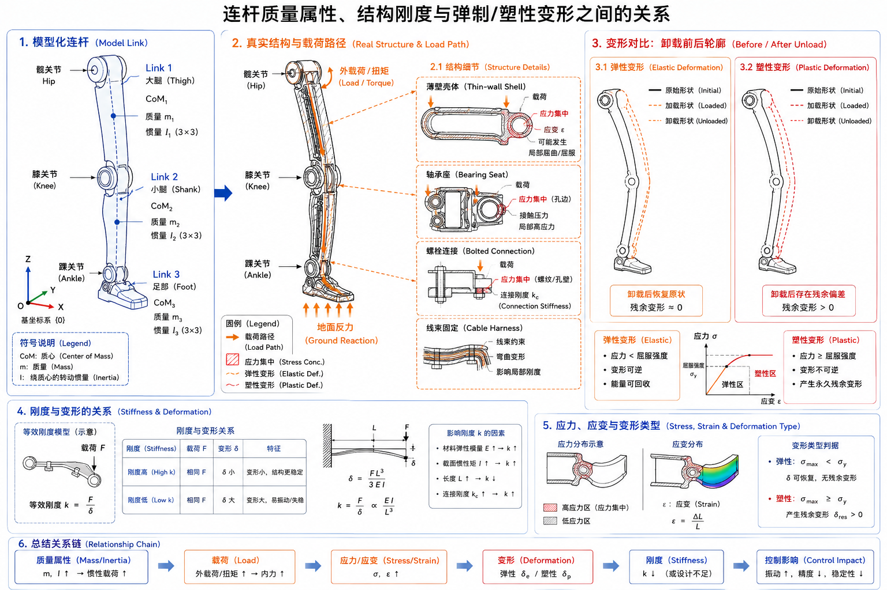

# 2.2 结构设计、材料与刚柔性

## 先看一个现场问题

G1 连续完成几轮起立、下蹲和落脚测试后，左膝附近的安装面出现了细小裂纹；关节角度日志看起来仍然正常，但脚端标定位置逐渐偏了几毫米。算法同学先怀疑零位漂移，机械同学则发现裂纹位于螺栓孔边缘的应力集中处，连接刚度也已经下降。

这类问题不能只看关节角度。上一节已经说明了连杆、关节和运动链如何决定“哪里能动”；本节进一步追问承力结构能否在这些运动中保持足够的强度、刚度和寿命。材料、截面、连接细节和实际载荷谱会决定结构是否屈服、疲劳或变形，质量与质心变化还会继续传递到动力学和控制器。

现场通常会这样追问：

> “裂纹还没有断，为什么脚端已经偏了？模型里的质量和惯量，能不能告诉我们连接处还能承受多少次这样的载荷？”

## 从运动链进入承力结构

本节沿用 [2.1 机构、关节与自由度](./01-mechanisms-and-dof.md) 对连杆（Link）、关节（Joint）和运动链（Kinematic Chain）的定义，不再重复介绍它们的运动学含义。这里把“连杆”当作承力对象，关注它在载荷、温度和重复运动下是否仍能保持设计功能。



图：左侧是用于动力学计算的模型化连杆，中部展示真实结构中的载荷路径与连接细节，右侧对比卸载后的弹性恢复和塑性残余变形。

### 承力结构（Load-bearing Structure）

承力结构（Load-bearing Structure）是承担载荷并保持部件相对位置的实体组合。对 G1 的一条腿来说，髋部壳体、膝关节连接件、小腿壳体、轴承座、紧固件和足部一起构成承力路径。结构设计不仅要满足静态强度，还要控制变形、连接刚度、装配误差和维护可达性。

在 URDF 中，`link` 主要提供 `visual`、`collision` 和 `inertial` 三类模型信息；在 MJCF 中，相应信息分布在 `body`、`geom` 和 `inertial` 等元素中。它们回答的是“几何如何显示/碰撞、质量如何分布”，并不直接描述材料牌号、屈服强度、螺栓预紧力或壳体连接刚度。[1][2]

### 材料（Material）

材料（Material）决定结构在载荷和温度下“能承受多少、会变形多少、能重复多少次”。工程上常关注：

- 密度（Density）：影响总质量和惯性；
- 弹性模量（Young’s Modulus）：决定弹性变形的量级；
- 屈服强度（Yield Strength）：超过后可能产生不可恢复的塑性变形；
- 疲劳强度（Fatigue Strength）：承受重复载荷时的寿命边界；
- 热导率、热膨胀系数和耐腐蚀性：影响温升、尺寸稳定性与环境适应性。

材料参数不能只看数据手册中的单个数值。加工方向、热处理、表面处理、连接方式和实际载荷谱（Load Spectrum），都会让零件的有效性能偏离理想材料值。[3]

## 应力、应变与刚度

### 应力（Stress）和应变（Strain）

当连杆承受力或力矩时，内部会产生应力（Stress）；相对原始尺寸的变形比例称为应变（Strain）。在小变形、线弹性近似下，一维拉伸可以写成：

```text
σ = F / A
ε = ΔL / L
σ = E ε
```

其中 `σ` 是正应力，`F` 是轴向力，`A` 是受力面积，`ε` 是应变，`ΔL` 是长度变化，`L` 是原始长度，`E` 是弹性模量。这个关系只适用于相应的载荷、温度和材料范围；弯曲、扭转、接触应力和复合载荷需要使用更完整的梁、壳或有限元模型。[3]

### 弹性变形（Elastic Deformation）与塑性变形（Plastic Deformation）

弹性变形（Elastic Deformation）是载荷移除后可以基本恢复的形变。在弹性范围内，结构的位移与载荷近似可逆；例如 G1 小腿连杆受到短时外力后发生轻微挠曲，外力消失，几何位置应回到原来的范围。弹性变形不等于“没有变形”，它仍可能造成末端瞬时位置误差、柔性储能和控制误差。

塑性变形（Plastic Deformation）是超过材料屈服范围后留下的不可恢复形变。即使载荷已经撤除，零件仍可能出现弯曲、孔位偏移或装配面塌陷。塑性变形会改变关节零位、碰撞间隙和载荷路径，通常意味着结构已经不能继续按原设计状态使用，需要停机检查和更换或维修。[3][4]

两者的工程区别可以这样记：

| 变形类型 | 卸载后的状态 | 对 G1 调试的典型影响 |
| --- | --- | --- |
| 弹性变形 | 大部分恢复 | 运动中出现可重复的瞬时偏差或柔顺 |
| 塑性变形 | 保留永久偏差 | 零位、碰撞间隙和承载能力发生改变 |

实际零件可能同时经历弹性和塑性阶段；判断是否越过屈服，不能只看肉眼变形，还应结合材料数据、应变测量、尺寸复测和载荷记录。

### 刚度（Stiffness）

刚度（Stiffness）描述结构抵抗变形的能力，常用“载荷除以位移”或“力矩除以角变形”表示：

```text
k = F / Δx
kθ = τ / Δθ
```

刚度高不等于强度一定高。薄壁件可能在屈服前就出现较大的挠度；连接处的间隙、轴承预紧和螺栓滑移也会让整机等效刚度显著下降。对控制器而言，这种柔性会表现为关节输出与连杆姿态之间存在额外相位延迟和弹性储能，不能简单当作“调小一点位置增益”来解决。

### 强度（Strength）与安全系数（Factor of Safety）

强度（Strength）关注结构是否断裂、屈服或失稳；安全系数（Factor of Safety）则把允许载荷与设计载荷之间的裕量表达出来。设计载荷应包含站立、行走、落脚冲击、跌倒或外部碰撞等工况，而不是只取静态重力。真实项目还要分别检查屈服、疲劳、屈曲、连接失效和局部接触压溃。[3][6]

## 质量、质心与转动惯量

同样的关节轨迹，如果把质量集中到连杆末端，电机需要承担的惯性力矩会明显增加。刚体的质量属性通常包括：

- 质量（Mass, `m`）：决定重力和线性惯性；
- 质心（Center of Mass, CoM）：决定重力作用点和姿态耦合；
- 转动惯量（Moment of Inertia, `I`）：决定绕各轴改变角速度所需的力矩。

绕固定轴的简化关系为：

```text
τ = I α
```

`τ` 是绕该轴的力矩，`I` 是对应轴的转动惯量，`α` 是角加速度。对真实连杆，惯量是一个三维张量；坐标原点、坐标轴方向和质心位置不一致时，不能直接比较两个文件中的惯量数字。[1][2]

### 以 G1 模型参数为例

当前目录的 G1 MJCF/URDF 为每个 link 提供了模型化的质量属性。例如 `g1_29dof.xml` 中，骨盆（`pelvis`）质量为 3.813 kg，躯干（`torso_link`）质量为 9.598 kg，左膝连杆（`left_knee_link`）质量为 1.932 kg；这些数字是仿真模型参数，不应直接当作真实硬件称重结果。[5]

如果替换了外壳、加装相机或改变线束，却不更新 `inertial`，仿真中的重力矩、摆动腿惯量、质心位置和接触响应就会与实机产生系统性偏差。反过来，仅修改质量和惯量也不能模拟结构柔性，因为当前模型没有给出材料弹性和连接刚度。

## 疲劳与重复载荷

### 疲劳（Fatigue）

人形机器人常在数小时甚至数月内重复迈步、起身和摆臂。即使每次载荷都低于屈服强度，重复应力也可能造成疲劳裂纹。疲劳评估需要载荷谱、应力集中、表面状态、焊缝或螺纹细节以及目标寿命；不能只用一次静态仿真的最大应力下结论。[3]

## 轻量化的工程权衡

连杆轻量化会降低摆动惯量和驱动功耗，但可能牺牲刚度、抗冲击能力、散热面积和维修余量。常见权衡包括：

| 设计目标 | 可能收益 | 需要付出的代价 |
| --- | --- | --- |
| 降低质量 | 摆动更快、功耗更低 | 结构刚度、抗冲击和热容量可能下降 |
| 提高刚度 | 姿态误差和振动更小 | 质量、成本和冲击传递增加 |
| 增大截面 | 强度和屈曲裕量增加 | 与相邻关节、线束和碰撞空间冲突 |
| 采用复合材料或薄壁件 | 比刚度高、可定制 | 各向异性、连接和维修更复杂 |

因此，机械、驱动和控制参数必须一起评审：机械改动后至少要重新核对质量、质心、惯量、关节负载、弹性/塑性变形和碰撞包络，不能只确认“关节还能转到原来的角度”。


## 参考资料

[1] Lynch, K. M., & Park, F. C. *Modern Robotics: Mechanics, Planning, and Control*. Cambridge University Press, 2017. 刚体、质量属性、坐标变换与机器人动力学教材。<https://modernrobotics.northwestern.edu/chapters/chapter8/>

[2] Featherstone, R. *Rigid Body Dynamics Algorithms*. Springer, 2008. 刚体惯量、质心与多刚体动力学专著。<https://doi.org/10.1007/978-1-4899-7560-7>

[3] Budynas, R. G., & Nisbett, J. K. *Shigley’s Mechanical Engineering Design*, 11th ed. McGraw-Hill, 2020. 应力、强度、安全系数、疲劳与机械结构设计教材。

[4] Callister, W. D., & Rethwisch, D. G. *Materials Science and Engineering: An Introduction*, 10th ed. Wiley, 2018. 弹性变形、塑性变形、屈服与材料性能教材。

[5] Unitree Robotics. *unitree_rl_gym: G1 robot description*. 官方开源 G1 URDF/MJCF 与网格资料；本文使用提交 `276801e46c5d433564f24658bac64f254b7d2d4b`，用于核对模型变体、link 惯性字段和网格边界。<https://github.com/unitreerobotics/unitree_rl_gym/tree/276801e46c5d433564f24658bac64f254b7d2d4b/resources/robots/g1_description>

[6] International Organization for Standardization. *ISO 12100:2010 Safety of machinery — General principles for design — Risk assessment and risk reduction*. 机械设计与风险评估标准。<https://www.iso.org/standard/51528.html>
