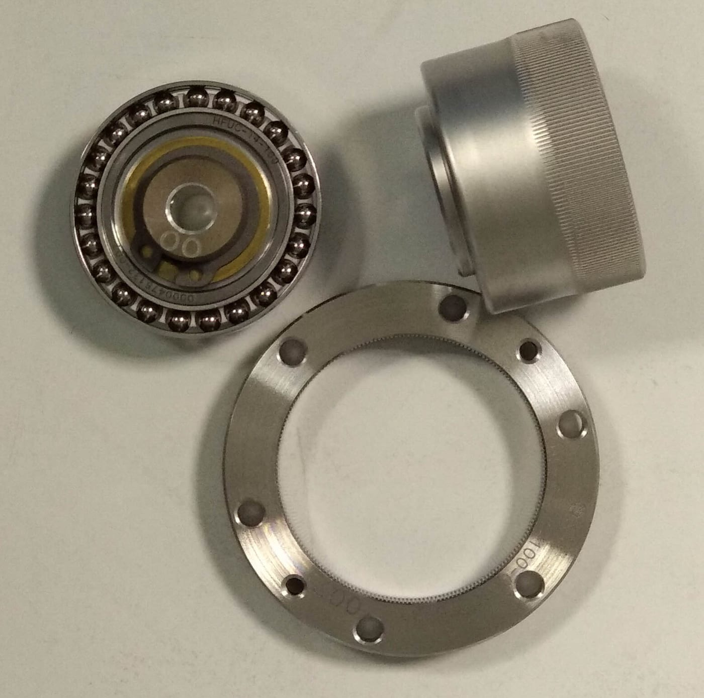
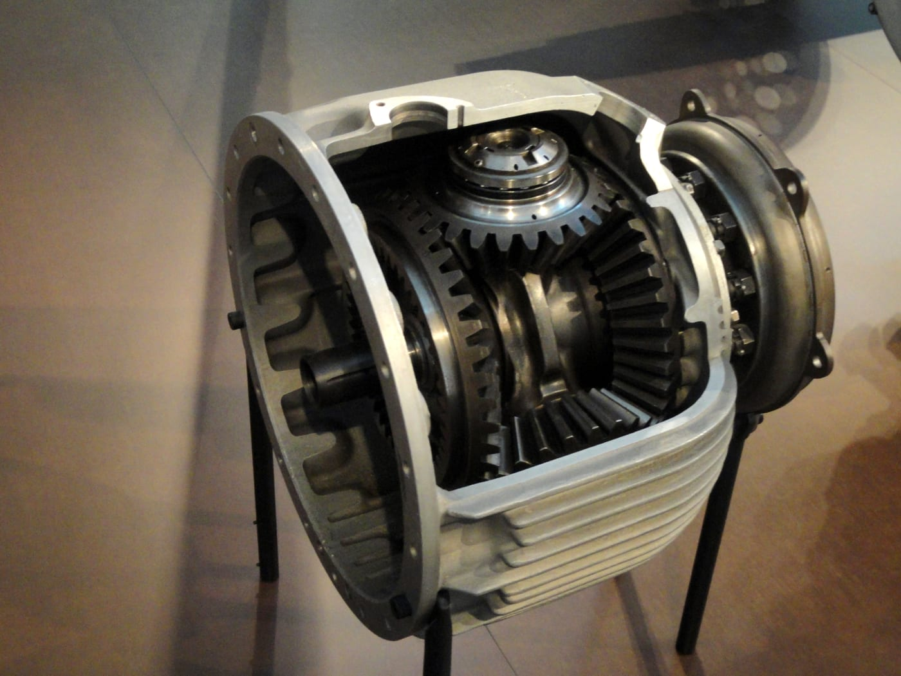
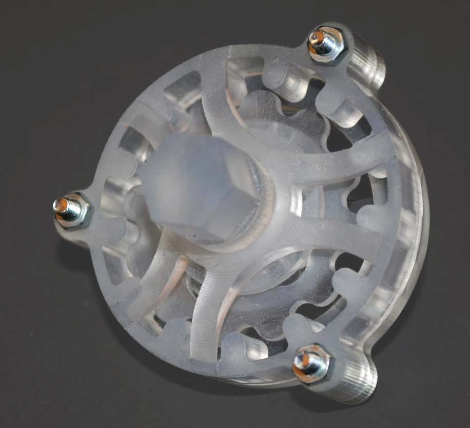

# 2.3 传动与关节模组

import JointTransmissionDemo from '../../../components/JointTransmissionDemo.astro';
import GearRatioDemo from '../../../components/GearRatioDemo.astro';
import HarmonicDriveDemo from '../../../components/HarmonicDriveDemo.astro';
import PlanetaryGearDemo from '../../../components/PlanetaryGearDemo.astro';
import CycloidalDriveDemo from '../../../components/CycloidalDriveDemo.astro';

## 先看一个现场问题

G1 在平地上抬腿时动作正常，一旦背上负载或开始爬小坡，膝关节就出现“电流已经很大、输出却跟不上”的现象。日志里的位置误差逐渐增大，关节还有轻微的回弹；把目标速度调低后，问题有所缓解，但电机和关节外壳明显发热。

现场通常会这样问：

> “电机已经在用力，为什么关节还是推不动？是减速比、摩擦、回差，还是控制器限幅了？”

（回差＝换向时空转的一小段行程，根因是齿隙与预紧不足；机制见本节「回差、摩擦与扭转刚度」。）

这不是一个只靠换 PID 参数就能回答的问题。电机、减速器、编码器、驱动器、输出轴、轴承和限位结构共同组成关节模组（Joint Module）。它们决定电机的转速和力矩如何变成关节端的运动与负载能力，也决定了热量、误差和故障会在哪里累积。

> **在整机里的位置**：这一节属于“机械执行层”；上游是驱动与嵌入式层的电机力矩，下游是连杆运动与关节负载。总图见 [1.3 节](../01-system-overview/03-humanoid-robot-system-architecture.mdx)。

## 一条关节传动链

### 关节模组（Joint Module）

关节模组（Joint Module）是可以独立安装和控制的执行单元，通常包括：

- 电机（Motor）：把电能转换成旋转机械能；
- 减速器（Reducer / Gearbox）：在速度、力矩和惯量之间进行变换；
- 编码器（Encoder）：测量电机侧或输出侧的位置和速度；
- 驱动器（Motor Drive）：执行电流、速度或位置控制，并提供保护；
- 输出轴与轴承（Output Shaft & Bearings）：承受外部载荷并把力矩传给连杆；
- 机械限位（Mechanical Stop）：在软件限位之外阻止危险的过行程。

“电机额定力矩”不是“关节端可用力矩”。中间的减速器效率、摩擦、回差、轴承载荷和热限制，都会改变最终输出。

> **一句话听懂**：关节模组就是机器人的“关节总成”：电机、减速器、编码器、驱动器和输出轴打包在一起，能单独拆装。就像汽车发动机的劲儿不等于车轮上的劲儿，电机使的力经过这一路，最后送到关节会打折扣。

### 执行器（Actuator）

执行器（Actuator）是把能量转换成受控运动或力的部件。机器人语境中的“执行器”有时只指电机，有时指包含电机、减速器和驱动器的完整模组。阅读规格或接口时，必须先确认力矩、速度和位置是电机轴还是关节输出轴的量。

> **一句话听懂**：执行器就是“真正出力的部件”，把电能变成受控的转动或推力。在机器人里，这个词有时只指电机，有时指含减速器和驱动器的整条模组，看上下文才分得清。

### 传动比（Gear Ratio）

传动比（Gear Ratio）通常定义为电机转速与输出轴转速之比：

$$
N = \omega_{\mathrm{m}} / \omega_{\mathrm{out}}
$$

在理想无损情况下，输出速度降低 $N$ 倍，输出力矩提高 $N$ 倍；考虑效率 $\eta$ 后，可以近似写成：

$$
\begin{aligned}
\omega_{\mathrm{out}} &= \omega_{\mathrm{m}} / N \\
\tau_{\mathrm{out}} &\approx \eta N \tau_{\mathrm{m}}
\end{aligned}
$$

其中 $\omega_{\mathrm{m}}$、$\tau_{\mathrm{m}}$ 是电机侧角速度和力矩，$\omega_{\mathrm{out}}$、$\tau_{\mathrm{out}}$ 是输出侧角速度和力矩。实际关系还会受到摩擦、弹性变形、冲击和速度变化的影响。传动比不是“凭空增加能量”，速度和力矩的转换受功率守恒约束。[1][2]

> **一句话听懂**：传动比就是“电机转几圈、输出才转一圈”：有点像自行车爬坡换低速挡，蹬得勤快但省劲，它把电机的高转速小力气换成关节的低转速大力气。但它不会凭空造出能量，转得越慢换来的力气也有上限。

下面把这两个公式变成可以看的关系：输入齿轮转 N 圈，输出才转 1 圈。

<GearRatioDemo />

下面用一个关节模组的传动链交互演示。电机经齿轮副减速器驱动关节输出，可以调转速、减速比和负载，实时看到两侧的转速、力矩与功率。

<JointTransmissionDemo />

## 常见减速器与选型直觉

### 减速器的外壳

> 减速器为什么常常是个“盒子”？

有些机器人上，电机并不直接和连杆相连。电机的输出轴会先进入一个封闭的“盒体”，再从盒体的另一侧连接关节或连杆。这个盒体通常就是减速器（Reducer / Gearbox）的外壳，内部容纳齿轮（Gear）或其他啮合、滚动传动元件。壳体内还要布置轴承、密封和润滑结构。

最简单的形式是两个齿轮啮合，即齿轮副（Gear Pair）；一对啮合齿轮就能改变转速和力矩。如果需要更大的减速比，往往会采用多级齿轮，壳体、轴承和润滑空间也会随之增加。这就是为什么有些关节模组看起来像一个体积不小的“盒子”。但“减速器一定很大”并不是普遍规律：齿轮级数、传动形式、减速比、输出力矩、封装方式和功率密度（Power Density）都会影响最终尺寸。谐波和摆线减速器也不应简单理解成普通的两齿轮盒体。

> **一句话听懂**：减速器就是关节里的“挡位箱”：把电机的转速降下来、力气放大，再送给关节。为了装下几级齿轮，还要给轴承和润滑油留地方，它常被做成盒子；但盒子多大并不固定，谐波和摆线也不是普通齿轮盒。

### 谐波、行星与摆线

谐波减速器（Harmonic Drive / Strain-wave Gear）体积紧凑、减速比高、回差可以做得较小，常用于对定位和体积敏感的关节。其柔性齿圈和波发生器会带来弹性与扭转刚度问题。

图 2.3-1 谐波减速器零件——波发生器轴承（左上）、柔轮（右上）和刚轮（下）。[4]

下面看它的工作原理：

<HarmonicDriveDemo />

行星减速器（Planetary Gearbox）由太阳轮（Sun Gear）、行星轮（Planet Gear）和齿圈（Ring Gear）组成，承载能力和效率较好，适合较高功率密度场景。回差（齿隙）、轴承载荷和级间误差会影响输出精度。

图 2.3-2 行星齿轮组实物（Maybach-Motors VL2，腓特烈港齐柏林博物馆藏）。[5]

下面看它的工作原理：

<PlanetaryGearDemo />

摆线减速器（Cycloidal Reducer）利用偏心运动（Eccentric Motion）和滚柱（Roller）啮合承载冲击，抗冲击能力较强。但体积、噪声、摩擦和加工精度需要综合权衡。

图 2.3-3 组装后的摆线减速器（立体光固化 3D 打印件）。[6]

下面看它的工作原理：

<CycloidalDriveDemo />

其他传动形式还包括滚珠丝杠（Ball Screw）和同步带（Timing Belt）。滚珠丝杠把旋转运动转换为直线运动。同步带可以隔开电机与输出轴并降低结构布置难度，但预紧、打滑和带的弹性会成为新的误差来源。

> **一句话听懂**：这三种减速器各有各的脾气：谐波小巧、减速比大，常装在手腕这类怕重又要准的地方，不过它的柔性齿圈会带来弹性；行星结实、效率高，适合出力大的关节；摆线靠偏心滚动扛撞，适合挨冲击的位置。

## 输出能力：力矩、速度与效率

### 峰值、持续与冲击力矩

峰值力矩（Peak Torque）是短时间内可以达到的最大输出，通常受电机电流、驱动器能力和结构强度限制。持续力矩（Continuous Torque）是给定散热条件下可以长期保持的输出。冲击力矩（Impact Torque）来自落脚、碰撞或突然堵转，持续时间短但可能远高于正常工作负载。

三者不能互换。用峰值力矩规划长时间站立，会导致温升和降额。用持续力矩覆盖碰撞工况，又可能低估齿轮、轴承、输出轴和连接件的瞬态载荷。关节设计需要同时核对任务载荷谱、力矩限幅和机械安全裕量。[2][3]

> **一句话听懂**：峰值力矩是“短时间能顶住多大劲”，持续力矩是“能一直使多大劲”，冲击力矩是“被撞一下能扛住多大劲”。这三个不是一回事：能扛一下的，不一定能一直扛。

### 力矩—速度包络（Torque-speed Envelope）

电机和减速器的可用输出会随速度、温度、电压和工作时间变化，通常用力矩—速度包络（Torque-speed Envelope）来描述。低速时可能受最大电流限制，高速时可能受反电动势（Back EMF）和电压限制；连续运行时还要叠加热限制。

这一步把前面说的“功率守恒”写成公式。

$$
\begin{aligned}
P_{\mathrm{out}} &= \tau_{\mathrm{out}} \omega_{\mathrm{out}} \\
P_{\mathrm{in}} &\approx P_{\mathrm{out}} / \eta
\end{aligned}
$$

当输出力矩和速度同时升高，输入功率与发热都会增加。站立、行走、快速摆腿和负载操作的热负荷不同，不能只依据某一个动作的峰值日志来判断模组是否“够用”。

> **一句话听懂**：力矩—速度包络就是电机的出力边界：转速越快，同时还能使出的劲儿就越小，不是什么时候都能全力输出，跑久了还得考虑发热。就像人骑车，蹬得越快反而越用不上劲。

## 回差、摩擦与扭转刚度

### 回差（Backlash）

回差（Backlash）是输入方向反转时，输出端在重新建立啮合或接触前可以出现的相对空行程。它会造成：

- 位置指令改变方向时，输出暂时不动；
- 力矩反向时出现冲击或“敲击感”；
- 低速轨迹存在死区，接触任务中的力控制变差。

回差不等于编码器噪声，也不等于结构弹性。减小回差可能需要更高的加工精度、预紧（Preload）或更复杂的齿形设计，但过度预紧又会增加摩擦和温升。

> **一句话听懂**：回差就是“换方向时先空转一点点”：齿轮之间留着缝，输出要等牙重新咬上才跟上，来回倒手时就会慢半拍。它和编码器测不准、结构被压弯是两回事。

### 摩擦（Friction）

摩擦（Friction）是接触表面相对运动或即将运动时产生的阻力。工程模型中常区分静摩擦（Static Friction）、库仑摩擦（Coulomb Friction）和与速度相关的黏性摩擦（Viscous Friction）。低速换向时，静摩擦和库仑摩擦可能形成粘滞—滑动（Stick-slip）现象，使关节出现小范围跟踪误差或抖动。

润滑状态、密封、轴承预紧、齿面加工、温度和载荷都会改变摩擦。仿真里一个简单的阻尼或摩擦参数只能近似趋势，不能替代实机辨识。

> **一句话听懂**：摩擦就是“一动起来就有阻力”，关节慢慢换方向时，这股阻力会一阵卡、一阵松，让机器人哆嗦一下。它跟润滑、温度和松紧都有关系，很难用一个简单数字说清。

### 扭转刚度（Torsional Stiffness）

扭转刚度（Torsional Stiffness）描述输出轴受到力矩后抵抗角变形的能力：

$$
k_\tau = \tau / \Delta \theta
$$

电机转子、减速器齿轮、输出轴、轴承座和连杆会串联形成等效扭转刚度。刚度不足时，电机编码器读到的角度与关节输出角度之间会产生差异。控制器若只看电机侧位置，就可能低估输出端的误差。这个问题与 [2.2 节](../02-mechanics/02-links-structure-and-materials.mdx)讨论的结构弹性相连，但本节重点是传动链中的角扭转和间隙。

> **一句话听懂**：扭转刚度就是“使劲拧一下，关节会扭过去多少”：从电机转子、齿轮、输出轴到连杆一路串起来，每一环都会被拧出一点形变。刚度不够时，电机以为自己到位了，关节那头其实还偏着。

> **第一次阅读如果只是建立系统概念，到这里即可。** 你已经拿到关节模组主线：电怎么变成关节端的力、一路在哪里损失与发热。下面的减速器结构对比、力矩—速度包络与寿命清单，属于选型与维护的深入内容。

## 热、寿命与保护

电机铜损（Copper Loss）通常与绕组电流的平方成正比，减速器和轴承还会产生摩擦损耗；这些损耗最终转化为热。[2][3] 关节模组的温度上升会导致绕组电阻、磁性能、润滑黏度和材料尺寸发生变化。驱动器也可能触发降额（Derating，也称热降额）或保护停机。

> **一句话听懂**：热降额就是关节“太热了就自己收着点劲儿”：电流越大越发热，温度高了会伤到绕组和润滑，驱动器就主动把输出压下来，甚至停一会儿。所以能猛一下，不等于能一直猛。

寿命评估不能只看“最大力矩有没有超过限值”。还要记录：

- 峰值和持续力矩的占空比；
- 速度、换向次数和冲击次数；
- 温度循环与润滑维护间隔；
- 齿轮、轴承、密封和编码器的磨损模式；
- 回差和定位误差随时间的变化。

当温度、过流、堵转、超速或编码器异常触发保护时，系统应进入受控降级或停止状态，而不是继续提高目标力矩“硬顶”。

> **一句话听懂**：关节的寿命不是“某一下没超上限就没事”，而是磨损、发热和一次次冲击慢慢攒出来的。就像鞋底，每天走路和偶尔跑一次，磨掉的程度完全不一样。

回到开头：关节推不动可能来自减速比不足、摩擦损耗、回差空行程或驱动器限幅，而持续大电流又会带来发热与降额。它们分别落在传动链的不同环节，需要分开测量、分别归因。

## 参考资料

[1] Spong, M. W., Hutchinson, S., & Vidyasagar, M. *Robot Modeling and Control*. Wiley, 2006. 机器人执行器、传动比、摩擦与关节建模教材。

[2] Siciliano, B., Sciavicco, L., Villani, L., & Oriolo, G. *Robotics: Modelling, Planning and Control*. Springer, 2009. 机器人关节、驱动、力矩/速度关系与控制基础。<https://doi.org/10.1007/978-1-84628-642-1>

[3] Budynas, R. G., & Nisbett, J. K. *Shigley’s Mechanical Engineering Design*, 11th ed. McGraw-Hill, 2020. 齿轮、轴、轴承、疲劳、效率和机械设计裕量教材。

[4] Pieceofmetalwork. *Harmonic Drive AG 谐波减速器实拍*。图 2.3-1 取自 Wikimedia Commons，许可 CC BY-SA 4.0（相同方式共享）<https://creativecommons.org/licenses/by-sa/4.0/>。

[5] Daderot. *行星齿轮组实拍（Maybach-Motors VL2，腓特烈港齐柏林博物馆藏）*。图 2.3-2 取自 Wikimedia Commons，许可 CC0（公共领域贡献）<https://creativecommons.org/publicdomain/zero/1.0/>。

[6] Clemenspool. *组装后的摆线减速器实拍（立体光固化 3D 打印件）*。图 2.3-3 取自 Wikimedia Commons，许可 CC BY-SA 3.0（相同方式共享）<https://creativecommons.org/licenses/by-sa/3.0/>。
