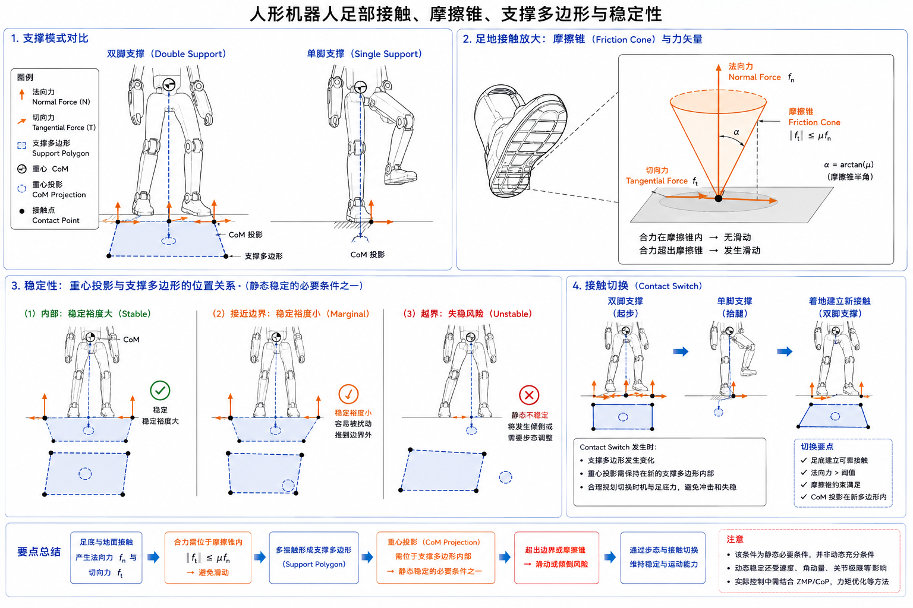

# 2.4 足部、接触与稳定性

## 先看一个现场问题

机器人站在平地上看起来很稳，换到稍微光滑的地面后却开始向前滑；另一台机器人抬起一只脚时，支撑脚边缘的接触点不断变化，躯干越晃越大。算法同学查看关节角和 IMU，发现姿态误差并不算大，却仍然无法解释机器人为什么会倒。

现场通常会这样问：

> “脚已经碰到地面，为什么还会滑？重心投影明明在两脚之间，为什么抬脚后还是站不住？”

足部问题的关键不只是“脚的位置”，而是机器人与地面之间形成了什么样的接触、能传递多大的力和力矩，以及这些接触是否足以约束整机运动。本节把足底几何、接触力、摩擦和支撑域连起来，再说明它们如何影响 G1 的站立、抬腿和落脚。

## 足部与地面接触



图：左侧对比双脚支撑与单脚支撑，中部展示足地接触处的摩擦锥和法向/切向力，右侧说明重心投影接近支撑多边形边界以及接触切换时的稳定风险。该图为教学示意，不代表某一具体 G1 实机传感器布局。

### 接触（Contact）

接触（Contact）是两个物体在边界处发生几何约束并相互施力的状态。机器人足部接触地面时，地面对脚施加接触力；脚也必须满足不穿透地面的几何约束。接触可能是一个点、一条边或一片区域，仿真中通常用若干碰撞几何近似真实鞋底和地面。

接触状态不是永久不变的。摆动脚落地、支撑脚卸载、脚尖离地或脚跟抬起，都会造成接触建立、维持、滑动和脱离的切换。控制器若把“上一时刻接触”当成永远成立，接触丢失时就可能继续施加错误的支撑力矩。

### 法向力与切向力

把地面法线方向记为 `n`，接触力可以分为：

- 法向力（Normal Force, `F_n`）：垂直于接触面，主要承担重力和冲击；
- 切向力（Tangential Force, `F_t`）：平行于接触面，用于抵抗滑动和改变水平动量。

在平面接触的简化模型中，法向力通常要求非负：脚不能“拉住”地面；切向力受摩擦能力限制。接触力的作用点和分布还会产生绕脚部的力矩，这就是为什么足底尺寸和接触区域会影响稳定性。

### 摩擦锥（Friction Cone）

库仑摩擦模型用摩擦系数（Coefficient of Friction, `μ`）约束切向力：

```text
‖F_t‖ ≤ μ F_n,    F_n ≥ 0
```

在二维力空间中，这个可行集合画成摩擦锥（Friction Cone）。如果期望切向力超出摩擦锥，脚就会滑动；增大法向载荷可以提高可用切向力，但不能无限增加，因为结构、执行器、地面承载和接触冲击都有上限。[1][2]

真实地面不是一个固定的 `μ`。灰尘、水分、地毯、金属板、坡度、鞋底材料和法向载荷都会改变摩擦条件。仿真中若采用单一摩擦系数，只能代表指定场景的近似，不能直接推断所有实地面。

## 支撑域与稳定性

### 支撑多边形（Support Polygon）

支撑多边形（Support Polygon）是所有当前承载接触点在地面平面上的凸包。双脚平稳着地时，左右脚接触区域共同形成一个较大的支撑域；单脚站立时，支撑域缩小到单只脚的接触区域。脚掌越大、两脚间距越合理，静态姿态通常拥有更大的几何裕量。

如果把整机重心（Center of Mass, CoM）在地面上的投影记为 `p_CoM`，静态近似下通常要求：

```text
p_CoM ∈ Support Polygon
```

这只是低速、近似静态的必要条件之一。机器人加速、减速、受到外力或发生接触切换时，还要考虑惯性力矩、地面反力分布和摩擦约束；不能把“重心投影在多边形内”当成所有动态情况下的充分稳定条件。[1][3]

### 单脚与双脚支撑

双脚支撑（Double Support）提供更大的接触冗余，适合站立、起步和落脚后的稳定过渡；单脚支撑（Single Support）只有一只脚承受主要地面反力，摆动腿的运动会把惯性和反作用力传回支撑腿。抬脚不只是“把一条腿离开地面”，还会改变支撑域、质心轨迹、关节力矩和允许的水平加速度。

接触切换时，规划器和控制器需要协调：摆动脚应在预计接触时刻具有合适的高度、速度和姿态；支撑脚不能同时因法向力降到零而失去约束。落脚冲击过大时，足部、踝关节和上游连杆会承受瞬时载荷，结构与传动限幅也必须参与约束。

### 稳定裕量（Stability Margin）

稳定裕量（Stability Margin）可以用重心投影到支撑多边形边界的最小距离等方式衡量。裕量小意味着轻微扰动、建模误差或接触位置变化就可能让投影越界。不同算法可能使用几何裕量、力矩裕量或基于可行接触力集合的指标，使用时要说明具体定义。

## 足部几何、刚度与碰撞模型

足底尺寸、材料和结构刚度影响接触面积、压力分布、冲击响应和可承受的切向力。真实鞋底可能发生压缩和局部翘曲；刚体仿真通常把足部视为刚性几何，再用接触刚度、阻尼和摩擦参数近似碰撞过程。两者在落脚时间、峰值冲击力和脚底滚转行为上可能存在明显差异。

碰撞模型（Collision Model）不一定等于显示模型（Visual Model）。显示网格可以很细，碰撞几何却可能采用简化网格、盒体、球体或多个几何体组合，以提高求解稳定性。碰撞几何过粗会让脚“提前碰地”或“穿过”台阶；过细则可能增加计算量并引入不必要的接触点。

## 参考资料

[1] Pratt, J., Carff, J., Drakunov, S., & Goswami, A. “Capture Point: A Step toward Humanoid Push Recovery.” *2006 IEEE-RAS International Conference on Humanoid Robots*, 2006. 双足稳定、质心与支撑关系论文。

[2] Murray, R. M., Li, Z., & Sastry, S. S. *A Mathematical Introduction to Robotic Manipulation*. CRC Press, 1994. 接触、摩擦约束和机器人操作数学教材。

[3] Kajita, S., Hirukawa, H., Harada, K., & Yokoi, K. *Introduction to Humanoid Robotics*. Springer, 2014. 双足支撑、ZMP、地面反力和人形机器人平衡专著。<https://doi.org/10.1007/978-3-642-54536-8>

[4] Unitree Robotics. *unitree_rl_gym: G1 robot description*. 官方开源 G1 URDF/MJCF 与网格资料；本文使用提交 `276801e46c5d433564f24658bac64f254b7d2d4b`，用于核对踝部 link、碰撞几何、腰部模型和仿真接触表示。<https://github.com/unitreerobotics/unitree_rl_gym/tree/276801e46c5d433564f24658bac64f254b7d2d4b/resources/robots/g1_description>
