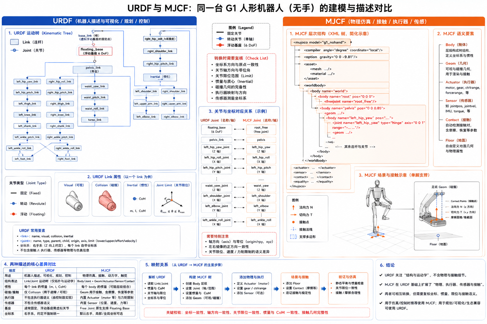

# 2.5 机器人描述文件

## 先看一个现场问题

同一台 G1 被加载到两个工具里，画面都能显示机器人，但一个工具的膝关节方向反了，另一个工具的碰撞检查又完全没有反应。继续排查后发现：显示网格加载成功，并不代表关节轴线、碰撞几何、质量属性和执行器都被正确解释。

现场通常会这样问：

> “URDF 和 MJCF 都是在描述机器人，为什么同一个模型在不同仿真器里的自由度、接触和控制接口不一样？”

机器人描述文件（Robot Description File）是机械结构、坐标关系、质量属性和仿真/控制接口之间的机器可读契约。它不是 CAD 装配文件，也不是完整的真实硬件规格书。文件中的每个字段都要结合格式、解析器和具体模型版本理解。

## URDF：用 Link 和 Joint 组织运动树

### Link、Joint 与树结构

URDF（Unified Robot Description Format）用 `link` 描述刚体，用 `joint` 描述父子 link 之间的运动关系。多个 link 和 joint 组成一棵从根部向末端展开的运动树（Kinematic Tree）。标准 URDF 的基本结构是树，而不是带闭环约束的任意机构图；四连杆等闭环机构通常需要额外插件、约束或转换后的近似模型。[1]

在 G1 URDF 中，`pelvis` 是主要根部 link，下方连接腿部，躯干再连接腰部、头部和双臂。每个关节通常包含：

- `parent` / `child`：父子 link；
- `origin`：关节相对父 link 的位姿；
- `axis`：运动轴线；
- `type`：`revolute`、`continuous`、`prismatic`、`fixed` 等运动类型；
- `limit`：位置、速度和力矩等限制。

### Visual、Collision 与 Inertial

一个 link 往往同时包含三套几何/物理信息：

- `visual`：用于显示的网格、颜色和材质；
- `collision`：用于碰撞检测的几何，通常比显示网格更简化；
- `inertial`：质量、质心和转动惯量。

三者可以不同。显示网格很精细，不代表碰撞网格同样精细；有碰撞几何，也不代表文件中包含真实接触力传感器。`inertial` 只表达刚体质量属性，不表达材料屈服强度、齿轮回差、结构柔性或电池热模型。[1][2]

## MJCF：把仿真世界、执行器和传感器一起写入

### Body、Joint 与 Geom

MJCF（MuJoCo XML Format）以嵌套的 `body` 组织刚体层级，在 body 内放置 `joint`、`geom`、`site` 和 `inertial`。与 URDF 的树结构类似，嵌套 body 直接表达父子关系；但 MJCF 还把场景、材质、接触、执行器和传感器纳入同一份 XML。[2]

常见元素可以这样理解：

- `body`：刚体层级、位姿和惯性；
- `joint`：关节类型、轴线、范围和自由度；
- `geom`：显示或碰撞几何，也可附带接触属性；
- `actuator` / `motor`：把控制输入映射到关节或自由度；
- `sensor`：定义 IMU、关节、接触等仿真传感器；
- `contact`：接触排除、接触对或接触参数；
- `equality`：等式约束和耦合关系。

同名的 `joint` 在 URDF 和 MJCF 中不表示字段完全一一对应。URDF 的 `effort` 是关节限制字段，MJCF 的 `actuatorfrcrange` 是执行器力/力矩范围；二者都需要结合加载器和单位约定解释。

### 自由基座和广义坐标

当前 G1 MJCF 在 `pelvis` body 下显式放置了：

```xml
<joint name="floating_base_joint" type="free" limited="false" actuatorfrclimited="false"/>
```

这表示 MuJoCo 模型包含一个不受关节限位的自由基座，通常对应浮动基座的平移和旋转自由度。随后才是髋、膝、踝、腰、肩、肘和腕等关节。仿真状态中的 `qpos`/`qvel` 长度因此不等于“电机数量”；自由基座、可动关节和传感器状态要分别统计。

## URDF 与 MJCF 的分工差异



图：左侧以 URDF 的运动树和 link 属性为主，右侧以 MJCF 的 body、geom、actuator、sensor 和接触场景为主；中间强调格式转换时需要复核的坐标、惯性、限位和碰撞字段。图中 `floating_base`、`root_free` 等名称是概念示例，实际 G1 文件的根部配置应以本目录对应 URDF/MJCF 内容为准。

| 比较项 | URDF | MJCF |
| --- | --- | --- |
| 主要定位 | 机器人运动树和 ROS 工具之间的描述接口 | MuJoCo 仿真模型与场景配置 |
| 几何 | `visual`、`collision` | `geom`、`asset/mesh` |
| 惯性 | `inertial` | `inertial` |
| 执行器 | 通常由控制器或插件另行配置 | XML 内可直接定义 `actuator` |
| 传感器 | 通常由 ROS 2 节点/插件提供 | XML 内可直接定义 `sensor` |
| 接触 | 基础碰撞几何，具体行为依赖引擎 | `geom`、接触参数和场景一体化 |
| 闭环约束 | 基本树结构，需额外扩展 | 可用约束元素表达更多仿真关系 |
| 场景地面与灯光 | 通常不在 URDF 本体内 | 可直接写入同一 MJCF |

两种格式不是“谁更真实”的关系。URDF 适合作为 ROS 生态中的机器人结构接口；MJCF 适合把 MuJoCo 的动力学、接触、执行器和场景配置放在一起。将 URDF 转换为 MJCF 时，必须重新检查关节轴线、惯性、碰撞几何、执行器、接触和自由基座，不能只确认 XML 能被解析。

## G1 文件之间如何对应

当前目录保留三组主要 G1 变体：

| 模型 | URDF | MJCF | 可动关节 | 主要用途 |
| --- | --- | --- | ---: | --- |
| 无手、腰部可动 | `g1_29dof.urdf` | `g1_29dof.xml` | 29 | 系统、机械、动力学与控制基础 |
| 无手、锁腰 | `g1_29dof_lock_waist.urdf` | `g1_29dof_lock_waist.xml` | 27 | 隔离腿部或减少腰部变量 |
| 带手、腰部可动 | `g1_29dof_with_hand.urdf` | `g1_29dof_with_hand.xml` | 43 | 双臂操作、手部与 VLA 示例 |

这里的可动关节数不包含 MJCF 的 `free` 浮动基座，也不把固定关节算作 DoF。带手模型增加的是手指 revolute joint；锁腰模型把腰部 roll/pitch 关节改为 fixed，但文件仍可能保留相应 link 层级。

## 参考资料

[1] Open Robotics. *URDF Documentation*. ROS 2 官方文档，机器人模型、Link、Joint、Visual、Collision 和 Inertial 说明。<https://docs.ros.org/en/humble/Tutorials/Intermediate/URDF/URDF-Main.html>

[2] MuJoCo Documentation. *XML Reference*. MuJoCo 官方文档，Body、Joint、Geom、Actuator、Sensor、Contact 和 Equality 说明。<https://mujoco.readthedocs.io/en/stable/XMLreference.html>

[3] Unitree Robotics. *unitree_rl_gym: G1 robot description*. 官方开源 G1 URDF/MJCF、网格和模型变体资料；本文使用提交 `276801e46c5d433564f24658bac64f254b7d2d4b`。<https://github.com/unitreerobotics/unitree_rl_gym/tree/276801e46c5d433564f24658bac64f254b7d2d4b/resources/robots/g1_description>

[4] Unitree Robotics. *unitree_sdk2: Unitree robot SDK version 2*. 官方 SDK，用于核对 G1 关节索引和接口边界；本文使用提交 `9754cd153af3da471b0fe5f3aa535e426fb11db3`。<https://github.com/unitreerobotics/unitree_sdk2/tree/9754cd153af3da471b0fe5f3aa535e426fb11db3>
