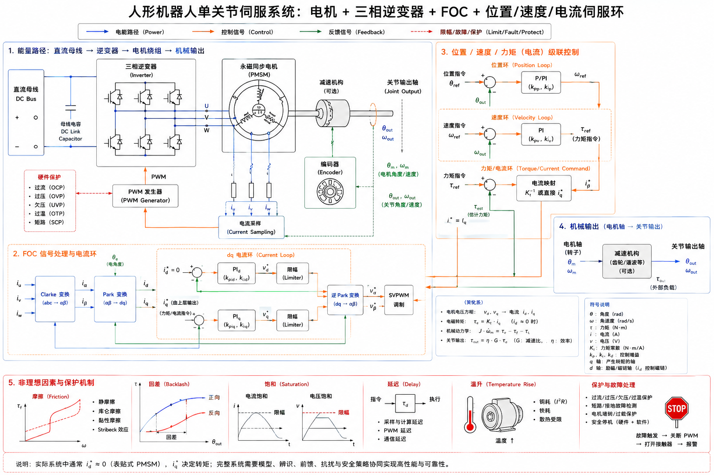

# 3.2 电机、驱动器与伺服控制

## 先看一个现场问题

G1 的某个关节在低速跟踪时出现“先不动、突然窜一下”的现象；提高位置增益后，静止误差变小，换向时却出现更明显的抖动。检查发现，电机驱动器已经受到目标位置和速度指令，电流环、编码器反馈、摩擦、饱和与温升共同决定了输出是否能按预期建立。

现场通常会这样问：

> “控制器给的是角度，驱动器为什么还要处理电流？`kp`、`kd`、`tau` 到底落在哪一层？”

伺服系统（Servo System）把目标位置、速度或力矩转换成电机绕组中的电流，再通过电磁转矩和机械传动产生关节输出。电机本体、三相逆变器、采样电路、编码器和多级控制环共同决定跟踪精度、响应速度、热负荷和故障行为。

图：左侧展示直流母线、三相逆变器、PMSM、编码器和关节输出，底部展开 Clarke/Park 变换与 $dq$ 电流环，右侧展示位置环、速度环和力矩/电流环的级联关系。图中的减速机构、参数和保护阈值属于教学示意，实际 G1 驱动器内部实现应以硬件资料为准。

## 电机把电流变成力矩

### 无刷直流电机与永磁同步电机

无刷直流电机（Brushless DC Motor, BLDC）使用电子换相代替机械电刷；永磁同步电机（Permanent Magnet Synchronous Motor, PMSM）使用转子永磁体和定子旋转磁场产生同步转矩。工程资料中两者的分类和控制方法有交叉，具体反电动势波形、绕组连接、位置传感器和控制策略需要看电机与驱动器规格。[1][2]

在一定工作区间内，电磁转矩通常与绕组电流相关：

$$
\tau_m \approx K_t I
$$

$\tau_m$ 是电机轴转矩，$I$ 是等效转矩电流，$K_t$ 是转矩常数。高速区还受到反电动势和母线电压限制，电机可以达到的转速—转矩范围会随电压、温度和电流上限变化。

### 伺服电机（Servo Motor）

伺服电机（Servo Motor）强调闭环控制能力。一个完整伺服轴通常具备位置或速度反馈、驱动器、电流控制和保护逻辑。电机“能转”只说明能量转换链路建立，伺服系统还要验证反馈方向、采样延迟、控制带宽、限流和异常状态。

## 三相逆变器与 PWM

### 逆变器（Inverter）

三相逆变器（Three-phase Inverter）由功率开关、续流路径、栅极驱动和母线电容组成，把直流母线电压转换为三相绕组所需的脉冲电压。功率开关的导通和关断由 PWM（Pulse-width Modulation，脉宽调制）控制；占空比改变绕组平均电压，电机电感和反电动势共同决定电流波形。

驱动器需要测量相电流或母线电流，监控母线电压、功率器件温度和故障状态。采样时刻与 PWM 同步关系会影响电流估计；采样偏置、量化误差和死区补偿会直接反映到低速转矩纹波。

### 换相与位置反馈

BLDC/PMSM 需要知道转子磁场位置。反馈来源可以是编码器、霍尔传感器或无位置传感器估计。位置方向、零位偏置和电角度极对数任一项不一致，都可能导致电流方向错误、转矩下降甚至反向加速。

## Clarke/Park 变换与 FOC

### 三相量变到两相量

Clarke 变换（Clarke Transform）把三相电流 $i_a$、$i_b$、$i_c$ 投影到静止的正交坐标系 $\alpha\beta$；Park 变换（Park Transform）再把 $\alpha\beta$ 坐标旋转到随转子磁场运动的 $dq$ 坐标系。这样，交流电流调节可以转化为两个近似直流量的控制问题。[1][2]

场定向控制（Field-oriented Control, FOC）通常把：

- $i_d$：与磁链方向相关的分量；
- $i_q$：主要产生电磁转矩的分量。

在表贴式永磁同步电机的简化工况下，常把 $i_q$ 作为主要转矩调节量；弱磁、高速运行和磁阻转矩明显时，需要使用更完整的电机模型。$dq$ 轴的正方向、零位和符号必须与驱动器实现一致，不能从变量名字推断具体约定。

## 三层伺服控制环

### 电流环（Current Loop）

电流环处于最内层，目标是让实测相电流或 $i_d/i_q$ 跟随给定值。它通常运行得最快，需要处理 PWM、采样同步、限流和解耦补偿。电流环输出电压指令，再交给逆变器生成 PWM。

### 速度环（Velocity Loop）

速度环根据目标速度与反馈速度的误差生成转矩电流或力矩指令。速度反馈常由编码器差分、观测器或驱动器内部估计得到；低速时量化噪声、摩擦和采样延迟更容易暴露。

### 位置环（Position Loop）

位置环根据目标角度与反馈角度的误差生成速度或力矩目标。最常见的比例—微分形式可以写成：

$$
\tau_{\mathrm{cmd}} = K_p (q^* - q) + K_d (\dot{q}^* - \dot{q}) + \tau_{\mathrm{ff}}
$$

$q^*$、$\dot{q}^*$ 是目标位置和速度，$q$、$\dot{q}$ 是反馈位置和速度，$K_p$、$K_d$ 是位置/速度误差增益，$\tau_{\mathrm{ff}}$ 是前馈力矩。这个表达式描述接口层控制结构，实际驱动器可能还有电流限幅、摩擦补偿、滤波、重力补偿和内部级联环。[3]

### 前馈与力矩控制

前馈（Feedforward）根据重力、惯性、摩擦或期望加速度提前提供一部分力矩，减少反馈环需要纠正的误差。力矩控制（Torque Control）直接指定期望输出力矩或电流，要求驱动器、传感器标定、传动效率和安全限幅足够可靠。位置环、速度环和力矩环可以由不同控制器承担，消息字段名不能单独说明控制环实际运行在哪里。

## 饱和、死区、摩擦与延迟

### 饱和（Saturation）

饱和（Saturation）发生在指令超过驱动器、电机、电源或机械允许范围时。限幅后的输出与理想控制律不同，积分器还可能继续累积误差，形成积分饱和（Integrator Windup）。控制器应在位置、速度、电流和力矩多个层级进行限幅，并处理限幅后的反馈与恢复。

### 死区与摩擦

电机和减速器的静摩擦、回差、齿隙及 PWM 死区会让小指令无法立即产生输出。低速换向时，指令可能先用于克服静摩擦，随后突然进入滑动状态，形成“卡住—窜动”的观感。补偿模型要经过实机辨识，过度补偿会放大噪声和冲击。

### 延迟与编码器误差

传感器采样、总线传输、计算、PWM 更新和机械响应都会引入延迟。延迟增大后，反馈信息对应的是更早的状态，较高的增益可能降低相位裕量。编码器零位、方向、分辨率、丢计数和安装偏心还会造成静态偏差与周期误差。

## 温升与降额

绕组电阻、电流平方和逆变器开关损耗共同产生热量；减速器、轴承和密封也会把机械损耗转为热。温度升高会改变电阻、磁性能、润滑状态和传感器误差，驱动器可能进入降额（Derating）、限流或保护停机状态。[1][2]

评估关节伺服性能时，应同时记录目标/反馈位置和速度、力矩或电流、母线电压、温度、限幅状态与故障码。只看位置误差曲线，无法区分摩擦、饱和、供电不足、编码器问题和结构变形。

## 用 G1 接口理解控制字段

### `MotorCmd_` 的目标字段

Unitree SDK2 的 `MotorCmd_` 消息包含 `mode`、`q`、`dq`、`tau`、`kp` 和 `kd` 等字段。它们可分别理解为电机控制模式、目标位置、目标速度、前馈力矩以及位置/速度反馈增益；具体单位、可用范围和字段是否被目标固件采用，应以对应 SDK 版本和机器人模式为准。[4]

在低层控制链路中，算法层可能先计算期望关节目标，再由 `MotorCmd_` 封装下发。消息字段存在不代表所有控制环都开放给用户，也不代表 `tau` 一定等于输出轴实测力矩。减速器效率、摩擦、回差、限幅和驱动器内部环路仍会影响最终关节响应。

### `MotorState_` 的反馈字段

`MotorState_` 提供 `q`、`dq`、`ddq`、`tau_est`、温度、电压和状态码等状态信息。`tau_est` 属于估计值，可能来自电流、模型或驱动器内部观测；使用它做力控制、接触检测或安全判断前，需要核对标定、滤波、更新频率和故障语义。[4]

## 参考资料

[1] Krishnan, R. *Permanent Magnet Synchronous and Brushless DC Motor Drives*. CRC Press, 2010. PMSM/BLDC、电磁转矩、逆变器和驱动控制教材。

[2] Vas, P. *Sensorless Vector and Direct Torque Control*. Oxford University Press, 1998. Clarke/Park 变换、FOC、电流环和无位置传感器控制专著。

[3] Åström, K. J., & Murray, R. M. *Feedback Systems: An Introduction for Scientists and Engineers*. Princeton University Press, 2008. 反馈、延迟、饱和和控制环基础教材。<https://www.cds.caltech.edu/~murray/books/AM08/>

[4] Unitree Robotics. *unitree_sdk2: Unitree robot SDK version 2*. 官方 SDK2 消息定义；本文使用提交 `9754cd153af3da471b0fe5f3aa535e426fb11db3`，用于核对 `MotorCmd_` 与 `MotorState_` 字段。<https://github.com/unitreerobotics/unitree_sdk2/tree/9754cd153af3da471b0fe5f3aa535e426fb11db3/include/unitree/idl/hg>

[5] Unitree Robotics. *unitree_rl_gym: G1 robot description*. 官方 G1 URDF/MJCF 模型；本文使用提交 `276801e46c5d433564f24658bac64f254b7d2d4b`，用于核对 actuator 挂接和 `effort`/`actuatorfrcrange` 模型边界。<https://github.com/unitreerobotics/unitree_rl_gym/tree/276801e46c5d433564f24658bac64f254b7d2d4b/resources/robots/g1_description>
