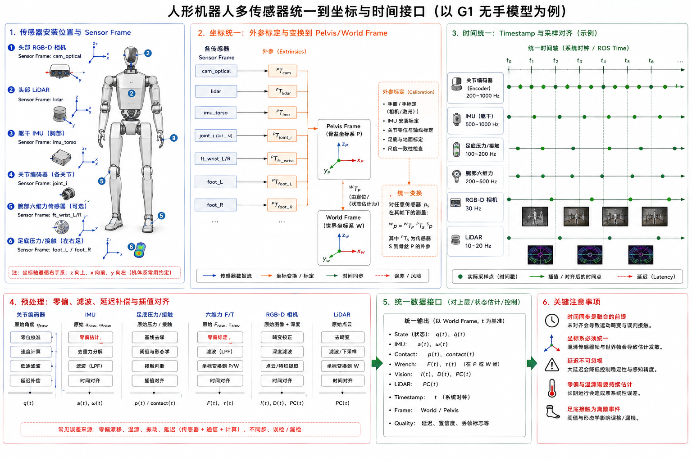

# 3.3 传感器与数据采集

## 先看一个现场问题

机器人站立时，关节角度看起来平稳，IMU 却显示躯干在缓慢旋转；把 IMU 数据直接积分后，位置估计很快漂移。另一组同样的传感器数据送入控制器时，足底接触判断比真实落脚晚了几帧，导致支撑腿已经接触地面，算法仍把它当成摆动腿。

现场通常会这样问：

> “传感器都在输出数据，为什么姿态、接触和时间还是对不上？编码器、IMU 和足底压力应该怎样放到同一套坐标和时间轴里？”

传感器系统（Sensor System）负责把关节、机身、接触和环境中的物理量转换成可计算的数据。数据采集的难点集中在四个接口：测量对象、坐标系、时间戳和误差模型。任何一个接口没有对齐，状态估计和控制器都会把系统性偏差当成机器人真实运动。

## 编码器：关节角度和速度

图：左侧展示 G1 无手模型上的相机、激光雷达、IMU、关节编码器、腕部力传感器和足底压力/接触传感器位置，中部统一到骨盆/世界坐标系，右侧对齐不同采样频率和时间戳。图中的腕部力传感器与足底压力属于可选/概念化配置，不能作为当前 G1 实机传感器清单。

### 绝对式与增量式编码器

绝对式编码器（Absolute Encoder）在上电后可以直接给出当前位置，通常不需要先寻找零点；增量式编码器（Incremental Encoder）输出脉冲或计数增量，需要通过计数和回零建立角度。两者都需要明确分辨率、方向、零位偏置、多圈处理和通信更新率。[1][2]

编码器读数通常写成：

$$
q = q_{\mathrm{raw}} \times \mathrm{scale} + q_{\mathrm{offset}}
$$

$q_{\mathrm{raw}}$ 是原始计数，$\mathrm{scale}$ 是计数到弧度的比例，$q_{\mathrm{offset}}$ 是机械装配零位与模型零位之间的偏置。速度 $\dot{q}$ 常由相邻角度差分得到，但差分会放大量化噪声，实际系统需要滤波、观测器或驱动器内部速度估计。

### 编码器误差

零位偏置、方向接反、丢计数、齿槽周期误差、安装偏心、通信延迟和温度漂移都会影响关节状态。一个“角度值看起来合理”的编码器仍可能存在固定偏差；验证时应将读数与机械限位、标定姿态和外部测量交叉核对。

## IMU：角速度、加速度与姿态

### 惯性测量单元（Inertial Measurement Unit, IMU）

惯性测量单元（IMU）通常包含陀螺仪（Gyroscope）和加速度计（Accelerometer），有些设备还包含磁力计。陀螺仪测量角速度，加速度计测量比力（Specific Force），其中包含运动加速度和重力影响。姿态估计需要处理零偏、噪声、坐标变换和积分漂移。[2][3]

短时间内可以用角速度积分估计姿态变化：

$$
\boldsymbol{R}_{k+1} \approx \boldsymbol{R}_k \mathrm{Exp}([\boldsymbol{\omega}_k \Delta t]_\times)
$$

$\boldsymbol{R}$ 是姿态旋转矩阵，$\boldsymbol{\omega}$ 是传感器坐标系中的角速度，$\Delta t$ 是采样间隔，$\mathrm{Exp}$ 表示旋转指数映射，$[\cdot]_\times$ 是叉乘矩阵。长时间积分会受到陀螺仪零偏影响，因此通常要结合重力方向、足底接触或其他外部观测进行校正。

### IMU 安装与坐标变换

IMU 输出位于传感器坐标系（Sensor Frame）。控制器使用躯干、骨盆或世界坐标系时，需要应用外参变换：安装位置、轴方向和固定旋转必须经过标定。坐标轴交换、左右手系混用或角速度单位错误，会表现为姿态方向相反、重力补偿错误和足底接触判断异常。

## 力、压力与接触

### 六维力/力矩传感器

六维力/力矩传感器（Force/Torque Sensor, F/T Sensor）测量三轴力和三轴力矩，常用于脚踝、腕部或末端执行器。传感器输出需要进行零偏、坐标旋转、工具中心点和载荷补偿；传感器额定量程、过载能力、采样频率和滤波也会影响接触控制。

### 六维力/力矩传感器的常见安装形式

六维力/力矩传感器通常采用法兰串联安装（Inline Flange Mount）：传感器一侧固定在关节输出法兰、腕部或踝部，另一侧连接连杆、工具或足部结构。这样，末端受到的外力和力矩会完整经过传感器本体，便于测量末端交互负载。安装时需要保证法兰平面、螺栓预紧、传感器坐标轴和工具中心点定义一致。

常见布置包括：

- **腕部安装**：位于前臂末端与夹爪/灵巧手之间，用于测量抓取、接触和碰撞力；
- **踝部安装**：位于小腿末端与足部之间，用于测量足地三轴力、力矩和接触状态；
- **基座或外部工装安装**：位于机械臂基座、支撑平台或测试台，用于测量整机反作用力。

传感器需要承受目标方向的载荷，同时避免线缆拖拽、偏心安装和结构件局部变形把额外力矩带入测量结果。量程、过载保护和安装刚度应按最坏工况选择。

### 足底压力传感器

足底压力传感器（Foot Pressure Sensor）通过多个压力单元估计足底载荷分布、接触区域和压力中心（Center of Pressure, CoP）。单个压力点只能提供局部信息，完整接触判断需要结合多个点、关节状态和 IMU。压力传感器的零点会随温度、鞋底材料和长期载荷变化，需要定期校准。

### 足底压力传感器的常见安装形式

足底压力传感器常见三种安装形式：

- **鞋垫式阵列（Instrumented Insole）**：把薄膜压力单元或柔性传感器铺在鞋垫/脚掌接触面下方，能够获取前掌、后跟和足弓区域的压力分布，适合穿戴式测量；
- **足底板嵌入式（Instrumented Sole Plate）**：在刚性足底板上嵌入多个压力单元或小型力传感器，结构稳定、量程较高，便于和足部碰撞几何结合；
- **多点支撑式（Multi-point Load Cells）**：在足底前后左右布置若干独立载荷点，通过各点法向力估计合力和压力中心，结构简单但空间分辨率取决于点数和布置。

安装形式会影响测量对象：鞋垫更接近脚掌局部压力，足底板和多点载荷结构更接近足部整体受力。足底材料的压缩、传感器厚度、保护层和固定方式也会改变压力分布与响应时间。行业常见安装形式只能帮助理解设计选项，不能据此判断某个 G1 版本是否配备足底压力阵列。

### 接触状态

接触状态（Contact State）通常包括接触/离地、接触点、法向载荷、切向载荷和滑动风险。它可以由足底压力、六维力、关节电流、动力学残差或仿真接触结果推断。不同来源的延迟和置信度不同，状态估计应保留时间戳和来源标识，避免把估计值误当成直接测量。

## 电流、温度与环境传感器

驱动器常提供相电流、母线电压、绕组或壳体温度和故障状态。电流可用于估计电机力矩、检测堵转和评估功耗；温度可用于降额和寿命管理。电流到力矩的映射依赖电机转矩常数、驱动器标定、传动效率和摩擦，`tau_est` 需要明确其估计模型和单位。

RGB、深度、双目、鱼眼和激光雷达属于环境传感器。它们需要内参（焦距、主点、畸变）、外参（相对机身的位姿）、时间戳和数据同步。图像或点云即使像素/点坐标正确，坐标系和时间对不齐也会导致目标位姿、障碍物位置和抓取规划错误。

## 采样、时间戳与同步

### 采样率和时间戳

每个传感器都有采样率（Sampling Rate）和时间戳（Timestamp）。控制器需要知道数据采集时刻，而不只知道消息到达时刻。网络传输、线程调度、驱动缓冲和序列化都会造成到达延迟与抖动（Jitter）。

### 同步与插值

关节、IMU、足底压力和相机数据往往使用不同频率。状态估计可以按照统一时间轴对数据进行重采样或插值：

$$
x(t) \approx \mathrm{Interpolate}(x_k, x_{k+1}, t)
$$

插值应尊重数据类型：角度需要处理周期性，姿态需要使用旋转或四元数插值，接触状态通常采用离散逻辑与时间窗。把不同时间点的数据直接拼成一帧，会制造虚假的姿态和接触关系。

### 延迟标定

端到端延迟应拆成传感器内部、驱动读取、通信、计算和控制输出几个部分。可以通过硬件触发、时间戳对比或已知运动事件估计延迟，并把延迟纳入状态估计和控制器设计。

## 参考资料

[1] ISO 6487:2015. *Road vehicles — Measurement techniques in impact tests — Instrumentation*. 传感器采样、滤波、量程和数据质量参考标准。<https://www.iso.org/standard/63422.html>

[2] Titterton, D., & Weston, J. *Strapdown Inertial Navigation Technology*, 2nd ed. IET, 2004. IMU、陀螺仪、加速度计、零偏和姿态估计专著。

[3] Crassidis, J. L., & Junkins, J. L. *Optimal Estimation of Dynamic Systems*. CRC Press, 2004. 状态估计、传感器融合、噪声和时间更新教材。

[4] Unitree Robotics. *unitree_sdk2: Unitree robot SDK version 2*. 官方 SDK2 消息定义；本文使用提交 `9754cd153af3da471b0fe5f3aa535e426fb11db3`，用于核对 `MotorState_`、`IMUState_` 和 `PressSensorState_` 类型。<https://github.com/unitreerobotics/unitree_sdk2/tree/9754cd153af3da471b0fe5f3aa535e426fb11db3/include/unitree/idl/hg>

[5] Unitree Robotics. *unitree_rl_gym: G1 robot description*. 官方 G1 URDF/MJCF 模型；本文使用提交 `276801e46c5d433564f24658bac64f254b7d2d4b`，用于核对 IMU site、仿真传感器和 `d435_link`/`mid360_link` 接口。<https://github.com/unitreerobotics/unitree_rl_gym/tree/276801e46c5d433564f24658bac64f254b7d2d4b/resources/robots/g1_description>
