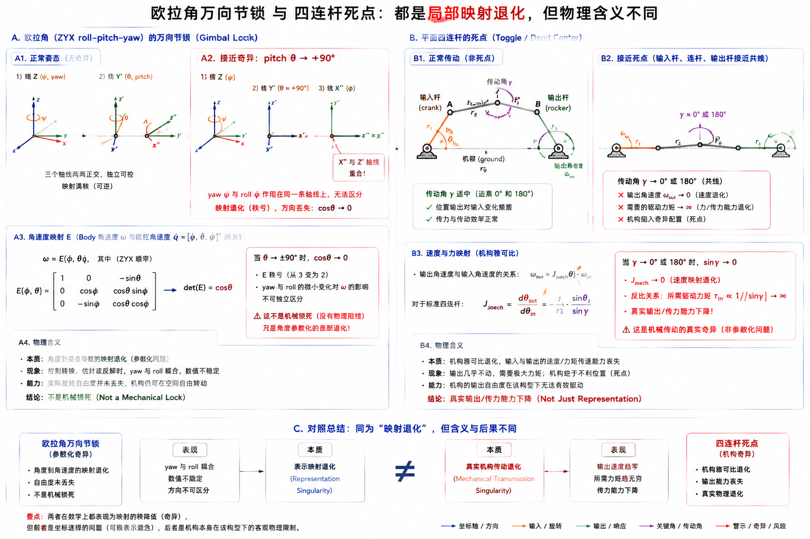

# 4.1 机器人数学基础

## 先看一个现场问题

仿真中的 G1 明明只需要把左脚向前移动 10 cm，程序算出的目标却让脚向侧面运动；另一段代码把 IMU 四元数传给可视化工具后，机器人躯干突然翻转了 180°。数值没有越界，矩阵维度也能相乘，但结果就是不对。

现场通常会这样问：

> “这个位置到底是相对世界、骨盆还是左脚？旋转矩阵乘在左边还是右边？四元数是 `wxyz` 还是 `xyzw`？为什么同一个姿态换一种欧拉角写法就不一样了？”

机器人数学的作用在于为“方向、位置、速度和力属于哪个坐标系，以及它们如何转换”建立统一语言。向量和矩阵负责组织数值，旋转表示负责描述方向，齐次变换负责把旋转和平移放进同一个坐标变换。只要坐标系、单位、乘法方向或分量顺序有一项没有写清楚，形式正确的计算也可能产生完全错误的机器人动作。[1][2]

## 向量：一组带语义和坐标系的数

### 向量（Vector）

向量可以表示位置、位移、速度、角速度、力或力矩。例如：

$$
\begin{aligned}
\boldsymbol{p} &= [0.30,\ 0.10,\ 0.80]^\top \ \text{m} \\
\boldsymbol{v} &= [0.20,\ 0.00,\ 0.00]^\top \ \text{m/s} \\
\boldsymbol{F} &= [0.00,\ 0.00,\ 150.0]^\top \ \text{N}
\end{aligned}
$$

三个数本身不够，还必须说明它们的物理含义和表达坐标系。$[0.20,\ 0,\ 0]$ 在世界坐标系中可能表示向场地前方运动，在一个旋转了 90° 的骨盆坐标系中却可能对应世界侧向。更完整的写法是 ${}^{W}\boldsymbol{p}_F$：点 $F$ 的位置，用世界坐标系 $W$ 表达。

位置和方向虽然都常用三维数组存储，但不能随意相加。两个点相减得到位移；速度与时间相乘得到位移；力和位置直接相加则没有物理意义。接口设计应同时固定字段语义、坐标系、单位和时间戳。

### 范数（Norm）

范数用于衡量向量大小。三维向量最常用二范数：

$$
\lVert \boldsymbol{v} \rVert_2 = \sqrt{v_x^2 + v_y^2 + v_z^2}
$$

它可以表示速度大小、位置误差距离或力的合力大小。范数会丢失方向，因此“误差范数变小”不等于每个轴的误差都按期望方式变化。工程中还要明确是否对不同量纲做了归一化；位置误差的米、角度误差的弧度和力误差的牛顿不能在没有权重的情况下直接放进同一个范数比较。

### 内积、外积与叉乘

内积（Dot Product / Inner Product）把两个等长向量映射成一个标量：

$$
\boldsymbol{a} \cdot \boldsymbol{b} = \lVert \boldsymbol{a} \rVert \, \lVert \boldsymbol{b} \rVert \cos\theta
$$

它可以判断两个方向是否对齐：结果为正表示夹角小于 90°，为零表示正交，为负表示大致相反。投影、功率 $P = \boldsymbol{F} \cdot \boldsymbol{v}$ 和关节功率 $P = \boldsymbol{\tau} \cdot \dot{\boldsymbol{q}}$ 都会用到内积。

外积（Outer Product）把两个列向量变成矩阵：

$$
\boldsymbol{a}\boldsymbol{b}^\top
$$

它常出现在协方差、惯性矩阵和最小二乘推导中。叉乘（Cross Product）只针对三维向量，结果仍是向量：

$$
\boldsymbol{a} \times \boldsymbol{b}
$$

叉乘结果垂直于 $\boldsymbol{a}$ 和 $\boldsymbol{b}$，方向由右手定则决定。力矩 $\boldsymbol{\tau} = \boldsymbol{r} \times \boldsymbol{F}$、角速度引起的线速度 $\boldsymbol{v} = \boldsymbol{\omega} \times \boldsymbol{r}$ 都依赖叉乘顺序；交换两个向量会改变符号。[1]

## 矩阵：把多条线性关系放在一起

### 矩阵（Matrix）

矩阵可以表示线性映射、旋转、惯性、协方差或多个方程。例如三维旋转矩阵 $\boldsymbol{R}$ 把一个坐标系中表达的向量转换到另一个坐标系：

$$
\boldsymbol{v}_A = \boldsymbol{R}_{AB} \boldsymbol{v}_B
$$

这里采用的约定是：$\boldsymbol{R}_{AB}$ 把用坐标系 $B$ 表达的向量转换为用坐标系 $A$ 表达。不同教材和库可能使用不同下标、主动/被动旋转或行向量约定，因此代码和文档必须先声明约定，不能只写一个没有上下文的 $\boldsymbol{R}$。

矩阵乘法通常不可交换：

$$
\boldsymbol{R}_{AB} \boldsymbol{R}_{BC} \ne \boldsymbol{R}_{BC} \boldsymbol{R}_{AB}
$$

前者可以沿 $C \to B \to A$ 的坐标链组合；后者不但语义不同，在一般情况下数值也不同。检查一串变换时，可以把相邻下标是否“接得上”作为第一道人工检查。

### 转置与逆

矩阵转置（Transpose）把行列交换，记作 $\boldsymbol{A}^\top$。一般矩阵的逆（Inverse）满足 $\boldsymbol{A}\boldsymbol{A}^{-1} = \boldsymbol{I}$，但不是所有矩阵都可逆。旋转矩阵具有特殊性质：

$$
\begin{aligned}
\boldsymbol{R}^\top \boldsymbol{R} &= \boldsymbol{I} \\
\det(\boldsymbol{R}) &= +1 \\
\boldsymbol{R}^{-1} &= \boldsymbol{R}^\top
\end{aligned}
$$

如果一个所谓的旋转矩阵不再正交，或行列式远离 $+1$，它可能混入了缩放、反射或数值误差。反复积分和插值后，应检查并在必要时重新正交化，而不是默认九个浮点数永远构成合法旋转。

## 姿态的四种常见表示

### 欧拉角（Euler Angles）

欧拉角用三个依次执行的轴向旋转表示姿态，工程中常见 roll、pitch、yaw。它直观、适合显示和人工配置，但必须声明：

- 旋转轴顺序，例如 XYZ 或 ZYX；
- 绕固定轴还是随物体转动的轴；
- 角度单位是弧度还是度；
- 每个角的取值范围和归一化方式。

同一个三元组在不同旋转顺序下会产生不同姿态，同一个姿态也可能对应多组欧拉角。某些姿态会出现万向节锁（Gimbal Lock）：两个旋转轴重合，使三个参数无法独立描述局部旋转。万向节锁是参数化的奇异，不表示真实机器人关节一定被机械锁住。[1][2]

### 万向节锁为什么会发生

以最常见的 ZYX 顺序为例，先绕 $z$ 轴旋转 yaw ($\psi$)，再绕中间轴 $y$ 旋转 pitch ($\theta$)，最后绕随动的 $x$ 轴旋转 roll ($\phi$)：

$$
\boldsymbol{R} = \boldsymbol{R}_z(\psi)\,\boldsymbol{R}_y(\theta)\,\boldsymbol{R}_x(\phi)
$$

这里的“锁”与轴承卡死无关：这组三个角度对三维角速度的局部坐标发生了退化。用 $\boldsymbol{\omega}$ 表示机体坐标系中的角速度，可写成：

$$
\boldsymbol{\omega} = \boldsymbol{E}(\phi, \theta)\,[\dot{\phi},\ \dot{\theta},\ \dot{\psi}]^\top
$$

$$
\boldsymbol{E}(\phi, \theta) =
\begin{bmatrix}
1 & 0 & -\sin\theta \\
0 & \cos\phi & \sin\phi\cos\theta \\
0 & -\sin\phi & \cos\phi\cos\theta
\end{bmatrix}
$$

这个映射矩阵的行列式满足：

$$
\det(\boldsymbol{E}) = \cos\theta
$$

当 $\theta$ 接近 $+\pi/2$ 或 $-\pi/2$ 时，$\cos\theta$ 接近零，$\boldsymbol{E}$ 的条件数迅速变坏；在正好 $\pm\pi/2$ 处，矩阵秩下降。几何上，中间的 pitch 把原本不同的 yaw 轴和 roll 轴转到了同一直线上，因此绕这两个轴的微小旋转无法再被三个独立角度唯一地区分。对于同一个实际姿态，yaw 和 roll 可以出现一组连续的等价组合，而不是各自都有稳定、唯一的数值。

这会在软件中表现为几个容易误判的现象：

- 从旋转矩阵或四元数反解欧拉角时，某个角可能突然跳变接近 $\pi$，另一个角同时补偿；
- 根据欧拉角速度反算角速度时，$\boldsymbol{E}^{-1}$ 中会出现 $\tan\theta$、$\sec\theta$ 一类项，噪声会被放大；
- 控制器可能为了实现一个很小的实际姿态变化，算出很大的 yaw/roll 角速度，随后触发速度限幅、关节限位或轨迹不连续。

这些异常说明“欧拉角坐标不好用”，不说明 G1 的骨盆、躯干或 IMU 真的失去一个物理自由度。旋转矩阵和单位四元数仍然可以连续、唯一地表示（除四元数 $q$ 与 $-q$ 的双重覆盖外）该姿态；奇异的是欧拉角这张局部坐标图。工程上通常采用四元数或旋转矩阵进行状态积分和插值，在控制器内部使用小的局部旋转向量表示姿态误差，并在必须输出 roll-pitch-yaw 时限制工作范围、跨越奇异区域时重新选择表示或显式处理角度连续性。[1][2][3]

对本手册使用的 G1 `g1_29dof` 无手、腰部可动模型，`pelvis` 和 `torso` 是真实刚体坐标系，`imu_in_pelvis`、`imu_in_torso` 是传感器安装坐标系；它们的姿态仍由三维旋转描述。若调试工具把 IMU 的四元数转换成 ZYX roll-pitch-yaw，只应把欧拉角当作显示或配置接口，不能因为显示角跳变就修改 URDF/MJCF 中的关节轴线、骨盆位姿或传感器安装关系。[6][7]

### 与四连杆死点的联系

前文[四连杆机构与死点](../02-mechanics/01-mechanisms-and-dof.mdx#四连杆机构与死点)讨论的是机构约束下的速度映射：输入关节速度经过机构雅可比 $\boldsymbol{J}_{\mathrm{mech}}$ 才能变成输出端速度。接近共线构型时，传动角变差，$\boldsymbol{J}_{\mathrm{mech}}$ 可能接近奇异，导致输出几乎不动、需要很大的输入速度，或越过死点后运动方向改变。万向节锁也可以写成一个局部映射：欧拉角速度经过 $\boldsymbol{E}$ 才变成真实角速度；但这里退化的是姿态参数化，不是机器人刚体或关节的机械传动能力。



图：左侧展示 ZYX 欧拉角在 $\text{pitch} \to \pm 90^\circ$ 时 yaw/roll 轴重合、$\det(\boldsymbol{E}) = \cos\theta$ 趋近于零；右侧展示四连杆传动角接近 $0^\circ$ 或 $180^\circ$ 时输出速度和传力能力退化。两者都可用局部映射的秩下降或条件数恶化描述，但只有右侧是机械传动本身的死点；该图中的四连杆是概念示意，不代表 G1 的真实内部结构。

| 对比项 | 四连杆死点/死区 | 欧拉角万向节锁 |
| --- | --- | --- |
| 退化对象 | 真实机构的输入到输出传动 | 姿态坐标到真实角速度的表示映射 |
| 根本原因 | 连杆几何约束、传动方向接近共线 | 欧拉角旋转轴在特定姿态重合 |
| 真实自由度 | 输出运动和传力能力确实变差 | 刚体姿态仍有 3 个自由度 |
| 典型数值信号 | $\boldsymbol{J}_{\mathrm{mech}}$ 条件数升高、输出速度趋近零 | $\det(\boldsymbol{E}) = \cos\theta$ 接近零、$\boldsymbol{E}^{-1}$ 放大噪声 |
| 工程处理 | 改善杆长/传动角、避开构型、限速限矩 | 换四元数/旋转矩阵、用局部误差、避开欧拉奇异区 |

因此，两者可以用同一个排查问题开头：“哪个局部映射的秩或条件数变坏了？”但后续动作不能混用：四连杆死点需要检查机械设计、接触力和执行器负载；万向节锁需要检查姿态表示、轴顺序和角速度转换。把万向节锁当作机械死点，会错误地更换电机或修改机构；把四连杆死点只当作坐标问题，则可能掩盖真实的卡滞、过载和不可控输出。

### 图片 Prompt：万向节锁与四连杆死点的对照

```text
用途：同时解释欧拉角万向节锁和四连杆死点都属于局部映射退化，但物理含义不同
主体：左右并列两组工程示意。左侧为 ZYX roll-pitch-yaw 三个旋转轴，展示正常姿态和 pitch 接近 +90° 时 yaw/roll 轴重合；右侧为平面四连杆，展示正常传动角和输入杆、连杆、输出杆接近共线的死点
构图：左侧标注 phi、theta、psi、角速度映射 E 以及 cos(theta) 接近 0；右侧标注输入角速度、输出速度变小、传动角、机构雅可比 J_mech 接近奇异。底部用一条对照箭头写“表示映射退化”与“真实机构传动退化”
标注：中文为主，英文术语放在括号中；明确写出“不是机械锁死”和“真实输出/传力能力下降”，避免把两者画成同一种故障
风格：机械与机器人学教材风格，白色背景，黑色线稿，蓝色表示坐标轴，橙色表示旋转或输入，绿色表示输出，少量红色用于警示
比例：16:9，适合 Markdown 页面，所有公式、箭头和文字清晰可读
禁止：不把万向节锁画成轴承卡死，不把四连杆示意伪装成 G1 的真实内部机构，不添加未说明的电机、传感器或复杂背景，不使用透视造成轴线和共线关系误读
```

### 旋转矩阵（Rotation Matrix）

旋转矩阵用 $3 \times 3$ 正交矩阵表达方向。它没有欧拉角的参数奇异，组合和向量变换直接，但用九个数表达三个旋转自由度，并且数值计算后可能偏离正交约束。

旋转矩阵既可以被解释为“主动旋转一个向量”，也可以被解释为“同一几何向量在两个坐标系之间换表达”。两种解释可以使用相同数值，却对应不同叙述和乘法方向。机器人软件中更稳妥的做法，是始终写出源坐标系和目标坐标系。

### 轴角（Axis-Angle）与旋转向量

轴角用单位轴 $\boldsymbol{u}$ 和旋转角 $\theta$ 表示姿态。把二者合成 $\boldsymbol{\phi} = \theta \boldsymbol{u}$ 后得到旋转向量（Rotation Vector）。它与旋转矩阵之间可以通过指数映射和 Rodrigues 公式转换，适合表示小姿态误差和优化变量。[1]

当 $\theta$ 很小时，旋转向量近似等于三个轴上的微小角度；但较大旋转不能简单按三个独立角度相加。角度接近 $\pi$ 时，轴角也存在符号和表示不唯一的问题。

### 四元数（Quaternion）

单位四元数用四个数表达旋转，避免欧拉角的万向节锁，适合姿态积分和球面插值。它必须满足单位长度：

$$
q_w^2 + q_x^2 + q_y^2 + q_z^2 = 1
$$

四元数最常见的接口错误出在约定不一致，而非公式本身：有的库使用 `[w, x, y, z]`，有的消息使用 `[x, y, z, w]`；乘法左右顺序和坐标系定义也可能不同。另外，$q$ 与 $-q$ 表示同一个三维旋转。比较姿态或插值前，应处理这个双重覆盖，否则数值可能突然跳号或沿长路径插值。[2][3]

四元数没有消除三维旋转本身的复杂性。它只是另一种参数化；读取、归一化、组合和转换时仍然必须说明坐标系、分量顺序和旋转方向。

## 齐次变换：同时描述旋转和平移

### 位姿（Pose）与齐次变换（Homogeneous Transform）

位姿由位置和姿态组成。齐次变换把旋转矩阵 $\boldsymbol{R}_{AB}$ 和坐标系 $B$ 原点在 $A$ 中的位置 $\boldsymbol{p}_{AB}$ 放进一个 $4 \times 4$ 矩阵：

$$
\boldsymbol{T}_{AB} =
\begin{bmatrix}
\boldsymbol{R}_{AB} & \boldsymbol{p}_{AB} \\
\boldsymbol{0}_{1 \times 3} & 1
\end{bmatrix}
$$

把点 $\boldsymbol{p}_B$ 写成齐次坐标后，可以转换到坐标系 $A$：

$$
\begin{bmatrix} \boldsymbol{p}_A \\ 1 \end{bmatrix}
= \boldsymbol{T}_{AB}
\begin{bmatrix} \boldsymbol{p}_B \\ 1 \end{bmatrix}
$$

齐次变换的优势是可以用矩阵乘法组合运动链：

$$
\boldsymbol{T}_{WF} = \boldsymbol{T}_{WP} \boldsymbol{T}_{PL} \boldsymbol{T}_{LF}
$$

它表示从脚 $F$ 依次经过腿部 $L$、骨盆 $P$，最终得到脚在世界 $W$ 中的位姿。顺序不能颠倒。其逆变换为：

$$
\begin{aligned}
\boldsymbol{T}_{BA} &= \boldsymbol{T}_{AB}^{-1} \\
\boldsymbol{R}_{BA} &= \boldsymbol{R}_{AB}^\top \\
\boldsymbol{p}_{BA} &= -\boldsymbol{R}_{AB}^\top \boldsymbol{p}_{AB}
\end{aligned}
$$

位置向量、方向向量和角速度的变换规则并不完全相同：方向向量不受平移影响，空间速度和力还会用到伴随变换（Adjoint Transform）。本节先建立坐标链直觉，速度和力的完整变换将在运动学与动力学章节展开。[1]

## 坐标系、单位和时间必须一起传递

机器人系统常见坐标系包括：

| 坐标系 | 回答的问题 | 常见用途 |
| --- | --- | --- |
| 世界/地图坐标系（World/Map Frame） | 机器人在场地哪里 | 定位、导航、全局轨迹 |
| 基座/骨盆坐标系（Base/Pelvis Frame） | 目标相对身体哪里 | 全身控制、局部规划 |
| 关节/连杆坐标系（Joint/Link Frame） | 父子连杆如何连接 | 正运动学、动力学 |
| 末端坐标系（End-effector Frame） | 手、脚或工具朝向哪里 | 抓取、足端任务、接触 |
| 传感器坐标系（Sensor Frame） | 测量沿哪个轴输出 | IMU、相机、雷达和力传感器 |

一条可用的数据不能只有数值。至少要能回答：

```text
是什么物理量？
用哪个坐标系表达？
单位是什么？
对应什么时间？
坐标变换在该时间是否可用？
```

ROS 2 的坐标约定通常遵循 REP 103：右手系，长度使用米，角度使用弧度，常规机体坐标轴约定为 $x$ 向前、$y$ 向左、$z$ 向上；相机 optical frame 则使用 $z$ 向前、$x$ 向右、$y$ 向下。[4] 这些是 ROS 接口约定，不代表所有厂商 SDK、CAD 文件、图像库或仿真器都自动采用完全相同的轴向。

TF2 用带时间戳的坐标变换树管理坐标系关系。查询失败时坐标系往往存在，问题出在目标时间没有对应变换、发布频率不足、时钟源不同或树中存在断链。把最新变换强行用于旧传感器数据，会引入随机器人运动变化的空间误差。[5]

## 参考资料

[1] Lynch, K. M., & Park, F. C. *Modern Robotics: Mechanics, Planning, and Control*. Cambridge University Press, 2017. 向量、旋转矩阵、轴角、刚体运动、齐次变换和伴随表示教材。<https://modernrobotics.northwestern.edu/chapters/chapter3/>

[2] Siciliano, B., Sciavicco, L., Villani, L., & Oriolo, G. *Robotics: Modelling, Planning and Control*. Springer, 2009. 机器人坐标系、姿态表示和运动学基础教材。<https://doi.org/10.1007/978-1-84628-642-1>

[3] Shoemake, K. “Animating Rotation with Quaternion Curves.” *Proceedings of SIGGRAPH '85*, 1985. 四元数旋转插值与球面线性插值的经典论文。<https://doi.org/10.1145/325334.325242>

[4] Open Robotics. *REP 103: Standard Units of Measure and Coordinate Conventions*. ROS 标准单位、右手坐标系、机体坐标轴和相机 optical frame 约定。<https://www.ros.org/reps/rep-0103.html>

[5] Open Robotics. *tf2 Documentation*. ROS 2 带时间坐标变换、坐标树、发布和查询接口文档。<https://docs.ros.org/en/humble/Concepts/Intermediate/About-Tf2.html>

[6] Unitree Robotics. *unitree_rl_gym: G1 robot description*. 官方 G1 URDF/MJCF 模型；本文使用提交 `276801e46c5d433564f24658bac64f254b7d2d4b`，用于核对 `pelvis`、关节轴线、自由基座及 `imu_in_pelvis`、`imu_in_torso`。<https://github.com/unitreerobotics/unitree_rl_gym/tree/276801e46c5d433564f24658bac64f254b7d2d4b/resources/robots/g1_description>

[7] Unitree Robotics. *unitree_sdk2: Unitree robot SDK version 2*. 官方 SDK2 消息定义；本文使用提交 `9754cd153af3da471b0fe5f3aa535e426fb11db3`，用于说明 `IMUState_` 等运行时消息与模型坐标系之间需要显式核对接口约定。<https://github.com/unitreerobotics/unitree_sdk2/tree/9754cd153af3da471b0fe5f3aa535e426fb11db3/include/unitree/idl/hg>
