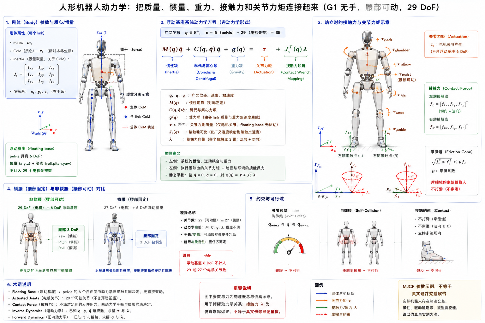

# 4.3 动力学

## 先看一个现场问题

G1 的腿已经通过逆运动学算到了目标位置，但机器人抬腿时仍然明显下沉；把同一条轨迹放慢后动作反而更稳定，换一个姿态又出现电机电流突然升高。日志里关节角和脚端轨迹都没有越限，问题却出在“需要多大的力和力矩”没有被算清楚。

现场通常会这样问：

> “为什么同样的关节速度，在不同姿态需要的电流不一样？站立时电机为什么一直要出力？脚接触地面后，地面反力应该分配到哪些关节？”

动力学（Dynamics）研究运动与质量、惯量、重力、接触力和执行器力矩之间的关系。[4.2 节的运动学](./02-kinematics.md)只回答“末端在哪里、速度如何映射”；动力学进一步回答“要产生这个加速度需要多大力矩，以及外力会怎样改变运动”。它连接模型参数、逆动力学前馈、重力补偿、接触控制、能耗估计和执行器保护。

## 刚体参数：质量、质心和转动惯量

### 三个最重要的参数

- **质量（Mass）**：刚体对平动加速度的惯性，单位是 $\text{kg}$；
- **质心（Center of Mass, CoM）**：质量等效集中的位置，决定重力力矩和整体平衡；
- **转动惯量（Moment of Inertia）**：刚体对角加速度的抗拒程度，通常用 $3 \times 3$ 对称矩阵表示，单位是 $\text{kg}\ \text{m}^2$。

同一个连杆换一个坐标系后，惯量矩阵的分量会改变，但物理刚体没有改变。模型中的惯量通常在指定的质心坐标系或 link 坐标系中给出，使用前必须确认 `inertial` 原点、旋转方向和矩阵表达坐标系。把 `diaginertia` 当成世界坐标系下永远不变的三个数，会在机器人转动后产生错误的动力学结果。

对于绕固定轴的简化转动，直觉关系是：

$$
\tau = I\alpha
$$

其中 $\tau$ 是力矩，$I$ 是转动惯量，$\alpha$ 是角加速度。人形机器人不是一根孤立的刚杆：每个关节的等效惯量会随着姿态变化，邻近连杆的运动还会引入科氏力、离心力和耦合项。

### G1 MJCF 中的参数

在本手册使用的 `robot_descriptions/g1/g1_29dof.xml` 中，每个 body 的 `inertial` 元素包含 `mass`、质心位置和惯量相关字段。例如 `pelvis` 的质量字段为 `3.813`，`torso_link` 的质量字段为 `9.598`；这些是该 MJCF 模型的刚体参数示例，不是整机真实质量，也不包含电池、线束、装配误差和所有硬件版本差异的完整证明。模型中还为 `pelvis` 放置了 `floating_base_joint`，说明仿真需要同时处理基座平动和转动。

## 方程：关节运动如何变成力矩

### 最小坐标形式

在不显式展开浮动基座细节的最小坐标中，常见的刚体动力学方程写成：

$$
\boldsymbol{M}(\boldsymbol{q})\ddot{\boldsymbol{q}} + \boldsymbol{C}(\boldsymbol{q}, \dot{\boldsymbol{q}})\dot{\boldsymbol{q}} + \boldsymbol{g}(\boldsymbol{q}) + \boldsymbol{\tau}_{\mathrm{fric}} = \boldsymbol{\tau}_{\mathrm{act}} + \boldsymbol{J}_c(\boldsymbol{q})^\top \boldsymbol{\lambda} + \boldsymbol{\tau}_{\mathrm{ext}}
$$

各项含义如下：

- $\boldsymbol{M}(\boldsymbol{q})$：质量矩阵（Mass Matrix），描述平动和转动惯性以及关节间耦合；
- $\boldsymbol{C}(\boldsymbol{q}, \dot{\boldsymbol{q}})\dot{\boldsymbol{q}}$：科氏和离心项，随姿态和速度变化；
- $\boldsymbol{g}(\boldsymbol{q})$：重力项，站立时即使 $\dot{\boldsymbol{q}} = \boldsymbol{0}$、$\ddot{\boldsymbol{q}} = \boldsymbol{0}$ 也可能不为零；
- $\boldsymbol{\tau}_{\mathrm{fric}}$：库仑摩擦、黏性摩擦、齿轮损耗和其他未建模阻力的等效项；
- $\boldsymbol{\tau}_{\mathrm{act}}$：执行器施加的关节力矩；
- $\boldsymbol{J}_c^\top \boldsymbol{\lambda}$：接触力通过接触雅可比映射回关节的力矩；
- $\boldsymbol{\tau}_{\mathrm{ext}}$：其他外部力或力矩的广义表示。

不同教材可能把摩擦、重力或外力移到等式另一侧，因此不能只比较符号就判断实现错误。真正需要固定的是：每一项的坐标系、正负方向、是否包含浮动基座，以及 $\boldsymbol{\lambda}$ 表示接触力还是约束乘子。

### 浮动基座形式

G1 在 MuJoCo 中使用 `free` 类型的 `floating_base_joint`。浮动基座的姿态在 `qpos` 中通常需要四元数的 4 个数，平移需要 3 个数，因此自由基座占 7 个配置量；但其速度使用 3 个线速度和 3 个角速度，共 6 个速度量。加上 29 个电机关节后，常见的维度关系是：

$$
\begin{aligned}
\text{qpos}:&\quad 7 + 29 \\
\text{qvel}:&\quad 6 + 29 \\
\boldsymbol{\tau}:&\quad 29\ \text{actuated joints}
\end{aligned}
$$

这不表示 G1 只有 29 个总自由度，也不表示浮动基座有 7 个物理自由度；四元数的 4 个分量受单位长度约束，实际基座位姿仍是 6 DoF。动力学方程中，浮动基座对应的行通常没有直接电机力矩输入，是由地面接触、外力和全身关节动作共同决定的“欠驱动”部分。

## 三类计算：正动力学、逆动力学和重力补偿

### 正动力学（Forward Dynamics）

正动力学给定当前状态、执行器力矩和外力，求下一时刻的加速度：

$$
\ddot{\boldsymbol{q}} = \boldsymbol{M}(\boldsymbol{q})^{-1}\left[\boldsymbol{\tau}_{\mathrm{act}} + \boldsymbol{J}_c^\top \boldsymbol{\lambda} + \boldsymbol{\tau}_{\mathrm{ext}} - \boldsymbol{C}(\boldsymbol{q}, \dot{\boldsymbol{q}})\dot{\boldsymbol{q}} - \boldsymbol{g}(\boldsymbol{q}) - \boldsymbol{\tau}_{\mathrm{fric}}\right]
$$

仿真器通常在每个时间步执行类似过程，再用数值积分更新 $\boldsymbol{q}$ 和 $\dot{\boldsymbol{q}}$。接触发生时，$\boldsymbol{\lambda}$ 不能随便填：它要与接触几何、法向约束、摩擦和求解器共同确定。时间步长、接触软化和积分器会影响仿真结果，因此“仿真能站住”不等于真实机器人一定能站住。

### 逆动力学（Inverse Dynamics）

逆动力学给定期望的 $\boldsymbol{q}$、$\dot{\boldsymbol{q}}$、$\ddot{\boldsymbol{q}}$ 和外力估计，反算所需关节力矩：

$$
\boldsymbol{\tau}_{\mathrm{req}} = \boldsymbol{M}(\boldsymbol{q})\ddot{\boldsymbol{q}} + \boldsymbol{C}(\boldsymbol{q}, \dot{\boldsymbol{q}})\dot{\boldsymbol{q}} + \boldsymbol{g}(\boldsymbol{q}) + \boldsymbol{\tau}_{\mathrm{fric}} - \boldsymbol{J}_c(\boldsymbol{q})^\top \boldsymbol{\lambda} - \boldsymbol{\tau}_{\mathrm{ext}}
$$

它常用于轨迹前馈、重力补偿、力矩限幅和动力学一致性检查。逆动力学算出的 $\boldsymbol{\tau}_{\mathrm{req}}$ 不是可以直接发送给电机的最终命令，还要经过电机常数、减速比、效率、温升、通信延迟和安全限幅等执行器层处理。

### 重力补偿（Gravity Compensation）

低速保持姿态时，主要负担可能来自重力项：

$$
\boldsymbol{\tau}_{\mathrm{hold}} \approx \boldsymbol{g}(\boldsymbol{q})
$$

如果控制器完全忽略重力，电机需要靠位置误差产生额外力矩，结果可能是静态偏差、持续高电流和关节温升。重力补偿也不能盲目全量叠加：质量参数、基座姿态、接触状态和工具载荷不准确时，补偿误差会把机器人推向错误方向。实际系统通常把模型前馈与反馈控制结合，并对补偿量做限幅和状态检查。

## 接触、地面反力和摩擦约束

### 接触力为什么要单独建模

双足站立时，脚底接触力不是某个单一关节的属性。地面反力通过足端接触点作用在整机上，再沿腿部和躯干传递。设接触点速度为 $\boldsymbol{v}_c$，接触雅可比为 $\boldsymbol{J}_c$，则：

$$
\begin{aligned}
\boldsymbol{v}_c &= \boldsymbol{J}_c(\boldsymbol{q})\dot{\boldsymbol{q}} \\
\boldsymbol{\tau}_{\mathrm{contact}} &= \boldsymbol{J}_c(\boldsymbol{q})^\top \boldsymbol{\lambda}
\end{aligned}
$$

接触约束近似固定时，还需要满足：

$$
\begin{aligned}
\boldsymbol{J}_c(\boldsymbol{q})\dot{\boldsymbol{q}} &= \boldsymbol{0} \\
\boldsymbol{J}_c(\boldsymbol{q})\ddot{\boldsymbol{q}} + \dot{\boldsymbol{J}}_c(\boldsymbol{q}, \dot{\boldsymbol{q}})\dot{\boldsymbol{q}} &= \boldsymbol{0}
\end{aligned}
$$

对平面接触，法向力通常满足单边约束 $f_n \ge 0$；摩擦力不能无限增大，常用库仑摩擦锥近似：

$$
\lVert \boldsymbol{f}_t \rVert \le \mu f_n
$$

其中 $\boldsymbol{f}_t$ 是切向力，$f_n$ 是法向力，$\mu$ 是摩擦系数。仿真中的 $\mu$、接触刚度、阻尼、碰撞几何和求解器参数都会改变滑动、冲击和支撑表现，不能把一个仿真摩擦系数直接当作真实地面材料的精确测量值。

### 与前文足部和全身控制的联系

[前文足部、接触与稳定性](../02-mechanics/04-foot-contact-and-stability.mdx)中，运动学可以告诉规划器“脚能否到达某个位置”，动力学还要检查“接触力是否能支撑整机且不滑动”。因此，双脚支撑时常见的约束包括：足底位姿、接触法向、摩擦锥、质心/动量变化和关节力矩上限。仅有几何上可行的脚步，如果需要的地面反力超过摩擦或某个膝关节的持续力矩能力，仍然是动力学不可行的。

## 质量矩阵、动量与能量的工程意义

质量矩阵 $\boldsymbol{M}(\boldsymbol{q})$ 不只是一个供公式使用的黑盒。它可以用于：

- 判断某个姿态下哪些方向容易加速、哪些方向惯性很大；
- 估计轨迹所需的峰值力矩和功率；
- 做操作或行走时的动量、角动量管理；
- 为全身控制分配任务优先级和关节力矩；
- 检查模型参数是否导致明显不合理的能量或加速度。

理想无损系统的机械功率关系可写成：

$$
P_{\mathrm{joint}} = \boldsymbol{\tau}^\top \dot{\boldsymbol{q}}
$$

但真实 G1 还存在电机铜损、逆变器损耗、减速器效率、轴承摩擦、结构变形和电池侧损耗。动力学模型可以预测机械侧需求，不能单独替代电气功耗和热模型。

## 从 MJCF 参数到真实执行器的边界

G1 MJCF 中的 `mass`、`inertial`、关节范围和 `actuator` 定义足以支持一种仿真动力学，但通常不能据此推出真实机器人的完整动力学规格。还需要核对：

| 参数或效应 | 仿真模型可能包含 | 真实系统还需确认 |
| --- | --- | --- |
| 刚体质量/惯量 | body 的 `inertial` 参数 | 实际装配、线束、电池、外壳和版本差异 |
| 执行器力矩 | MJCF motor/force 配置 | 电流环、减速比、效率、温升和峰值持续时间 |
| 摩擦和回差 | 简化阻尼或关节摩擦 | 齿轮摩擦、密封、回差、润滑和温度依赖 |
| 接触 | geom、碰撞和接触参数 | 足底材料、地面不平、柔性、滑移和冲击 |
| 传感器 | 仿真 sensor 输出 | 偏置、噪声、延迟、滤波、同步和安装误差 |

因此，动力学辨识应把模型输出与真实关节位置、速度、电流、温度、足底接触和外部力测量对齐。未经验证的质量、摩擦或接触参数，不应被包装成“G1 的真实力矩上限”。

图：以 G1 `g1_29dof` 无手、腰部可动模型为例，概览刚体质量/质心/惯量、浮动基座动力学方程、双足接触力与摩擦锥、关节力矩，以及锁腰和非锁腰模型的动力学差异。图中的质量、力和力矩用于解释模型关系；MJCF 参数示例不等于真实硬件完整规格。

## 参考资料

[1] Featherstone, R. *Rigid Body Dynamics Algorithms*. Springer, 2008. 刚体动力学、空间向量、浮动基座和递归算法经典教材。<https://doi.org/10.1007/978-1-4899-7560-7>

[2] Lynch, K. M., & Park, F. C. *Modern Robotics: Mechanics, Planning, and Control*. Cambridge University Press, 2017. 第 8、9、10、11 章介绍动力学、轨迹、力控制和接触基础。<https://modernrobotics.northwestern.edu/chapters/chapter8/>

[3] Siciliano, B., Sciavicco, L., Villani, L., & Oriolo, G. *Robotics: Modelling, Planning and Control*. Springer, 2009. 刚体动力学、逆动力学、力控制和机器人动力学建模教材。<https://doi.org/10.1007/978-1-84628-642-1>

[4] MuJoCo Documentation. *XML Reference*. MuJoCo 官方文档，`body`、`inertial`、`free joint`、`actuator`、`geom` 和接触参数说明。<https://mujoco.readthedocs.io/en/stable/XMLreference.html>

[5] Orin, D. E., et al. “The Development of a General Dynamic Model for a Robot Manipulator.” *Proceedings of the IEEE International Conference on Robotics and Automation*, 1983. 机器人动力学建模与递归计算的经典工作。

[6] Unitree Robotics. *unitree_rl_gym: G1 robot description*. 官方 G1 URDF/MJCF 模型；本文使用提交 `276801e46c5d433564f24658bac64f254b7d2d4b`，用于核对 `g1_29dof`、`g1_29dof_lock_waist`、`inertial`、浮动基座和执行器配置。<https://github.com/unitreerobotics/unitree_rl_gym/tree/276801e46c5d433564f24658bac64f254b7d2d4b/resources/robots/g1_description>
