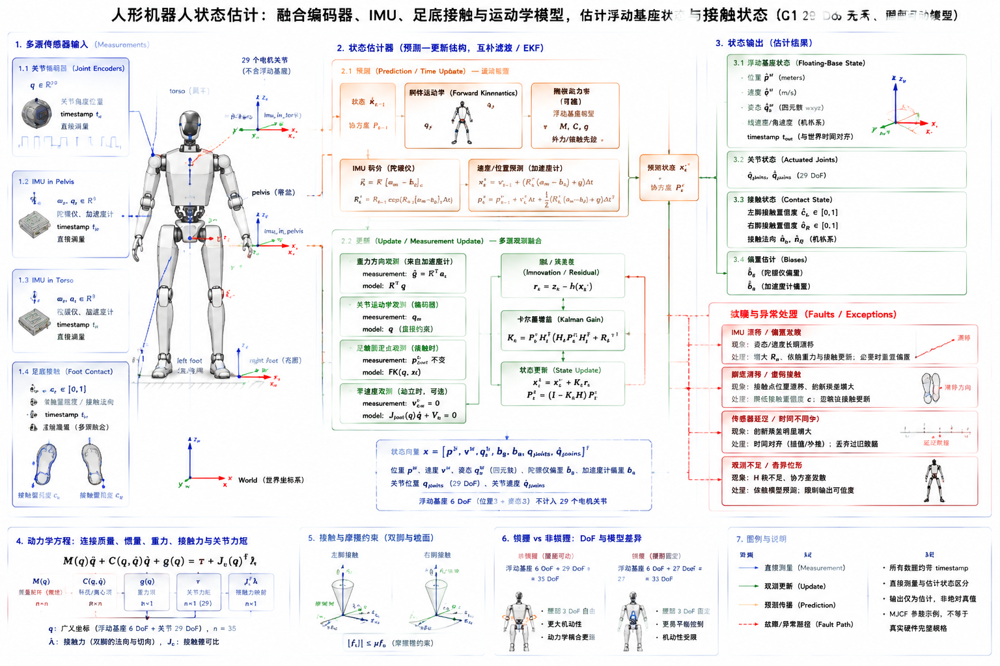

# 4.4 状态估计

## 先看一个现场问题

G1 站在平地上时，关节编码器读数几乎不变，IMU 却显示躯干在缓慢倾斜；把陀螺仪数据积分几秒后，估计姿态开始明显漂移。机器人抬脚时，足底刚接触地面，控制器却还把它当作摆动腿，导致下一步的基座速度和落脚位置都算错。

现场通常会这样问：

> “编码器、IMU 和足底接触都在发数据，为什么机器人还是不知道自己现在的姿态、速度和支撑脚？浮动基座的位置到底是谁测出来的？”

状态估计（State Estimation）是根据带噪声、带延迟、彼此不完整的传感器数据，推断机器人当前最可能的状态。对人形机器人而言，关节位置通常可以直接读取，但浮动基座的姿态、速度、位置、质心状态和接触状态往往不能由单个传感器直接给出，需要把 IMU、编码器、足底接触、动力学模型和时间戳放进同一个估计器。

## 先分清“测量值”和“状态”

### 机器人状态向量

一个用于全身控制的状态可以抽象为：

$$
\boldsymbol{x} = \{\boldsymbol{q}_j, \dot{\boldsymbol{q}}_j, \boldsymbol{R}_{WB}, \boldsymbol{p}_{WB}, \boldsymbol{v}_{WB}, \boldsymbol{b}_g, \boldsymbol{b}_a, c_{\mathrm{contact}}\}
$$

其中 $\boldsymbol{q}_j$、$\dot{\boldsymbol{q}}_j$ 是关节位置和速度，$\boldsymbol{R}_{WB}$、$\boldsymbol{p}_{WB}$、$\boldsymbol{v}_{WB}$ 是基座相对世界的姿态、位置和速度，$\boldsymbol{b}_g$、$\boldsymbol{b}_a$ 是陀螺仪和加速度计零偏，$c_{\mathrm{contact}}$ 是足端接触状态或接触置信度。具体系统还可能加入足端滑移速度、IMU 外参、关节偏置和传感器延迟等扩展状态。

状态不是把所有消息字段拼在一起。`MotorState` 的角度是关节测量，IMU 的加速度是传感器坐标系中的比力，足底压力是局部接触证据；估计器必须说明每一项的坐标系、单位、时间和不确定度，才能把它们组合成可供控制器使用的 $\hat{\boldsymbol{x}}$。

### G1 的传感器落点

在 `robot_descriptions/g1/g1_29dof.xml` 中，模型定义了 `imu_in_pelvis` 和 `imu_in_torso` 两个 IMU site，并为它们配置了陀螺仪和加速度计仿真传感器。对应 URDF 中，它们分别作为固定关节连接到 `pelvis` 和 `torso_link`。这些定义说明传感器安装坐标和相对位姿如何进入模型，但不等于真实 G1 每个硬件版本的完整传感器清单。

SDK 接口中的 `MotorState_`、`IMUState_` 和可能存在的 `PressSensorState_` 也不能直接假设字段含义完全等于仿真器输出。实际使用前应核对消息版本、分量顺序、坐标系、单位、时间戳和数据有效标志；仿真中的足底接触也可能来自碰撞求解器，而不是真实压力阵列。

## 编码器：关节状态的基础观测

关节编码器通常提供位置，速度可能由驱动器估计或对位置差分得到：

$$
\begin{aligned}
q_k &= q_{\mathrm{raw},k}\cdot\mathrm{scale} + q_{\mathrm{offset}} \\
\dot{q}_k &\approx \frac{q_k - q_{k-1}}{\Delta t}
\end{aligned}
$$

差分会放大量化噪声和时间抖动，因此估计器常对 $\dot{q}$ 使用低通滤波、Savitzky–Golay 滤波或观测器。滤波窗口越长，噪声越小但延迟越大；对快速摆腿和接触切换，延迟可能比少量噪声更危险。

编码器不能直接告诉系统浮动基座在世界中的位置。如果双脚都离地，单靠关节角只能计算各连杆相对基座的几何关系；基座整体如何平移和旋转，需要 IMU、外部定位或接触约束提供信息。

## IMU：短期姿态和速度变化

### 陀螺仪积分

陀螺仪测量角速度。若已知传感器坐标系中的角速度 $\boldsymbol{\omega}_m$，可以在短时间内更新姿态：

$$
\boldsymbol{R}_{k+1} = \boldsymbol{R}_k\, \mathrm{Exp}\!\left([(\boldsymbol{\omega}_m - \boldsymbol{b}_g)\Delta t]_\times\right)
$$

但零偏 $\boldsymbol{b}_g$ 会被积分成不断增长的姿态误差。陀螺仪擅长短期动态响应，不擅长长期提供绝对航向；磁力计、视觉或外部定位是否可用，需要根据环境和任务另行判断。

### 加速度计与重力方向

加速度计测量比力，不是简单的“世界坐标线加速度”。静止或低动态时，可以利用重力方向校正 roll/pitch；剧烈加速、碰撞和摆腿时，测量中还包含运动加速度，不能把瞬时加速度方向直接当作竖直方向。

姿态估计通常把陀螺仪作为预测，把重力方向或其他观测作为校正。yaw 方向没有重力观测，若没有视觉、磁场、足端里程计或外部定位，航向漂移通常无法仅靠 IMU 消除。

## 互补滤波：先建立可解释的融合

互补滤波（Complementary Filter）用高频陀螺仪跟踪快速变化，用低频重力方向抑制长期漂移。对简化的单轴姿态，可写成：

$$
\begin{aligned}
\hat{\theta}_k &= \alpha\left(\hat{\theta}_{k-1} + \mathrm{gyro}_k\,\Delta t\right) \\
&\quad + (1 - \alpha)\,\theta_{\mathrm{acc},k}
\end{aligned}
$$

$\alpha$ 接近 1 时响应快但更依赖陀螺仪，$\alpha$ 较小时更依赖加速度计但容易受到动态加速度干扰。真实实现通常在旋转群上进行姿态更新，而不是直接把三个欧拉角相加；4.1 节的万向节锁说明了为什么欧拉角不适合作为内部积分状态。

互补滤波的优点是计算量小、行为直观、调参容易，适合先验证坐标系、符号和传感器延迟。它的局限是难以自然表达多传感器不确定度、接触切换和相关噪声，因此复杂全身状态通常需要更完整的观测器或 EKF。

## 卡尔曼滤波与 EKF：把模型和不确定度放在一起

### 预测—更新结构

卡尔曼滤波（Kalman Filter, KF）及其扩展形式 EKF（Extended Kalman Filter）把系统分成状态预测和观测更新：

$$
\begin{aligned}
\boldsymbol{x}_k^- &= \boldsymbol{f}(\boldsymbol{x}_{k-1}^+, \boldsymbol{u}_{k-1}) + \boldsymbol{w}_k \\
\boldsymbol{z}_k &= \boldsymbol{h}(\boldsymbol{x}_k^-) + \boldsymbol{v}_k
\end{aligned}
$$

$\boldsymbol{f}$ 是动力学或运动学预测模型，$\boldsymbol{h}$ 是传感器观测模型，$\boldsymbol{w}$ 和 $\boldsymbol{v}$ 分别代表过程噪声和测量噪声。EKF 在当前估计附近线性化，使用协方差矩阵描述不确定度；噪声协方差不是越小越好，而应反映传感器实际噪声、模型误差和延迟。

### 足端接触作为观测约束

当某只脚可靠接触地面且没有明显滑移时，可以把足端近似为世界中的固定点：

$$
\begin{aligned}
\boldsymbol{p}_{WF}(\boldsymbol{q}, \boldsymbol{x}_{\mathrm{base}}) &\approx \text{constant} \\
\boldsymbol{v}_{WF}(\boldsymbol{q}, \dot{\boldsymbol{q}}, \boldsymbol{x}_{\mathrm{base}}) &\approx \boldsymbol{0}
\end{aligned}
$$

这个约束可以帮助估计浮动基座速度和位置漂移。若接触判断错误，估计器会把正在摆动的脚强行当作固定点，产生反向的基座速度和姿态误差；若脚底发生滑移，固定点模型同样会注入错误约束。因此接触状态不应只有布尔值，最好包含置信度、持续时间和滑移检测结果。

对双脚同时接触，左右脚约束可以共同提供基座平移和部分姿态信息，但它们并不自动解决所有状态：航向、柔性地面、足底滚动和接触几何误差仍可能使估计不完全可观。接触约束越强，越要保证脚端坐标、地面模型和时间戳可靠。

## 浮动基座估计：姿态、速度和位置各有难点

### 姿态

IMU 可以快速提供角速度和重力方向，适合估计基座 roll/pitch；yaw 往往需要外部参考或足端/视觉里程计。姿态误差内部应使用旋转矩阵、四元数或局部旋转向量，输出给人看的 roll-pitch-yaw 只是显示接口。

### 速度

基座速度可以由 IMU 比力积分得到，也可以通过接触脚速度约束、关节编码器和运动学雅可比反推。单独积分会受加速度计零偏和姿态误差影响，接触脚速度又会受足底滑移和模型误差影响，因此常用多源融合：

$$
\hat{\boldsymbol{v}}_{\mathrm{base}} = \operatorname{Fuse}\!\left(\boldsymbol{v}_{\mathrm{imu,integrated}}, \boldsymbol{v}_{\mathrm{foot,kinematic}}, \boldsymbol{c}_{\mathrm{contact}}\right)
$$

### 位置

位置是最容易漂移的量。没有视觉、光学定位、GPS、激光或可靠接触里程计时，IMU 双积分无法长期提供稳定世界位置。双足接触可以在短时间内约束相对位移，但脚步移动和地面不平会不断改变参考。控制器若只需要局部平衡，可能只估计相对基座速度和重力方向，而不强行追求全局绝对位置。

## 观测延迟、偏置和可观性

### 时间不是附属字段

状态估计器必须使用测量时间，而不是消息到达时间。IMU、编码器和接触消息的延迟不同；如果把旧的 IMU 数据和新的关节角拼成同一时刻，运动学反推的脚速度会带有系统误差。常见处理包括时间排序、缓存、插值、延迟状态扩展和测量回溯更新。

### 偏置和可观性

偏置（Bias）是长期误差的核心来源。陀螺仪和加速度计偏置可以在一定运动和外部观测下估计，但不是任何动作下都可观。机器人长时间静止时，重力方向有助于估计 roll/pitch 和部分加速度计偏置；没有航向参考时，yaw 偏置和绝对 yaw 可能仍不可观。

“不可观”通常意味着当前传感器和动作没有提供足够信息，代码本身未必有错。此时应降低对该状态的控制权重、增加外部传感器、设计激励动作或接受相对状态；盲目把滤波器增益调大解决不了问题。

## 接触状态估计与故障处理

接触检测可以融合压力、六维力、关节电流、足端速度和动力学残差：

$$
\text{contact\_score} = \operatorname{Fuse}\!\left(\text{force\_signal}, \text{pressure\_signal}, \text{foot\_speed}, \text{dynamics\_residual}\right)
$$

工程上应避免单帧阈值抖动，常用进入/退出不同阈值、最小持续时间和滞回：

$$
\begin{cases}
\text{contact\_on}, & \text{if } \text{score} > \text{threshold}_{\mathrm{on}} \text{ for } N_{\mathrm{on}} \text{ samples} \\
\text{contact\_off}, & \text{if } \text{score} < \text{threshold}_{\mathrm{off}} \text{ for } N_{\mathrm{off}} \text{ samples}
\end{cases}
$$

接触估计失败时，系统应返回来源、置信度和原因，例如 `NO_FOOT_SENSOR`、`STALE_IMU`、`SLIP_DETECTED` 或 `MODEL_RESIDUAL_HIGH`。状态估计器不应在观测失效后继续输出看似正常但置信度未知的基座状态；上层控制器应根据置信度降低速度、切换支撑策略或进入安全状态。

## G1：仿真、SDK 与真实硬件的边界

对 G1 `g1_29dof` 无手、腰部可动模型，建议把以下内容分开验证：

| 来源 | 可以直接验证的内容 | 不能直接推出的内容 |
| --- | --- | --- |
| MJCF `imu_in_pelvis` / `imu_in_torso` | IMU site 的安装位置、仿真噪声和滤波配置 | 真实 IMU 的偏置、延迟、量程和安装误差 |
| URDF 固定 IMU link | 传感器与 `pelvis`/`torso_link` 的静态位姿关系 | 真实装配是否完全一致 |
| `MotorState_` | 关节角、速度和电机状态字段的接口语义（需核对版本） | 完整浮动基座位姿 |
| `IMUState_` | SDK 提供的 IMU 消息字段和单位（需核对版本） | 长期无漂移的世界姿态 |
| `PressSensorState_` 或仿真接触 | 足底接触相关观测（若该版本提供） | 所有地面材质和滑移状态 |

锁腰模型只改变运动学和动力学的可动变量，不会自动让 IMU 估计更准确；非锁腰模型增加腰部运动后，编码器、IMU 外参和接触约束之间的时序一致性反而更重要。比较两种模型时，应固定传感器噪声、延迟、接触判据和初始化姿态，分别记录姿态漂移、速度误差、接触切换延迟和估计协方差。

## 一套可复用的状态估计排查顺序

1. **先核对消息和坐标**：确认 `wxyz/xyzw`、轴向、单位、符号、坐标系和时间戳。
2. **单独验证编码器**：检查零位、方向、差分速度和关节索引，不先接入复杂滤波器。
3. **单独验证 IMU**：静止时检查重力方向和零偏，旋转时检查角速度轴和积分方向。
4. **加入已知接触**：用双脚静止或单脚支撑测试足端速度约束是否接近零。
5. **再调融合器**：记录预测残差、更新残差、协方差、延迟和接触置信度，而不只看最终姿态。
6. **注入故障**：模拟 IMU 丢帧、编码器偏置、接触误判、足底滑移和时间戳跳变，检查估计器是否降级或报警。
7. **最后连接控制器**：确认估计状态的延迟和置信度满足平衡、步态和力矩控制需求。

### 图片 Prompt：G1 状态估计融合与接触约束

```text
用途：解释人形机器人如何融合编码器、IMU、足底接触和运动学模型，估计浮动基座姿态、速度、位置和接触状态
主体：G1 29 DoF 无手、腰部可动模型，标出 pelvis、torso、imu_in_pelvis、imu_in_torso、左右脚和关节编码器
构图：左侧为多源传感器输入和各自坐标系/时间戳；中间为预测—更新结构（互补滤波/EKF），显示陀螺仪积分、重力方向校正、关节运动学和足端固定点约束；右侧为状态输出 x_hat、姿态/速度/位置/接触置信度，并画出 IMU 漂移、脚底滑移和延迟故障分支
标注：中文为主，英文术语放在括号中；标出 measurement、bias、timestamp、contact confidence、floating-base state、innovation/residual；明确区分“直接测量”和“估计状态”
风格：机器人状态估计教材工程示意图，白色背景，清晰线条，蓝色表示传感器数据，橙色表示预测，绿色表示观测更新，红色表示漂移、延迟或故障
比例：16:9，适合 Markdown 页面，所有箭头、坐标轴和公式清晰可读
禁止：使用 G1 无手模型，不添加未公开的真实足底压力阵列；不把仿真接触结果画成真实传感器测量；不把估计的世界位置画成绝对无漂移；不使用难以辨认的小字
```



图：以 G1 `g1_29dof` 无手、腰部可动模型为例，概览编码器、IMU 与足底接触如何经由预测—更新结构融合为浮动基座姿态、速度和位置估计，以及漂移、滑移和延迟等故障分支。图中信号流用于解释融合关系；仿真接口字段不等于真实硬件的完整测量能力。

## 参考资料

[1] Titterton, D., & Weston, J. *Strapdown Inertial Navigation Technology*, 2nd ed. IET, 2004. 惯性测量、姿态积分、零偏和漂移基础。

[2] Crassidis, J. L., & Junkins, J. L. *Optimal Estimation of Dynamic Systems*. CRC Press, 2004. 卡尔曼滤波、非线性状态估计、协方差和可观性基础。

[3] Bar-Shalom, Y., Li, X. R., & Kirubarajan, T. *Estimation with Applications to Tracking and Navigation*. Wiley, 2001. 预测—更新滤波、噪声建模和多传感器融合教材。

[4] Bloesch, M., et al. “State Estimation for Legged Robots—Consistent Fusion of Leg Kinematics and IMU.” *Robotics: Science and Systems*, 2013. 腿式机器人 IMU、腿部运动学和接触约束融合的经典工作。<https://doi.org/10.15607/RSS.2013.IX.046>

[5] Open Robotics. *REP 103: Standard Units of Measure and Coordinate Conventions*. ROS 坐标系、单位和右手系约定。<https://www.ros.org/reps/rep-0103.html>

[6] Unitree Robotics. *unitree_sdk2: G1 robot SDK version 2*. 官方 SDK2 消息接口；本文使用提交 `9754cd153af3da471b0fe5f3aa535e426fb11db3`，用于核对 `MotorState_`、`IMUState_` 和 `PressSensorState_` 等字段边界。<https://github.com/unitreerobotics/unitree_sdk2/tree/9754cd153af3da471b0fe5f3aa535e426fb11db3/include/unitree/idl/hg>

[7] Unitree Robotics. *unitree_rl_gym: G1 robot description*. 官方 G1 URDF/MJCF 模型；本文使用提交 `276801e46c5d433564f24658bac64f254b7d2d4b`，用于核对 IMU site、固定 link 和仿真传感器配置。<https://github.com/unitreerobotics/unitree_rl_gym/tree/276801e46c5d433564f24658bac64f254b7d2d4b/resources/robots/g1_description>
