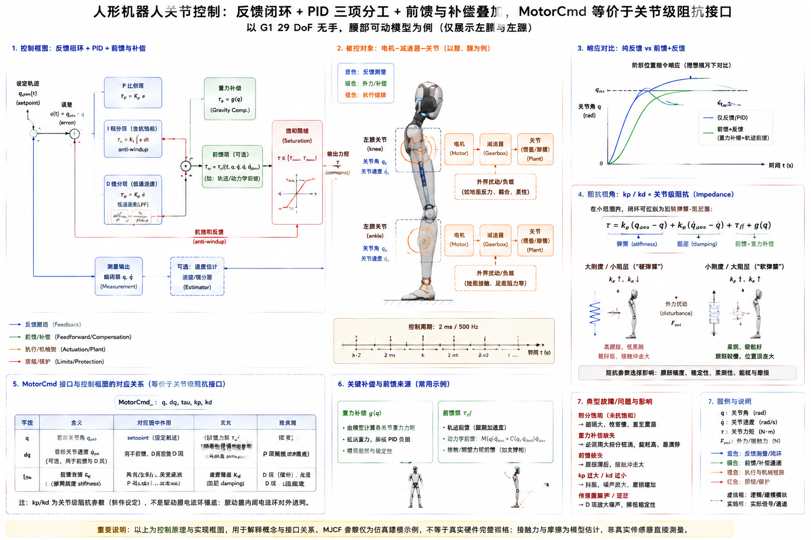

# 4.5 基础控制

## 先看一个现场问题

调试 G1 膝关节位置保持时，目标角设为 0.5 rad：增益小了，关节要爬好几秒才到目标，停在目标附近还有一段固定偏差；把 $k_p$ 调大，关节开始快速抖动并伴随异响，电机温度上升。站立时给踝关节一个阶跃目标，机器人会猛地一震；而手臂伸出碰到桌面时，位置控制器仍在向桌内推进，力矩越顶越大。

现场通常会这样问：

> “为什么同一组 $k_p$、$k_d$，换到不同关节、不同负载表现完全不一样？$\tau$ 前馈什么时候该加？机器人已经碰到东西了，控制器为什么还在用力顶？”

基础控制（Basic Control）回答的是最底层的问题：给定一个期望目标，如何根据当前反馈持续修正输出，让关节或末端既快又稳地到达并保持在目标上。[3.2 节](../03-electrical-embedded/02-motors-drivers-servo-control.mdx)讲的是驱动器内部的电流环、速度环和位置环；本节讲的是算法层如何组织反馈、前馈、补偿和柔顺行为，它是后续全身控制和运动规划的地基。

## 反馈控制的最小闭环

### 误差、反馈与设定点

反馈控制（Feedback Control）的核心是误差（Error）：期望值与实际值的差。期望目标称为设定点（Setpoint），传感器反馈（Feedback）提供实际值，控制器输出作用于执行器，形成一个闭环（Closed Loop）：

$$
\begin{aligned}
e &= q_{\mathrm{des}} - q \\
u &= \mathrm{Controller}(e, \dot{e}, \int e\,dt, \dots)
\end{aligned}
$$

开环（Open Loop）只按预定指令输出、不看结果，例如“发 100 ms 的固定力矩”；闭环则持续比较目标和现实。闭环的代价是：传感器噪声、延迟和模型误差都会进入回路，处理不好时控制器会放大问题而不是修正问题。

### 稳定性与带宽

稳定性（Stability）指扰动之后系统是回到目标附近，还是振荡发散。带宽（Bandwidth）描述闭环能跟上多快的目标变化，常用频率表示：目标变化频率远高于带宽时，系统只能跟踪一个衰减、滞后的影子。

评价阶跃响应常用四个词：上升时间、超调（Overshoot）、振荡次数和稳态误差（Steady-State Error）。增益提高通常能缩短上升时间、减小稳态误差，但同时增大超调和振荡倾向；带宽越高，对延迟和噪声越敏感。人形机器人上带宽不是越高越好：腿部关节接触切换频繁，过高的位置带宽会把地面冲击直接变成力矩振荡。

### 饱和与延迟是闭环的边界条件

执行器输出有上限，这就是饱和（Saturation）。一旦输出饱和，误差继续积累，但执行器已无法响应，线性控制器假设失效。延迟同样危险：3.2 节的编码器误差、通信延迟和 3.4 节的总线传输，都会让控制器用“过去的状态”纠正“现在的系统”，相位滞后积累到一定程度，稳定的控制器也会振荡。设计增益时必须先问：这条环路的输出限幅是多少，端到端延迟是多少。

## PID：三项各自解决什么

PID 控制（Proportional–Integral–Derivative Control）把误差的比例、积分、微分线性相加：

$$
u = k_p e + k_i \int e\,dt + k_d \dot{e}
$$

三项的分工可以用一句话概括：比例项（P）负责“现在就纠”，积分项（I）负责“把剩下的偏差磨掉”，微分项（D）负责“提前刹车”。[1][2]

### 比例项：快，但有稳态误差

只有比例项时，要让控制器输出足以对抗重力或摩擦，就必须保留一个非零误差，这就是稳态误差的来源。提高 $k_p$ 能减小它，但受稳定性和执行器饱和限制，不可能无限大。

### 积分项：消除稳态误差，但会“记仇”

积分项累积历史误差，能把长期存在的固定偏差（例如重力造成的下垂）逐渐磨平。风险是积分饱和（Integral Windup）：执行器已经饱和，误差仍在累积，积分项越攒越大，等误差反号时控制器还带着巨大的“存货”，造成严重超调。工程上必须配抗积分饱和（Anti-Windup）：检测到饱和时停止或回退积分，或对积分量直接限幅。[2]

### 微分项：阻尼，但放大噪声

微分项按误差变化率提前施加反向作用，等效于给系统加阻尼。问题在于它对测量噪声极其敏感：4.4 节讲过差分会放大编码器量化噪声，微分项会把这种噪声直接放大成力矩抖动。实际实现几乎总是给微分通道加低通滤波，称为微分滤波（Derivative Filtering）；在机器人关节控制里，更常见的做法是对“测量速度”而不是“误差微分”施加 $k_d$，避免目标突变时微分项瞬间打满（称为微分冲击，Derivative Kick）。[2]

### 参数整定

参数整定（Tuning）没有一劳永逸的公式，工程上的稳妥顺序是：先只加 $k_p$ 到响应开始偏快、略有振荡；再加 $k_d$ 压住振荡；最后引入小 $k_i$ 消除稳态误差，并立刻配好抗积分饱和。每调一步都要检查执行器是否饱和、环路延迟是否变化、温度是否上升。Ziegler–Nichols 等经典法则可以给出初始量级，但在带接触、带减速器非线性的关节上，最终仍要靠阶跃、斜坡和扰动测试逐关节确认。[1][2]

## 前馈与轨迹：不等误差发生再纠正

### 前馈

前馈（Feedforward）根据模型提前给出“按道理需要多少力”，反馈只负责修正模型没算准的残差。纯反馈必须等误差出现才动作；前馈可以在动作发生的同一时刻就把主要力矩给出去。动力学里算出的重力项、科氏项、期望加速度对应的惯性项（见 4.3 节），都可以作为前馈力矩 $\tau_{\mathrm{ff}}$。[4]

前馈和反馈是互补的：模型越准，反馈需要补的越少，可以用更低的增益获得同样的跟踪精度，系统也更安静。反之，模型错了前馈就是稳定的误差源，所以前馈量也应记录、可开关、可限幅。

### 位置、速度、加速度要自洽

给关节的目标不只是一个终点位置。一个可执行的目标轨迹（Trajectory）要求位置、速度、加速度彼此一致且连续：位置突变会让速度前馈出现冲激，速度突变会让加速度项发散。离散实现中常见做法是按控制周期做插值，例如用五次多项式或余弦曲线在一个控制周期粒度上生成 $q_{\mathrm{des}}(t)$、$\dot{q}_{\mathrm{des}}(t)$，再逐点下发。

这与 G1 的低层示例结构一致：`g1_ankle_swing_example` 按 2 ms（500 Hz）控制周期用 `sin` 曲线逐拍生成踝关节目标位置并写入 `MotorCmd_`，而不是一次性写一个阶跃目标。[5] 3.5 节已讨论过这个 500 Hz 循环的实时性约束；本节关心的是：轨迹生成频率、控制频率和反馈频率应对齐，目标更新比控制环路慢得多时，等于在环路里注入台阶。

## 补偿：重力、摩擦与低速爬行

### 重力补偿

重力补偿（Gravity Compensation）是最常用的前馈：用动力学模型的 $g(q)$ 项（见 4.3 节）实时给出对抗重力的力矩，让反馈增益只需要处理运动误差。没有重力补偿时，站立或悬臂姿态下每个承重关节都要靠稳态误差或积分项“顶住”重力，既慢又费电。要注意 $g(q)$ 依赖模型质量和当前位姿，带手与不带手、锁腰与非锁腰模型的重力项不同，切换模型后要同步切换补偿用的参数。

### 摩擦补偿与低速控制

减速器摩擦包含静摩擦、库仑摩擦和黏性摩擦（见 3.2 节）。静摩擦会让低速运动出现“卡住—滑动—卡住”的爬行（Stick-Slip）现象：误差小时力矩顶不动静摩擦，积分项攒够之后关节突然滑动冲过目标。常见处理包括摩擦前馈（按速度符号加固定补偿）、提高微分阻尼、以及对低速段使用更细的轨迹插值。摩擦参数随温度、磨损和批次漂移，补偿值应来自辨识实验（见 4.3 节末尾），并保留在线修正的接口。

## 阻抗控制：接触时不能只靠位置硬顶

### 从“到达位置”到“表现出某种力学行为”

位置控制只回答“到没到目标”，不回答“碰到环境时应该有多硬”。阻抗控制（Impedance Control）让机器人对外表现出可调的弹簧—阻尼行为：偏离目标越远，回得力越大，但多大的偏离产生多大的力，由刚度参数决定。[3]

关节空间阻抗的标准形式是：

$$
\tau = k_p (q_{\mathrm{des}} - q) + k_d (\dot{q}_{\mathrm{des}} - \dot{q}) + \tau_{\mathrm{ff}}
$$

$k_p$ 是虚拟弹簧刚度，$k_d$ 是虚拟阻尼，$\tau_{\mathrm{ff}}$ 是前馈力矩。刚度大时关节“硬”，跟踪准但碰撞冲击大；刚度小时关节“软”，碰人、碰桌时更安全，但轨迹精度下降。与之互补的概念是导纳控制（Admittance Control）：先测量外力，再反算位置修正，常用于末端装有力传感器的场合；本节只要求知道二者是“用力响应位置偏差”与“用位置响应力”的对偶关系。[3][4]

### G1 的 `kp`/`kd` 就是关节级阻抗接口

理解了阻抗形式，G1 的 `MotorCmd_` 字段就有了统一的读法：$q$、$\dot{q}$ 是期望位置和速度，$k_p$、$k_d$ 是期望的关节刚度和阻尼，$\tau$ 是前馈力矩。[5] 也就是说，SDK 暴露的接口超出了单纯的“位置模式”或“力矩模式”：它是一个可调刚柔的关节级阻抗接口。这既解释了 3.2 节“$k_p$、$k_d$、$\tau$ 落在哪一层”的问题，也给出明确的操作边界：

- 增益由算法层下发，驱动器内部的电流环仍独立存在，$k_p$/$k_d$ 不等于驱动器位置环增益；
- 同一组增益对不同关节不等价：膝关节负载大、惯量大，腕关节负载小，同样的 $k_p$ 产生的加速度响应完全不同；
- $\tau$ 前馈的质量取决于动力学模型，模型错时前馈会变成持续的偏差力矩；
- 低增益柔顺不代表安全：刚度太低的承重关节会撑不住自重，柔顺策略必须结合任务和支撑状态设计。

## 用 G1 的三个场景过一遍

### 场景一：膝关节位置保持

锁定目标角，只发 $q_{\mathrm{des}}$ 和一组 $k_p$、$k_d$。先观察纯比例的稳态误差和爬升速度，再逐步加阻尼。注意日志里要同时记录 `MotorState_` 的 $q$、$\dot{q}$、`tau_est` 和温度：抖动往往先在 `tau_est` 高频波动和温升里暴露，而不是肉眼可见。若机器人单腿站立，膝关节同时承担重力负载，应叠加 $g(q)$ 对应的重力前馈，否则积分或静差会一直“顶着”自重。

### 场景二：踝关节 PR/AB 模式摆动

2.1 节已说明，G1 低层示例中踝关节索引旁的 `PR` 和 `AB` 是驱动控制模式的命名，踝关节在模型中仍按 pitch 和 roll 两个独立关节建模。`g1_ankle_swing_example` 用 2 ms 周期按 `sin` 曲线生成目标位置，演示的就是“轨迹逐拍插值 + 关节级阻抗接口”的最小组合。[5] 调试这个例子时值得刻意做两个实验：把目标改成阶跃，观察微分通道和机械冲击；把 $k_d$ 减半，观察摆动末端的残余振荡。这两个现象分别对应本节的轨迹自洽性和阻尼整定。

### 场景三：腕关节的柔顺抓握准备

腕关节（`wrist_roll/pitch/yaw`）负载小、惯量小，适合演示低刚度行为：给较小的 $k_p$、适中的 $k_d$，用手轻推末端能感觉到“弹簧感”而不是硬顶。这个行为是后续 Manipulation 章节接触任务的基础：插孔、开门、抓取易碎物体时，纯位置控制会把几何误差全部转换成接触力，而阻抗行为能把误差吸收成可接受的位移。无手模型下可用腕关节或肘关节演示；带手模型的手指柔顺属于第 23 节的内容。

## 从单关节控制到全身控制的边界

本节所有内容都把关节当作近似独立的被控对象，这对单关节调试和简单摆动足够，但人形机器人站立和行走时，关节之间通过动力学耦合、接触约束和平衡任务强相关：踝关节控制器输出会改变全身质心，手臂摆动会影响支撑腿的受力。什么时候可以忽略耦合、什么时候必须全身一起算，是 4.6 节双足平衡与全身控制的主题；如何把目标轨迹和时间序列组织成可规划的运动，则由运动规划章节讨论。

图：以 G1 `g1_29dof` 无手、腰部可动模型为例，概览目标轨迹、PID 反馈、重力补偿与前馈力矩如何经饱和限幅后作用于关节，以及 `MotorCmd_` 的 $q$/$\dot{q}$/$\tau$/$k_p$/$k_d$ 与关节级阻抗行为的对应关系。图中框图用于解释控制结构；接口字段语义以对应 SDK 版本为准，不等于驱动器内部环路的完整实现。

## 参考资料

[1] Åström, K. J., & Murray, R. M. *Feedback Systems: An Introduction for Scientists and Engineers*, 2nd ed. Princeton University Press, 2021. 反馈、稳定性、带宽与 PID 基础，全书开放获取。<https://fbsbook.org>

[2] Åström, K. J., & Hägglund, T. *Advanced PID Control*. ISA, 2006. 抗积分饱和、微分滤波、微分冲击与工程整定方法。

[3] Hogan, N. "Impedance Control: An Approach to Manipulation, Parts I–III." *ASME Journal of Dynamic Systems, Measurement, and Control*, 1985. 阻抗控制的原始论文，弹簧—阻尼行为和导纳对偶关系。<https://doi.org/10.1115/1.3140711>

[4] Siciliano, B., Sciavicco, L., Villani, L., & Oriolo, G. *Robotics: Modelling, Planning and Control*. Springer, 2009. 关节空间控制、重力补偿、计算力矩与阻抗控制的教材表述。

[5] Unitree Robotics. *unitree_sdk2: G1 robot SDK version 2*. 官方 SDK2 消息定义与低层示例；本文使用提交 `9754cd153af3da471b0fe5f3aa535e426fb11db3`，用于核对 `MotorCmd_` 的 `mode`/`q`/`dq`/`tau`/`kp`/`kd` 字段及 `g1_ankle_swing_example.cpp` 的 2 ms 控制周期和 PR/AB 命名。<https://github.com/unitreerobotics/unitree_sdk2/tree/9754cd153af3da471b0fe5f3aa535e426fb11db3/example/g1/low_level>

[6] Unitree Robotics. *unitree_rl_gym: G1 robot description*. 官方 G1 URDF/MJCF 模型；本文使用提交 `276801e46c5d433564f24658bac64f254b7d2d4b`，用于核对 `g1_29dof` 模型的关节命名与结构。<https://github.com/unitreerobotics/unitree_rl_gym/tree/276801e46c5d433564f24658bac64f254b7d2d4b/resources/robots/g1_description>
