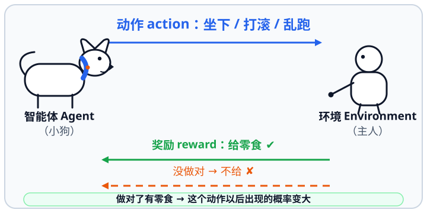
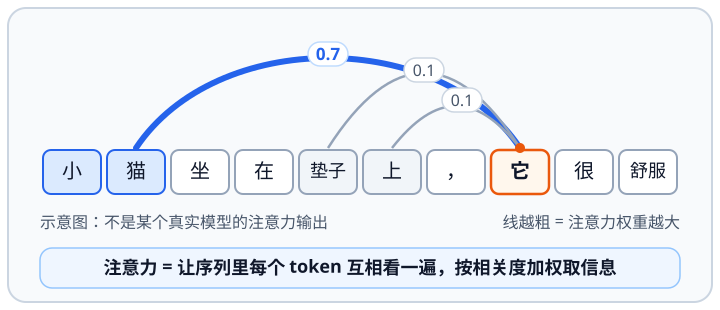
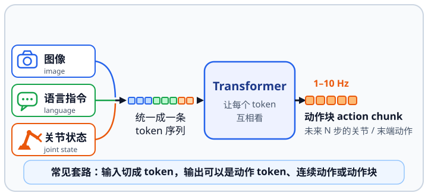
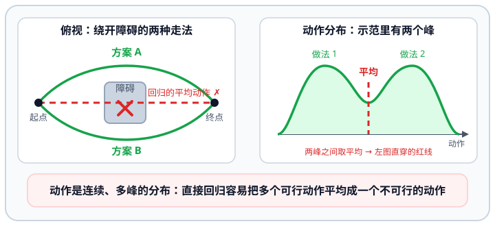
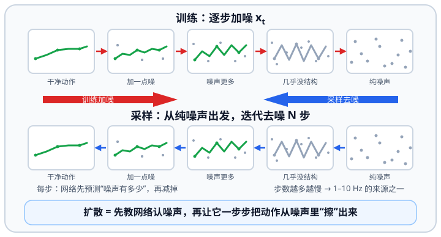
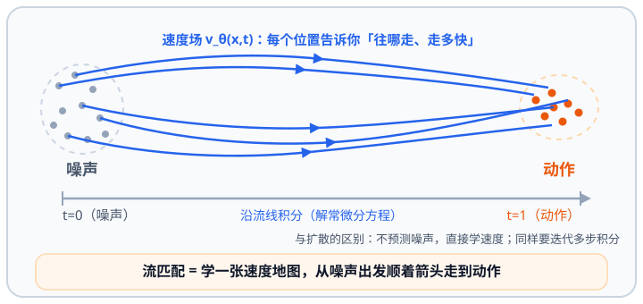

# 5.1 机器人学习与 AI 词汇

## 先看一个现场问题

算法同学在评审会上说：“这条线用**模仿学习**采数据，训一个 **VLA**，动作走**流匹配**，推理跑在 Orin 上，时延控制在 100 ms 以内。”机械同学听懂了“臂”，电气同学听懂了“Orin”，但“模仿学习、VLA、流匹配”这三个词谁管谁、各自在哪一层，没人说得清。

现场通常会这样问：

> “策略、模型、训练、推理、token、注意力、扩散、流匹配……这些词在机器人项目里到底指什么？哪些是同一个东西的不同叫法？”

本节是第五章的**词汇地图**：不推导算法、不涉及具体机型参数，只把后面几节会反复出现的现代 AI 与机器人学习词汇讲成人话。读完这一节再读 5.2–5.7，遇到这些词时能立刻知道它在说哪一层的事。

## 模型从哪来：三条路

- **规则与经典控制**：控制器由人设计，行为可预测、可证明（PID、WBC，见 4.5、4.6 节）；
- **从数据学**：给人做的示范或标注，让模型拟合输入与输出的关系（监督学习、模仿学习）；
- **从试错学**：只给奖励，让模型自己探索（强化学习）。[1]

三条路在真实系统里几乎总是混用：学习模块输出“意图”，经典控制负责把它变成可执行、可兜底的动作。

*图 5.1-1 强化学习 = 训狗：小狗（智能体）试动作，主人（环境）用零食（奖励）告诉它做对没有。*

## 神经网络的最小词汇

- **模型与参数**：模型是一个带参数的函数 $\hat{y}=f_\theta(x)$；参数 $\theta$ 就是训练要调整的那一堆数。
- **层与前向**：网络由若干层叠加，一次**前向传播**就是“输入 → 逐层计算 → 输出”。
- **训练与推理**：训练是在数据集上反复迭代求参数，$\theta^*=\arg\min_\theta \mathbb{E}_{(x,y)\sim D}\left[L(f_\theta(x),y)\right]$；**推理则是固定参数后做一次前向**。机器人上电后跑的都是推理，所以“一次推理多久、多久能出一次”比“训练了多久”更决定能不能用。
- **损失与过拟合**：损失衡量输出与目标的差距；过拟合是“把训练集背下来了，换一批数据就不行”。
- **数据集与标注**：数据从哪来、标签谁给、分布是否覆盖真实场景，往往比模型结构更决定成败。

## 表示：token 与嵌入

模型不直接处理图像、语言和关节角，而是先把它们切成 **token**（可离散编号的单元），再映射成**嵌入向量（Embedding）**：

- 语言按词或子词切分；
- 图像切成小块（patch）再线性映射成向量；
- 动作把每个维度的动作量离散成若干档（**动作 token**），或直接回归连续向量——前者像“生成词”，后者更适合精细的连续控制（见 5.6 节）。

## 架构：Transformer 与注意力

Transformer 的核心是**注意力（Attention）**：序列里每个元素都去“看”其他元素，按相关度加权后更新自己。给定查询、键、值三组向量 $Q,K,V$：

$$
\mathrm{Attention}(Q,K,V)=\mathrm{softmax}\!\left(\frac{QK^\top}{\sqrt{d_k}}\right)V
$$

- $QK^\top$ 衡量“谁和谁相关”，$\sqrt{d_k}$ 做尺度缩放，$\mathrm{softmax}$ 把相关度变成权重，再对 $V$ 加权求和；
- 实际模型用**多头注意力**（多组 $Q,K,V$ 并行）和**位置编码**（补上顺序信息）。[2]

*图 5.1-2 注意力 = 让序列里每个 token 互相“看一圈”：以指代消解为例，“它”对“小猫”的权重高、对“垫子”“上”的权重低。*

为什么 VLA/WAM 选它：图像、语言、机器人状态和动作可以统一成一条序列处理，容量大、易扩展。代价是**计算量和显存随序列长度增长**，而机器人对延迟敏感——这正是“模型很大、但推理只有 1–10 Hz”的根源（见 5.6 节）。

*图 5.1-3 VLA / WAM 的通用套路：图像、语言、关节状态统一切成一条 token 序列，经 Transformer 处理后输出未来若干步的动作块。*

## 生成：扩散与流匹配

机器人动作常是连续、多峰的分布，直接回归容易把多个可行动作“平均”成一个不可行的动作。扩散与流匹配是两类**生成式**方法：

*图 5.1-4 为什么动作不能直接回归：同一个指令下动作不止一个正确答案，直接回归会把多个可行方案平均成一个不可行的动作。*

- **扩散（Diffusion）**：训练时给真实动作逐步加噪，$x_t=\sqrt{\bar{\alpha}_t}\,x_0+\sqrt{1-\bar{\alpha}_t}\,\epsilon$；网络学的就是“给定加噪后的 $x_t$ 和时间 $t$，预测所加的噪声”，$\min_\theta \mathbb{E}\left\|\epsilon-\epsilon_\theta(x_t,t)\right\|^2$。采样时从纯噪声出发，迭代去噪得到动作。[3][8]

*图 5.1-5 扩散：训练时逐步给动作加噪，采样时从纯噪声出发、迭代去噪得到动作。*

- **流匹配（Flow Matching）**：直接学一个速度场 $v_\theta(x,t)$，采样时解常微分方程 $\frac{dx}{dt}=v_\theta(x,t)$，从噪声积分到动作。[4]

*图 5.1-6 流匹配：学一张速度场，从噪声出发沿流线积分（解常微分方程）走到动作。*

两者都能一次生成一整段**动作块（Action Chunk）**，用“一次推理出一串动作”来掩盖推理延迟；代价是采样需要迭代多步，步数与延迟成反比（见 5.6 节）。

## 学习范式地图

| 范式 | 数据从哪来 | 学什么 | 机器人上的典型用法 | 主要风险 |
| --- | --- | --- | --- | --- |
| 监督学习 | 带标签的数据集 | 输入到输出的映射 | 感知（检测、分割、位姿） | 标签贵、分布窄 |
| 模仿学习 / 行为克隆 | 人的示范轨迹 | 观测 → 动作 | 抓取、装配、双臂操作 | 分布偏移（见下） |
| 强化学习 | 奖励 + 自己试错 | 策略与价值函数 | 行走、平衡、Sim2Real 训练 | 样本效率极低、奖励难设计 |
| 自监督学习 | 数据自身的结构 | 通用表征 | 预训练视觉/多模态编码器 | 预训练目标与下游任务不匹配 |

强化学习的最小词汇：**状态** $s$、**动作** $a$、**奖励** $r$、**策略** $\pi(a\mid s)$、**价值函数** $V^\pi(s)$；目标通常是最大化折扣回报 $\mathbb{E}\left[\sum_t \gamma^t r_t\right]$。按数据来源分**离线**（用固定数据集）与**在线**（边跑边学）；按更新对象分 **on-policy**（只用自己的数据）与 **off-policy**（可用历史数据）。细节见 5.5 节。

## 具身特有的四个坑

1. **样本效率**：真机上试错一次代价很高，所以大量训练放在仿真里；
2. **Sim2Real 差距**：动力学、摩擦、传感器噪声和执行延迟在仿真与真机之间总有差别，常用域随机化和系统辨识来缩小（见 5.5、6.6 节）；
3. **分布偏移**：模型只见过示范附近的状态，一旦偏离就会累积误差、越走越偏——这是模仿学习最典型的失效模式；
4. **实时性与安全**：模型推理低频且可能出错，输出的每个动作都必须经过限幅、碰撞检查与可行性检查，再由确定性的控制层执行（见 3.6 节与 4.5、4.6 节）。

## 一张分工表

| 模块（节） | 主要方法 | 输入 → 输出 | 典型频率 | 一句话边界 |
| --- | --- | --- | --- | --- |
| 感知（5.2） | 检测、分割、点云、里程计 | 图像、点云 → 目标位姿、地图 | 10–30 Hz | 只回答“周围有什么、在哪里” |
| 运动规划（5.3） | 采样、优化、轨迹优化 | 目标位姿 → 关节轨迹 | 几–几十 Hz | 只给可行轨迹，不负责执行 |
| 双臂操作（5.4） | 抓取、接触、双臂协同 | 目标 → 末端与手指动作 | 与规划同级 | 动作空间必须与下游一致 |
| 学习控制（5.5） | 模仿学习、强化学习 | 观测 → 策略输出 | 训练离线、推理 10–100 Hz | 学出来的输出必须有兜底 |
| VLA（5.6） | 多模态大模型 + 动作头 | 图像 + 语言 + 状态 → 动作块 | 1–10 Hz | 负责任务理解，不做毫秒级闭环 |
| WAM（5.7） | 世界模型、动作条件预测 | 观测 + 动作 → 未来观测 | 低频、可异步 | 预测结果不等于物理可行 |

## 一句话听懂

> **一句话听懂**：训练是“改参数”，推理是“用参数算一步”；机器人身上跑的都是推理，所以延迟和频率比“模型有多大”更重要。
>
> **一句话听懂**：token 是把图像、语言、动作切成模型能吃的小块，嵌入是把小块变成向量。
>
> **一句话听懂**：Transformer 的注意力就是“让序列里每个元素互相看、按相关度加权”；它擅长多模态，但快不快取决于序列有多长。
>
> **一句话听懂**：扩散和流匹配解决的是“动作不止一个正确答案”：从噪声出发迭代去噪或积分，生成一整段连续动作块。
>
> **一句话听懂**：模仿学习最怕分布偏移，强化学习最怕样本效率——前者一离开示范就崩，后者在真机上试错太贵。

## 参考资料

[1] Sutton, R. S., & Barto, A. G. *Reinforcement Learning: An Introduction*, 2nd ed. MIT Press, 2018. 强化学习、策略、价值函数与折扣回报的标准教材。<http://incompleteideas.net/book/the-art-of-rl-2nd-edition.pdf>

[2] Vaswani, A., et al. “Attention Is All You Need.” *NeurIPS*, 2017. Transformer 与注意力机制的原始论文。<https://arxiv.org/abs/1706.03762>

[3] Ho, J., Jain, A., & Abbeel, P. “Denoising Diffusion Probabilistic Models.” *NeurIPS*, 2020. 扩散模型与去噪训练目标。<https://arxiv.org/abs/2006.11239>

[4] Lipman, Y., et al. “Flow Matching for Generative Modeling.” *ICLR*, 2023. 流匹配与速度场建模。<https://arxiv.org/abs/2210.02747>

[5] Brohan, A., et al. “RT-1: Robotics Transformer for Real-World Control at Scale.” *RSS*, 2023. 动作 token 化与大规模真实机器人数据训练。<https://arxiv.org/abs/2212.06817>

[6] Kim, M. J., et al. “OpenVLA: An Open-Source Vision-Language-Action Model.” *arXiv*, 2024. 开源 VLA 模型与动作解码接口。<https://arxiv.org/abs/2406.09246>

[7] Black, K., et al. “π0: A Vision-Language-Action Flow Model for General Robot Control.” *arXiv*, 2024. 流匹配动作生成与动作块输出。<https://arxiv.org/abs/2410.24164>

[8] Chi, C., et al. “Diffusion Policy: Visuomotor Policy Learning via Action Diffusion.” *RSS*, 2023. 用扩散生成动作序列的机器人策略。<https://arxiv.org/abs/2303.04137>

[9] Hugging Face. *LeRobot: Making AI for Robotics More Accessible*. 数据集格式、采集与训练流水线的开源参考实现。<https://github.com/huggingface/lerobot>
