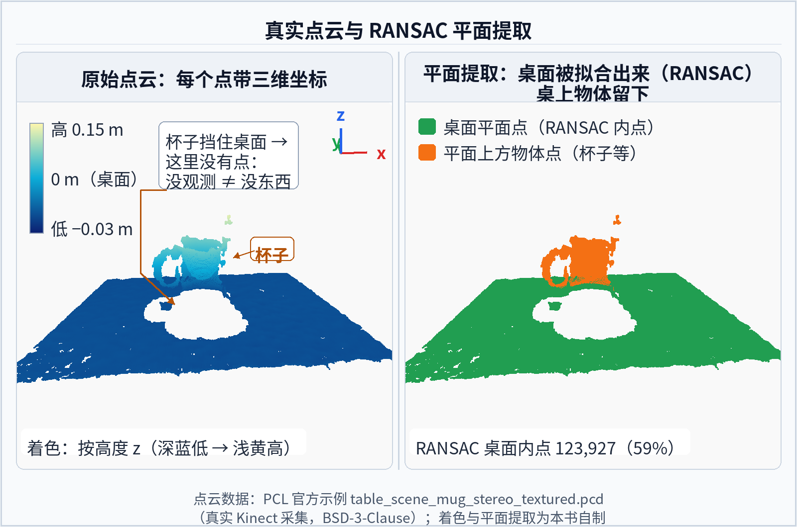

# 5.2 感知系统

## 先看一个现场问题

G1 头部的深度相机明明在画面里看到了桌上的杯子，RViz 2 里的点云却有两层重影；检测框标得准准的，抓取指令发出去，手却伸到了杯子左边 20 厘米的位置。机器人一走动，检测结果开始上下抖动；换了一张黑色桌面的桌子后，深度图直接空了一大片。

现场通常会这样问：

> “相机明明看到了，为什么机器人抓不准？这个目标的位姿到底在哪个坐标系、哪个时刻？点云为什么会飘、会缺？”

感知系统（Perception System）负责把相机、深度传感器等原始数据转换成关于环境的结构化判断：那里有什么、在哪里、在什么坐标系、置信度多高。[1][2] 它和 [4.4 节](../04-cerebellum-realtime-control/04-state-estimation.mdx)的状态估计分工明确：状态估计回答“我自己在哪、怎么动”，感知回答“周围有什么、它们在哪”。本章后续的操作、VLA/WAM 小节都要消费感知的输出。传感器本身的原理、安装与时间同步在 [3.3 节](../03-electrical-embedded/03-sensors-and-data-acquisition.md)，本节只讲感知怎么把它们的输出变成可用的结构化判断。

> **一句话听懂**：状态估计回答“我在哪”，感知回答“周围有什么”；两边的结果必须落在同一个坐标系、同一个时刻上，否则“看到杯子”和“手在哪”就对不上。

> **在整机里的位置**：这一节属于“反馈链：感知与状态估计”；上游是相机与激光雷达，下游是行为与技能层与运动与规划层。总图见 [1.4 节](../01-system-overview/04-from-task-to-motor.mdx)。

## 相机家族与标定

### RGB、深度、双目与鱼眼

- **RGB 相机（RGB Camera）**：常规彩色图像，语义信息最丰富，但不直接给距离；
- **深度相机（Depth Camera）**：主动结构光、ToF（Time of Flight）或主动双目，直接输出每像素距离；代价是黑色、反光、透明表面容易出现空洞和噪声；
- **双目相机（Stereo Camera）**：用两个相机的视差（Disparity）计算深度，被动方案，依赖表面纹理，弱纹理区域会失效；[1]
- **鱼眼相机（Fisheye Camera）**：视场角可达 180 度以上，适合近距离避障和周身覆盖，但畸变大，边缘区域的分辨率和精度都低。

选型看任务：抓取要精度，周身避障要覆盖，没有一种相机同时擅长两者。人形机器人常见的组合是头部深度相机加若干鱼眼或广角相机。

> **一句话听懂**：没有一种相机既看得广又看得准：抓取靠深度精度，避障靠视场覆盖，人形上常见的是“头部深度 + 周身鱼眼”的组合。

### 标定：感知结果落到哪个坐标系

标定（Calibration）分两层，内参和外参的一般定义见 [3.3 节](../03-electrical-embedded/03-sensors-and-data-acquisition.md)的“标定：内参与外参”，用到相机上就是：内参（Intrinsics）是相机的焦距 `fx, fy`、主点 `cx, cy` 和畸变系数，决定“像素怎么还原成一条射线”；外参（Extrinsics）是相机相对机器人某个 link 的安装位姿，决定“相机坐标系里的点落在身体的哪里”。[1]

外参错 2 度，一米外的目标位置就能偏 3 厘米以上——开头“手伸偏 20 厘米”这类故障，最常见的根因就是外参、坐标系约定或时间同步三者之一。标定参数会随碰撞、振动和温度漂移，重大撞击后要重新标定。

> **一句话听懂**：相机看到的东西要落到机器人身上，中间隔着内参和外参两道换算；外参差 2°，一米外就偏 3 厘米——抓不准时先查坐标系，再怀疑算法。

## 从像素到结构：检测、分割与点云

### 检测与分割

目标检测（Object Detection）输出目标的类别（Class）、置信度（Confidence）和包围框；实例分割（Instance Segmentation）进一步给出每个像素的归属掩码（Mask）。[2] 两者都在图像平面上工作，输出本身没有距离信息——“检测到杯子”和“杯子在桌上 30 厘米处”之间隔着深度和标定两道工序。

置信度要当作概率信号用：低置信度目标不应直接进入抓取闭环，而应先触发二次确认或换一个视角。检测模型在训练分布之外的表现会陡降，透明杯子、反光包装、训练集里没出现过的容器都是常见的失效场景。

> **一句话听懂**：检测框只说“图里有个杯子”，不说“杯子在哪”；从像素到三维位姿，还差深度和标定两道工序。

*图 5.2-1 目标检测与实例分割的输出对比；框、标签与掩码为本书叠加的示意标注（底图 [6]），不是某次真实推理的输出。*

### 深度、点云与平面提取

深度图配合内参可以逐像素反投影成点云（Point Cloud）：每个有效像素变成相机坐标系下的一个三维点。[3] 点云再经过去噪、降采样、平面提取（Plane Extraction）和聚类，就能得到桌面、地面和障碍物等结构。RANSAC 类的平面拟合是桌面操作场景的标配步骤。

深度的工程细节决定上限：边缘飞点（物体轮廓处前景背景混合的伪点）、多路径干扰、阳光下的红外失效、黑色吸光表面的空洞，都会原样传进点云。点云里“没有点”不等于“那里没有东西”，规划器必须区分“观测为空闲”和“未观测”。

> **一句话听懂**：点云里没有点，可能是那里真没东西，也可能是黑色、反光或距离太远没测到——规划器必须把“空闲”和“未观测”分开，否则会往没看过的地方撞。

*图 5.2-2 深度图按内参反投影得到点云，再经去噪、降采样与平面拟合，把桌面、地面这类结构分离出来。[7]*

## 定位与世界坐标系：里程计与 SLAM

### 里程计

视觉里程计（Visual Odometry, VO）用连续图像估计相机自身的相对运动；加入 IMU 后成为视觉惯性里程计（VIO）。激光里程计用点云匹配做同样的事。[5] 里程计输出的是局部连续的相对运动，长期会漂移。

### SLAM

SLAM（Simultaneous Localization and Mapping，同步定位与建图）在建图的同时定位，通过回环检测（Loop Closure）把漂移拉回全局一致的地图上。[4] 对机器人软件架构而言，SLAM 的产物通常是 [6.1 节](../06-software-tools-simulation/01-ros2-software-architecture.md) REP-105 里的 `map` 到 `odom` 变换：`odom` 系连续但会漂，`map` 系全局一致但允许跳变。[4.4 节](../04-cerebellum-realtime-control/04-state-estimation.mdx)的本体状态估计与感知里程计是互补的两路信息，融合时各自的时间戳、坐标系和不确定度都要显式处理。

> **一句话听懂**：里程计负责“连续但会漂”，SLAM 负责“全局一致但会跳”；两者都不能替代 [4.4 节](../04-cerebellum-realtime-control/04-state-estimation.mdx)的本体状态估计，融合时时间戳、坐标系和不确定度都要显式对齐。

## 感知输出的工程接口

感知结果要被规划器（[5.3 节](../05-brain-perception-planning-vla-wam/03-motion-planning.mdx)）和消费模块正确使用，输出至少应包含：

| 字段 | 说明 |
| --- | --- |
| 目标位姿 | 6 DoF 位姿或包围框，必须带 `frame_id` 标明坐标系 |
| 类别与置信度 | 类别标签、0–1 置信度，低置信度要有处理策略 |
| 点云/占据 | 带坐标系、时间戳和有效范围标记 |
| 时间戳 | 测量时刻，供 TF 查询和与机器人状态对齐 |
| 延迟 | 从曝光到结果可用的端到端耗时 |

延迟经常比精度更先出问题：一个 300 ms 前检测到的准确位姿，用在正在走动的机器人身上就是错的。时间戳与延迟的通用处理（测量时刻与到达时刻的区别、端到端延迟怎么拆）在 [3.3 节](../03-electrical-embedded/03-sensors-and-data-acquisition.md)，状态估计侧的要求在 [4.4 节](../04-cerebellum-realtime-control/04-state-estimation.mdx)；这里只补感知特有的一段：曝光 → 传输 → 推理 → 坐标变换 → 规划，每一级都要计入延迟预算。低置信度和超龄（时间戳过旧）的观测，应在进入规划前就被拦截。

> **一句话听懂**：感知的输出不是一张图，而是一组带坐标系、时间戳和置信度的结构化字段——少一个字段，下游就多一种出错方式。

回到开头：点云的两层重影、抓取偏出的 20 厘米、黑色桌面上缺掉的那一片深度，根因都在标定、坐标系约定与时间戳，而不是“相机不行”——相机只负责成像，把这些换算做对才是感知系统的活。

## 参考资料

[1] Hartley, R., & Zisserman, A. *Multiple View Geometry in Computer Vision*, 2nd ed. Cambridge University Press, 2004. 相机模型、内参外参标定与双目几何的标准教材。

[2] Szeliski, R. *Computer Vision: Algorithms and Applications*, 2nd ed. Springer, 2022. 检测、分割、深度与三维重建的系统性教材，全书开放获取。<https://szeliski.org/Book/>

[3] Rusu, R. B., & Cousins, S. “3D is here: Point Cloud Library (PCL).” *IEEE ICRA*, 2011. 点云处理、平面提取与 RANSAC 拟合的工程实践。<https://doi.org/10.1109/ICRA.2011.5980567>

[4] Cadena, C., et al. “Past, Present, and Future of Simultaneous Localization and Mapping: Toward the Robust-Perception Age.” *IEEE Transactions on Robotics*, 2016. SLAM 的问题定义、漂移与回环检测综述。<https://doi.org/10.1109/TRO.2016.2624754>

[5] Scaramuzza, D., & Fraundorfer, F. “Visual Odometry [Tutorial].” *IEEE Robotics & Automation Magazine*, 2011. 视觉里程计的基本原理与误差来源。<https://doi.org/10.1109/MRA.2011.943233>

[6] Unsplash. 桌面工作台俯拍照片（笔记本电脑、马克杯、书与眼镜），图 5.2-1 的底图，许可 Unsplash License（可自由使用，无需署名，此处按惯例标注）。摄影师与照片页在可达网络中未能确认，故不署名；底图直链：<https://images.unsplash.com/photo-1587614382346-4ec70e388b28>

[7] PointCloudLibrary/data. table_scene_mug_stereo_textured.pcd（真实 Kinect 采集的桌面场景点云）. 许可 BSD-3-Clause. <https://github.com/PointCloudLibrary/data>
