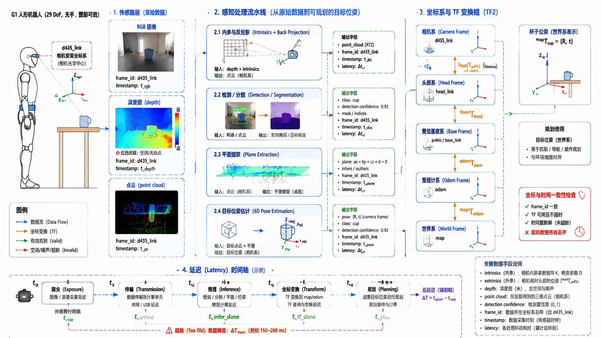

# 5.2 感知系统

## 先看一个现场问题

G1 头部的深度相机明明在画面里看到了桌上的杯子，RViz 2 里的点云却有两层重影；检测框标得准准的，抓取指令发出去，手却伸到了杯子左边 20 厘米的位置。机器人一走动，检测结果开始上下抖动；换了一张黑色桌面的桌子后，深度图直接空了一大片。

现场通常会这样问：

> “相机明明看到了，为什么机器人抓不准？这个目标的位姿到底在哪个坐标系、哪个时刻？点云为什么会飘、会缺？”

感知系统（Perception System）负责把相机、深度传感器等原始数据转换成关于环境的结构化判断：那里有什么、在哪里、在什么坐标系、置信度多高。[1][2] 它和 4.4 节的状态估计分工明确：状态估计回答"我自己在哪、怎么动"，感知回答"周围有什么、它们在哪"。本章后续的操作、VLA/WAM 小节都要消费感知的输出。

## 相机家族与标定

### RGB、深度、双目与鱼眼

- **RGB 相机（RGB Camera）**：常规彩色图像，语义信息最丰富，但不直接给距离；
- **深度相机（Depth Camera）**：主动结构光、ToF（Time of Flight）或主动双目，直接输出每像素距离；代价是黑色、反光、透明表面容易出现空洞和噪声；
- **双目相机（Stereo Camera）**：用两个相机的视差（Disparity）计算深度，被动方案，依赖表面纹理，弱纹理区域会失效；[1]
- **鱼眼相机（Fisheye Camera）**：视场角可达 180 度以上，适合近距离避障和周身覆盖，但畸变大，边缘区域的分辨率和精度都低。

选型看任务：抓取要精度，周身避障要覆盖，没有一种相机同时擅长两者。人形机器人常见的组合是头部深度相机加若干鱼眼或广角相机。

### 标定：感知结果落到哪个坐标系

标定（Calibration）分两层。内参（Intrinsics）描述相机自身：焦距 `fx, fy`、主点 `cx, cy` 和畸变系数，决定"像素怎么还原成射线"。外参（Extrinsics）描述相机相对机器人某个 link 的安装位姿，决定"相机坐标系里的点落在机器人身体的哪里"。[1]

外参错 2 度，一米外的目标位置就能偏 3 厘米以上——开头"手伸偏 20 厘米"这类故障，最常见的根因就是外参、坐标系约定或时间同步三者之一。标定参数会随碰撞、振动和温度漂移，重大撞击后要重新标定。

## 从像素到结构：检测、分割与点云

### 检测与分割

目标检测（Object Detection）输出目标的类别（Class）、置信度（Confidence）和包围框；实例分割（Instance Segmentation）进一步给出每个像素的归属掩码（Mask）。[2] 两者都在图像平面上工作，输出本身没有距离信息——"检测到杯子"和"杯子在桌上 30 厘米处"之间隔着深度和标定两道工序。

置信度要当作概率信号用：低置信度目标不应直接进入抓取闭环，而应先触发二次确认或换一个视角。检测模型在训练分布之外的表现会陡降，透明杯子、反光包装、训练集里没出现过的容器都是常见的失效场景。

### 深度、点云与平面提取

深度图配合内参可以逐像素反投影成点云（Point Cloud）：每个有效像素变成相机坐标系下的一个三维点。[3] 点云再经过去噪、降采样、平面提取（Plane Extraction）和聚类，就能得到桌面、地面和障碍物等结构。RANSAC 类的平面拟合是桌面操作场景的标配步骤。

深度的工程细节决定上限：边缘飞点（物体轮廓处前景背景混合的伪点）、多路径干扰、阳光下的红外失效、黑色吸光表面的空洞，都会原样传进点云。点云里"没有点"不等于"那里没有东西"，规划器必须区分"观测为空闲"和"未观测"。

## 定位与世界坐标系：里程计与 SLAM

### 里程计

视觉里程计（Visual Odometry, VO）用连续图像估计相机自身的相对运动；加入 IMU 后成为视觉惯性里程计（VIO）。激光里程计用点云匹配做同样的事。[5] 里程计输出的是局部连续的相对运动，长期会漂移。

### SLAM

SLAM（Simultaneous Localization and Mapping，同步定位与建图）在建图的同时定位，通过回环检测（Loop Closure）把漂移拉回全局一致的地图上。[4] 对机器人软件架构而言，SLAM 的产物通常是 6.1 节 REP-105 里的 `map` 到 `odom` 变换：`odom` 系连续但会漂，`map` 系全局一致但允许跳变。4.4 节的本体状态估计与感知里程计是互补的两路信息，融合时各自的时间戳、坐标系和不确定度都要显式处理。

## 感知输出的工程接口

感知结果要被规划器（5.3 节）和消费模块正确使用，输出至少应包含：

| 字段 | 说明 |
| --- | --- |
| 目标位姿 | 6 DoF 位姿或包围框，必须带 `frame_id` 标明坐标系 |
| 类别与置信度 | 类别标签、0–1 置信度，低置信度要有处理策略 |
| 点云/占据 | 带坐标系、时间戳和有效范围标记 |
| 时间戳 | 测量时刻，供 TF 查询和与机器人状态对齐 |
| 延迟 | 从曝光到结果可用的端到端耗时 |

延迟经常比精度更先出问题：一个 300 ms 前检测到的准确位姿，用在正在走动的机器人身上就是错的。感知链路（曝光 → 传输 → 推理 → 坐标变换 → 规划）的每一级都要计入延迟预算，这也是 4.4 节"时间不是附属字段"原则在感知侧的延续。

## G1：头部相机与仿真相机的落点

在本手册使用的 `g1_29dof.urdf` 中，头部有 `head_link`，并定义了 `d435_link` 作为头部深度相机的安装坐标系（命名对应 Intel RealSense D435 这一档深度相机）。[6] 这个 link 给出的是相机在机器人上的几何安装位姿；真实 G1 各硬件版本的相机型号、内参和出厂标定，以 Unitree 官方资料为准，模型文件不能反推这些信息。

`g1_29dof.xml` 的 MJCF 中没有定义 `camera` 元素，MuJoCo 仿真需要自行添加相机并固定到头部 link 上，同时自行配置分辨率、视场角、噪声和更新频率。[6] 这也让仿真相机成为一个可控的教学工具：可以逐项打开噪声、延迟和外参误差，观察它们如何沿"检测 → 坐标变换 → 规划 → 抓取"的链路传播成最终的操作失败，再回头对照本节的排查顺序定位问题。

感知到规划的接口建议按前文的字段表固定下来：目标位姿带 `frame_id` 和时间戳，经 TF（6.1 节）变换到基座或世界坐标系后交给 5.3 节的规划器；低置信度和超龄（时间戳过旧）的观测在进入规划前就应被拦截。

图：以 G1 `g1_29dof` 无手、腰部可动模型为例，概览从头部相机 RGB/深度/点云到检测、平面提取和目标位姿估计的感知流水线，相机系、头部系、基座系与世界系之间的 TF 变换，以及"曝光—传输—推理—变换—规划"的延迟链路。图中相机安装系对应 URDF 中的 `d435_link`；相机内参、外参与延迟数值为示意，真实参数以出厂标定为准。

## 参考资料

[1] Hartley, R., & Zisserman, A. *Multiple View Geometry in Computer Vision*, 2nd ed. Cambridge University Press, 2004. 相机模型、内参外参标定与双目几何的标准教材。

[2] Szeliski, R. *Computer Vision: Algorithms and Applications*, 2nd ed. Springer, 2022. 检测、分割、深度与三维重建的系统性教材，全书开放获取。<https://szeliski.org/Book/>

[3] Rusu, R. B., & Cousins, S. “3D is here: Point Cloud Library (PCL).” *IEEE ICRA*, 2011. 点云处理、平面提取与 RANSAC 拟合的工程实践。<https://doi.org/10.1109/ICRA.2011.5980567>

[4] Cadena, C., et al. “Past, Present, and Future of Simultaneous Localization and Mapping: Toward the Robust-Perception Age.” *IEEE Transactions on Robotics*, 2016. SLAM 的问题定义、漂移与回环检测综述。<https://doi.org/10.1109/TRO.2016.2624754>

[5] Scaramuzza, D., & Fraundorfer, F. “Visual Odometry: Part I – The First 30 Years and Fundamentals.” *IEEE Robotics & Automation Magazine*, 2011. 视觉里程计的基本原理与误差来源。<https://doi.org/10.1109/MRA.2011.943232>

[6] Unitree Robotics. *unitree_rl_gym: G1 robot description*. 官方 G1 URDF/MJCF 模型；本文使用提交 `276801e46c5d433564f24658bac64f254b7d2d4b`，用于核对 `head_link`、`d435_link` 的定义及 MJCF 中相机元素的缺失情况。<https://github.com/unitreerobotics/unitree_rl_gym/tree/276801e46c5d433564f24658bac64f254b7d2d4b/resources/robots/g1_description>
