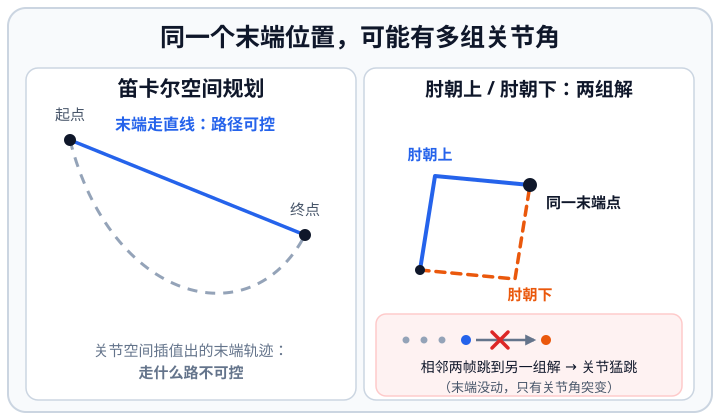
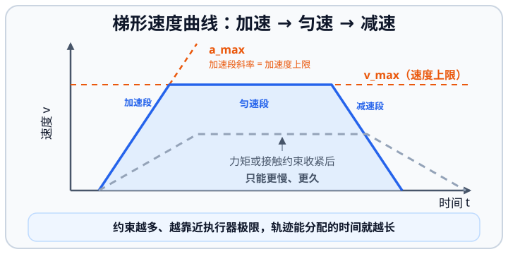

# 5.3 运动规划：大脑与小脑之间的桥

import MpcRecedingHorizonDemo from '../../../components/MpcRecedingHorizonDemo.astro';

## 先看一个现场问题

给 G1 手臂规划一条伸到桌面的轨迹：逆运动学逐帧求解都成功，每一帧的关节角也都没超限，但执行时手臂先是猛地一顿，中途肘部擦过躯干，到末端附近开始高频抖动。换到行走场景，操作员在机器人迈步中途发了一个新的速度指令，G1 急停下来，晃了两秒才重新起步。

现场通常会这样问：

> “每一个点都合法，为什么连起来就不能动？规划器出的轨迹和底层控制器到底谁听谁的？新目标来了，是立刻切过去还是把当前动作走完？”

这三个现象在下面各有各的位置：末端高频抖动出在逆解分支跳变（关节空间与笛卡尔空间），肘部擦过躯干属于自碰撞没检查到（碰撞），迈步中途急停重启则是轨迹刷新没做衔接（轨迹刷新与失败降级）。

## 规划什么、分几层、多久更新一次

运动规划（Motion Planning）回答的是：从当前状态到目标状态，生成一条满足运动学、动力学、碰撞和时间约束的运动序列。[1][2] 4.5 节假设“目标轨迹已经存在”，本节讨论它从哪里来、多久更新一次、失败时怎么办。规划器夹在中间：向上承诺能力，向下受约束限制。

在人形机器人上，规划不是一层，而是四层，相邻两层的时间尺度大约差一个量级（具体数值以各系统实现为准）：

| 层级 | 典型频率 | 职责 |
| --- | --- | --- |
| 任务/行为层 | 1–10 Hz | 目标选择、任务切换 |
| 运动规划/足步规划 | 10–100 Hz | 生成或更新轨迹与落脚点 |
| MPC/WBC | 100–1000 Hz | 滚动优化、任务分配 |
| 关节控制 | 500 Hz–数 kHz | 阻抗/力矩执行（见 4.5 节） |

分层不是流程图画得好看，而是被两件事逼出来的：越往上，决策越依赖任务和不完整的信息，算得越慢；越往下，越靠近执行器和安全边界，周期越短。跨层传递必须带时间戳——上层给的是“某时刻的目标”，不是“现在立刻照做”。4.4 节“时间不是附属字段”的原则，在规划这一层同样成立。

还有一条分岔要在开头看清楚：机械臂、移动底盘这类问题，解是**连续**的路径或轨迹；双足行走要先做**离散**决策——下一步踩在哪块地上、这一步能不能踩。接下来的小节先讲连续轨迹怎么生成（在哪个空间、怎么加时间、怎么保证不撞），再讲离散的足步规划，最后讲用什么方法算、多久刷新一次。

> **一句话听懂**：规划不是一个程序，是四层节奏不同的程序叠在一起：上层决定“去做什么”，下层决定“这一毫秒怎么动”，中间靠时间戳对齐。

## 关节空间与笛卡尔空间

### 关节空间规划

关节空间规划（Joint-Space Planning）直接在 $q$ 上插值：给定起点和终点关节角，用多项式或样条生成平滑的 $q(t)$。优点是计算快、不会奇异、关节限位可以直接写成边界；缺点是末端在空间中走什么路径完全不可控，两点之间末端可能划出很大的弧线。

### 笛卡尔空间规划

笛卡尔空间规划（Cartesian-Space Planning，也称任务空间规划）先规划末端位姿 $T(t)$——例如让手沿直线移动——再逐点用逆运动学映射回关节。末端路径可控，但代价随之而来：每一步都要解 IK（见 4.2 节），可能遇到奇异位形、无解或解分支跳变；上一帧选了肘朝上的分支，下一帧数值解跳到肘朝下，执行出来就是抖动。

开头“到末端附近开始高频抖动”说的就是这件事：位置解一直存在，但相邻两帧的解落在了不同的肘部构型上，关节角在两组解之间来回跳。工程上的选择原则：对“到没到”敏感的自由空间移动用关节空间，对“怎么过去”敏感的接触、避障和直线路径用笛卡尔空间，并显式固定 IK 解分支、检查连续性。

*图 5.3-1 同一个末端位置可能对应多组关节角：笛卡尔空间规划让末端走直线但要逐步解 IK，关节空间插值算得快、末端路径却不可控；两帧之间跳到另一组解，就是末端没动而关节猛跳。*

> **一句话听懂**：同一个末端位置往往有多组关节角，规划器要负责“一直用同一组”；换组的那一刻，末端没动，关节却在猛跳。

## 时间参数化与速度约束

一条几何路径只有加上时间才是轨迹（Trajectory）：路径回答“经过哪里”，轨迹回答“什么时刻到哪里”。时间参数化（Time Parameterization）给路径配上速度剖面，常见的是梯形速度曲线：加速、匀速、减速三段，使速度和加速度都连续有界。[1]

约束要分层核对：

- 关节速度、加速度、加加速度（Jerk）上限：来自执行器和 3.2 节的降额边界；
- 动力学约束：4.3 节的力矩上限会进一步压缩允许的加速度；
- 接触约束：行走中摆动腿的速度剖面必须与 4.6 节的步态相位对齐。

更精细的做法是时间最优路径参数化（Time-Optimal Path Parameterization, TOPP）：在固定几何路径上，求满足所有速度和力矩约束的最快时间分配。直觉不变：约束越多、越靠近执行器极限，轨迹能分配的时间就越长。

*图 5.3-2 梯形速度曲线：加速段的斜率由加速度（力矩）上限决定，平台高度由速度上限决定；约束收紧后曲线只能更矮更长。*

> **一句话听懂**：路径只说“经过哪里”，轨迹还要说“几点到哪里”；时间参数化就是给路径配一条速度曲线，配得太快会被速度、力矩和接触三条上限一起拦住。

## 碰撞：自碰撞与环境碰撞

碰撞检查分两类。自碰撞（Self-Collision）指机器人自己的连杆相撞，例如手臂后摆撞到躯干、屈膝时小腿碰大腿；它只依赖机器人自身几何，可以用 2.5 节描述的 collision 模型离线预计算连杆对、在线查表加速。环境碰撞（Environment Collision）依赖外部地图或感知，地图本身的误差和延迟必须计入。开头“肘部擦过躯干”就是自碰撞：位置和限位都合法，但中间那段轨迹扫过了自己的身体。

两个工程要点：

- 安全距离（Safety Distance/Clearance）不是装饰：模型误差、感知噪声和控制跟踪误差都会吃掉余量，贴着障碍的“零余量”轨迹在实机上几乎必然碰撞；
- 检查频率要匹配风险：规划期做完整检查，控制期至少对高速运动和已知危险连杆对做持续监控，后者与 3.6 节的保护机制衔接。

> **一句话听懂**：碰撞检查分“自己撞自己”和“撞环境”：前者靠机器人模型离线算，后者靠地图在线查；安全距离不是保守，是留给模型误差、感知噪声和控制误差的余量。

## 足步规划：离散的落脚点决策

行走的规划问题和机械臂有一个本质区别：机械臂在连续空间里找一条路径，而足步规划（Footstep Planning）要先在**离散**的落脚点集合上做选择——哪块地面能踩、踩上去会不会打滑、这一步跨多大才能既够到目标又留出稳定裕量。地面不平时，落脚点候选本身就是离散且有限的，这类问题通常用搜索求解（把落脚点当节点、把可行迈步当边），地形复杂时也会写成混合整数优化。

这一步输出的不是关节角，而是一串落脚点及其时刻（步态时序）。它交给两类下游：一是平衡控制器（4.6 节），决定质心怎么在落脚点之间移动、ZMP 与捕获点是否始终满足；二是摆动腿的连续轨迹与时间参数化（本章前两节），把“下一步踩到哪”变成可执行的关节曲线。规划层通常以 10–100 Hz 刷新，地形没变时大多只是维护已有序列，只有新障碍或新目标出现才真正重搜。

与 4.6 节的分工可以这样记：捕获点给出“为了站稳**应该**踩哪”，地形与障碍给出“**能**踩哪”，足步规划在两者之间取舍；冲突时用降低步速、缩短单支撑时长或躯干补偿来换可行性。步长、步宽、步高和时序本身的含义与取舍，见 4.6 节的“步态周期”。

> **一句话听懂**：机械臂只有“连续轨迹”一个问题，双足机器人还多了一个离散问题——下一步踩哪块地；踩哪里由“能踩哪”和“该踩哪”共同决定。

## 怎么算：采样、轨迹优化与 MPC

把“任务目标 + 约束 + 代价”写成优化问题，是现代运动规划的通用语言：

$$
\begin{aligned}
\min \quad & \text{跟踪误差} + \text{平滑代价} + \text{能耗/力矩代价} \\
\text{s.t.} \quad & \text{运动学/动力学约束、限位、碰撞、接触时序}
\end{aligned}
$$

不是所有问题都写成优化。路径搜索常用采样方法：在构型空间里随机撒点、把可行点连起来，找一条从起点到终点的无碰撞路径（RRT、PRM 一类）。它适合高维、约束不复杂的自由空间，缺点是每次解出来的路径质量不稳定，通常还要再做平滑和缩短。[2]

轨迹优化（Trajectory Optimization）离线或准实时地求解整段轨迹，代表方法包括直接配点法（Direct Collocation）、CHOMP、TrajOpt 以及 iLQR/DDP 类方法；优点是解的整体质量好，缺点是求解时间不可控，难以直接闭环。[3][4]

模型预测控制（Model Predictive Control, MPC）把优化搬进循环：每个控制周期以当前估计状态为起点，在一个有限预测时域内求解，只执行第一段控制量，下一周期用新状态重新求解。MPC 的意义不在“预测得准”，而在“每周期都重新决策”——扰动发生后，后续动作是基于新现实重新规划的。双足行走中经典的用法是以 LIPM 为预测模型在线生成质心/ZMP 轨迹和落脚点。[5] MPC 的代价是算力和实现复杂度：预测模型越精确越慢，必须在模型保真度和求解周期之间取舍。

<MpcRecedingHorizonDemo />

> **一句话听懂**：同一个问题有三条算路——随机采样找可行、轨迹优化求最优、MPC 把优化塞进每个控制周期；前两条算得慢但质量高，MPC 算得快靠的是“每次只执行第一步，下一周期重新算”。

## 轨迹刷新与失败降级

轨迹刷新（Replanning）的基本纪律是连续性：新轨迹应从旧轨迹的当前执行点平滑衔接，而不是从规划起点硬切。开头“迈步中途收到新速度指令就急停重启”正是这里没做好：规划器把新目标当成一个全新的起点，旧轨迹被整条丢掉，机器人只能先停下来再重新起步。每条轨迹应携带时间基准和时间戳，控制器按“轨迹时间”而不是“消息到达时间”执行——4.4 节“时间不是附属字段”的原则在这里同样适用。

规划失败（无解、超时、地图缺失）必须有明确的降级（Degradation）策略：保持当前轨迹走完、减速到停、退回上一安全姿态，或把控制权交还高层/操作员。最差的实现是“规划器挂了，控制器执行最后收到的半条轨迹到底”。降级策略与 3.6 节的保护链路是同一张安全网的上下两层。

> **一句话听懂**：规划器是会被打断的（新目标、新障碍、自己超时），所以刷新要“从当前执行点接上”，失败要有明确的退路——没有退路的规划器比没有规划器更危险。

## 参考资料

[1] Siciliano, B., Sciavicco, L., Villani, L., & Oriolo, G. *Robotics: Modelling, Planning and Control*. Springer, 2009. 关节空间/笛卡尔空间轨迹规划、时间参数化与插值的教材表述。

[2] LaValle, S. M. *Planning Algorithms*. Cambridge University Press, 2006. 运动规划的问题形式化、构型空间与基于采样的规划，全书开放获取。<https://lavalle.pl/planning/>

[3] Zucker, M., et al. “CHOMP: Covariant Hamiltonian Optimization for Motion Planning.” *International Journal of Robotics Research*, 2013. 以优化方式做轨迹规划的代表方法。<https://doi.org/10.1177/0278364913488805>

[4] Schulman, J., et al. “Motion Planning with Sequential Convex Optimization and Convex Collision Checking.” *International Journal of Robotics Research*, 2014. TrajOpt：序列凸优化轨迹规划。<https://doi.org/10.1177/0278364914528132>

[5] Wieber, P.-B. “Trajectory Free Linear Model Predictive Control for Stable Walking in the Presence of Strong Perturbations.” *IEEE-RAS Humanoids*, 2006. 以 LIPM 为预测模型的行走 MPC 经典工作。<https://doi.org/10.1109/ICHR.2006.321397>
