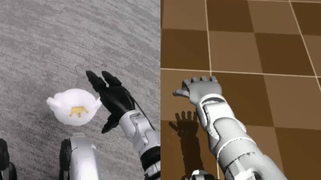

# 5.5 学习控制与模仿学习

import G1DeploySnippet from '../../../components/G1DeploySnippet.astro';
import LeRobotDatasetViewer from '../../../components/LeRobotDatasetViewer.astro';

## 先看一个现场问题

G1 的行走策略在训练仿真器里跑了几千轮，奖励曲线漂亮，换个仿真器验证时步态僵硬、轻微前倾，上实机后两脚打架直接摔倒（行走与平衡本身是第 4 章小脑层的内容，这里只借它讲学习控制的失效模式）。另一条线上，用遥操作采了 200 次抓杯示范训练的策略，杯子放在训练过的位置抓得很稳，把杯子挪开 10 厘米，机械臂就在空中犹豫抽动，最后停在了一个从未见过的姿态。

现场通常会这样问：

> “仿真里满分的策略，为什么一换环境就垮？示范数据里没出现过的状态，策略会怎么反应？训练时到底该随机化什么？”

学习控制（Learning-based Control）用从数据中训练出的策略（Policy）替代或补充手工设计的控制器。4.5–4.6 节与 5.3 节是模型驱动：先建模再求解；本节是数据驱动：先采集或生成经验，再拟合出控制行为。工程上两者几乎总是混合使用——学习策略输出的目标，最终仍由 4.5 节的关节阻抗接口执行。

> **一句话听懂**：模型驱动是“先建模再求解”，数据驱动是“先跑出经验再拟合”；两条路不是二选一，学习策略输出的目标最后仍由模型驱动的控制器执行。

## 模仿学习：从示范到策略

### 行为克隆

行为克隆（Behavior Cloning, BC）把示范数据（Demonstration）当作监督学习：每条样本是一对"观测、动作" `(observation, action)`，策略学习从状态到动作的映射 $\pi(a \mid s)$。它简单、直接、不需要奖励设计，遥操作采集 + BC 训练是当前操作任务最快出结果的路线。

代价藏在数据分布里。分布偏移（Distribution Shift）指策略执行时的小误差把机器人带进示范数据从未覆盖的状态，而在陌生状态上策略的输出无法预测，误差进一步放大，形成"越走越偏"的正反馈。开头"杯子挪 10 厘米就抽动"，就是策略离开了示范分布。DAgger 类方法的缓解思路是让专家继续标注策略实际访问到的状态，把"策略自己会走到哪里"纳入训练分布。[1]

> **一句话听懂**：行为克隆学的只是“示范里出现过的状态该怎么做”；一旦误差把机器人带出示范分布，策略就只能猜，而错误会进一步放大成“越走越偏”。

## 遥操作与数据采集

### 遥操作：人怎么把动作教给机器人

遥操作（Teleoperation）是人通过一套输入设备实时驱动机器人完成任务，同时把过程录下来当示范数据。它解决的是“人做得到、机器人还不会”这段差距：相比在仿真里反复调奖励函数，遥操作直接给出人认可的动作，省掉了奖励设计的试错。

按输入设备分，常见四类：

| 方式 | 覆盖的动作 | 力反馈 | 成本与门槛 | 典型场景 |
| --- | --- | --- | --- | --- |
| 主从臂（Leader-Follower） | 双臂 + 手爪/手指，结构与手接近 | 可做（取决于主臂是否反向可驱动） | 需要一整套同构主臂，最贵 | 精细双臂操作、灵巧手示教 |
| 动作捕捉 / 惯性手套 | 手臂姿态、手指关节角 | 通常无 | 中，需要标定与重定向 | 快速采集人的动作作为参考轨迹 |
| VR 手柄 / 空间鼠标 | 末端 6 DoF + 开合原语 | 无（只有画面反馈） | 低，一套头显即可 | 抓放、推拉等粗粒度任务 |
| 外骨骼 | 关节级，接近真机运动学 | 可做 | 高，需与人肢对齐 | 需要关节级示范的研究场景 |

三个工程细节决定数据好不好用。一是**重定向（Retargeting）**：人手和机器人手的关节数、指长、工作空间都不同，“人的姿势”必须换算成“机器人能执行的关节角”，换算有偏差，示范就带上一层系统性误差。二是**延迟与反馈**：操作者看到的画面和力反馈都有延迟，延迟越大动作越保守、越容易抖动，这些抖动会原样进数据集。三是**操作者一致性**：同一个任务换个人做，速度、抓取点、松手时机都不同，示范越多、风格越杂，策略要拟合的分布越宽。

落到 G1：带手模型上常见的组合是主从臂或 VR 手柄驱动，动作空间取 5.4 节的末端增量或手指原语。LeRobot 把采集、数据集格式与训练串成一条流水线，是本书采用的参考实现。[6][8]

> **一句话听懂**：遥操作是把“人做得到、机器人还不会”的那段差距人工补上；四种设备的差别在于覆盖的动作有多细、有没有力反馈，而重定向和延迟会在示范里留下系统性误差。

*图 5.5-1 用 Apple Vision Pro 遥操作 G1 的灵巧手完成任务：左为俯视、右为侧视相机画面。[11]*

### 数据采集：采什么、怎么保证能用

采一次示范，至少要同步记录这些流：

| 字段 | 说明 |
| --- | --- |
| 观测流 | RGB/深度图像、关节位置与速度；各路采样率不同，必须按时间戳对齐（3.3 节） |
| 动作 | 与 5.4 节一致的动作空间定义；换动作空间等于换数据集 |
| 时间戳 | 每路数据的测量时刻，而不是消息到达时刻 |
| 任务与语言标注 | 这条示范在做什么（如“把红杯子递给我”），VLA 训练要用（5.6 节） |
| 成功/失败标签 | 失败轨迹同样有训练价值，前提是保留“失败”这个事实 |
| 标定参数 | 相机内外参、坐标变换版本；换了标定要记下来，否则数据不可复现 |

上表是要记录的字段，下面用一个真实的 LeRobot 数据集片段把它们跑起来：拖动时间轴或用播放键逐帧查看，两台相机画面与关节状态、动作曲线上的游标始终对齐。[10]

<LeRobotDatasetViewer />

两个常踩的坑：**频率与同步**——图像 30 Hz、关节状态 500 Hz、动作指令 50 Hz，直接按帧拼会把不同时刻的数据凑成一帧，制造出并不存在的因果关系；**动作空间漂移**——采集中途换了动作空间却不标注，数据集会变成两种分布混在一起。

规模与质量的关系值得单说：示范数据决定策略的上限。几十到几百条精心采集的示范，往往比几千条随手采的更能训出稳定策略，因为分布偏移的严重程度由**示范覆盖了多少真实会遇到的状态**决定，而不是由条数决定。跨机构的大规模数据集（如 Open X-Embodiment）解决的是另一件事——让模型见到更多机器人、更多任务；具体到一台 G1 上的任务，本地采集的覆盖度仍然决定成败。[9]

注意区分两个“数据采集”：3.3 节的数据采集指传感器把物理量变成数据（采样率、时间戳、误差模型），本节的“数据采集”指把人的示范变成训练数据——共同点是时间同步，其余问题完全不同。

> **一句话听懂**：数据采集是把示范完整、同步、带标注地记下来；数据决定策略的上限，算法只决定能多接近这个上限。

## 强化学习：从奖励到策略

### 基本要素

强化学习（Reinforcement Learning, RL）把控制问题建模为马尔可夫决策过程（MDP）：智能体在状态 $s$ 下采取动作 $a$，环境（Environment）返回奖励（Reward）和下一状态，策略 $\pi(a \mid s)$ 的目标是让长期累计奖励最大；价值函数（Value Function）估计未来能拿到的预期回报，用于指导策略更新：只看当前状态的是状态价值 $V^\pi(s)$，看"状态—动作对"的是动作价值 $Q^\pi(s,a)$。[2] 人形机器人上最常用的算法是 PPO（Proximal Policy Optimization），配合大规模并行仿真一次训练成千上万个机器人实例。[3][5]

> **一句话听懂**：强化学习用奖励代替标准答案——智能体试、环境给分、策略朝加分的方向更新；代价是要海量试错，所以几乎只在并行仿真里做。

### 奖励设计是最大的自由度，也是最大的坑

奖励函数决定策略学成什么样。奖励黑客（Reward Hacking）指策略找到奖励函数的字面漏洞而非完成任务本身：为了最大化"头部高度"奖励而不迈步，为了最小化能耗而原地站立。好的奖励设计通常包含任务项（速度跟踪、目标位姿）加正则项（能耗、力矩变化率、关节接近限位惩罚、动作平滑），并需要大量观察训练曲线和回放来迭代。

> **一句话听懂**：奖励函数写的是什么，策略就学什么；写歪一点，它就会用最省力的方式钻空子——原地站着也能刷到“头部高度”奖励。

### 域随机化与课程学习

域随机化（Domain Randomization, DR）在训练时随机改变仿真参数——连杆质量、地面摩擦、电机强度、传感器噪声、外力扰动、延迟——让策略无法依赖任何一组具体参数，被迫学会在参数不确定下完成任务。[4] 课程学习（Curriculum Learning）则按难度递进安排训练：先平地低速，再逐渐加坡度、推力和复杂地形。[12]两者配合，是当前腿式机器人策略鲁棒性的主要来源。

> **一句话听懂**：域随机化让策略在训练时见不到两组完全一样的参数，逼它不依赖任何一组；课程学习把难度排好序。两者合起来，才是腿式机器人策略抗扰的主要来源。

## Sim2Sim 与 Sim2Real

仿真到现实的差距（Reality Gap）来自三类差异：

- **动力学差异**：接触模型、减速器摩擦与回差、执行器响应。仿真器之间也有差异，所以先在另一个仿真器里验证（[Sim2Sim](../06-software-tools-simulation/02-mujoco.mdx)，详见 6.2 节）——例如在 [Isaac Gym（6.3 节的 Isaac Lab 是其继任）](../06-software-tools-simulation/03-isaac-sim-isaac-lab.mdx) 里训练、到 [MuJoCo（6.2 节）](../06-software-tools-simulation/02-mujoco.mdx) 里部署——能用很低成本暴露"策略过拟合了训练仿真器"的问题；[5][7]
- **传感器差异**：噪声、量化、零偏、安装误差（对应 4.4 节的估计误差来源）；
- **延迟差异**：观测、推理、通信、执行各级的延迟在实机上更长且抖动更大。

弥合手段按性价比排序：域随机化是最通用的保险；系统辨识（4.3 节的参数辨识）把真实质量、摩擦和执行器特性测回来，直接缩小动力学差距；执行器模型（Actuator Model）把电机的非线性响应显式建进仿真；延迟建模把固定延迟和随机抖动注入训练。[5]

> **一句话听懂**：仿真与现实的差距就三类——动力学、传感器、延迟；先换一个仿真器验证（Sim2Sim）能以很低成本暴露“过拟合训练仿真器”，再用域随机化、系统辨识和执行器模型缩小真机差距。

## G1：从训练到部署的一条链路

以 [`unitree_rl_gym`](https://github.com/unitreerobotics/unitree_rl_gym) 的 G1 行走为例，训练到部署分四步：**并行训练 → Sim2Sim → 部署（50 Hz 输出关节目标）→ 低层 PD 执行**。四步分别落在仓库的 `legged_gym/`、`deploy/deploy_mujoco/`、`deploy/deploy_real/` 里（同族的 `unitree_mujoco`、`unitree_sdk2` 也都是 BSD-3-Clause）。下面把三段关键代码逐字摘出来：[7]

<G1DeploySnippet />

想自己跑一遍，顺序大致是：克隆 `unitree_rl_gym` → 用 `legged_gym/scripts/train.py` 先跑通默认任务，再改奖励与随机化 → 拿 `deploy/pre_train/g1/` 里的策略在 `deploy_mujoco.py` 里做 Sim2Sim → 步态在 MuJoCo 里站得住之后，再按 `deploy_real` 的说明上实机。这条顺序不建议跳：Sim2Sim 是最便宜的一道关。

注意这条链路里学习策略的边界：策略只决定"关节目标往哪走"，力矩级的稳定性、限幅和异常保护仍由低层和 3.6 节的安全链路承担。策略输出必须做限幅和变化率限制，未经 Sim2Sim 验证的策略不上实机，实机首跑必须有吊架或人工保护。

操作任务的链路对称：遥操作采集（LeRobot 格式）→ BC/扩散策略训练 → 输出 5.4 节的末端增量或关节动作 → 经全身控制和关节阻抗执行。两条链路共享同一条纪律：学习模块的失效模式是"输出无法预测"，所以所有学习输出的下游都必须有模型驱动的保护层兜底。

> **一句话听懂**：学习策略只负责“关节目标往哪走”，力矩、限幅和异常保护仍在模型驱动的低层；所以“未经 Sim2Sim 验证不上实机”这条纪律，比策略用什么网络更关键。

## 参考资料

[1] Ross, S., Gordon, G., & Bagnell, D. “A Reduction of Imitation Learning and Structured Prediction to No-Regret Online Learning.” *AISTATS*, 2011. DAgger 与分布偏移问题的经典分析。<https://arxiv.org/abs/1011.0686>

[2] Sutton, R. S., & Barto, A. G. *Reinforcement Learning: An Introduction*, 2nd ed. MIT Press, 2018. MDP、策略、价值函数与强化学习基础，全书开放获取。<http://incompleteideas.net/book/the-book-2nd.html>

[3] Schulman, J., et al. “Proximal Policy Optimization Algorithms.” *arXiv*, 2017. PPO 算法原文。<https://arxiv.org/abs/1707.06347>

[4] Tobin, J., et al. “Domain Randomization for Transferring Deep Neural Networks from Simulation to the Real World.” *IEEE/RSJ IROS*, 2017. 域随机化的奠基工作。<https://doi.org/10.1109/IROS.2017.8202133>

[5] Hwangbo, J., et al. “Learning Agile and Dynamic Motor Skills for Legged Robots.” *Science Robotics*, 2019. 腿式机器人 RL 训练、执行器模型与 Sim2Real 的代表工作。<https://doi.org/10.1126/scirobotics.aau5872>

[6] Hugging Face. *LeRobot: Making AI for Robotics More Accessible*. 本文使用提交 `fbb811fca92504439792b97d216f0d00c2268382`，用于核对机器人数据集格式、遥操作采集与模仿学习流水线。<https://github.com/huggingface/lerobot/tree/fbb811fca92504439792b97d216f0d00c2268382>

[7] Unitree Robotics. *unitree_rl_gym: G1 robot description and RL example*. 官方 G1 强化学习示例；本文使用提交 `276801e46c5d433564f24658bac64f254b7d2d4b`，用于核对 G1 行走策略训练、Sim2Sim 与部署链路结构。<https://github.com/unitreerobotics/unitree_rl_gym/tree/276801e46c5d433564f24658bac64f254b7d2d4b>

[8] Zhao, T., et al. “Learning Fine-Grained Bimanual Manipulation with Low-Cost Hardware.” *RSS*, 2023. 低成本主从遥操作与双臂精细操作的数据采集（ALOHA）。<https://arxiv.org/abs/2304.13705>

[9] Open X-Embodiment Collaboration. “Open X-Embodiment: Robotic Learning Datasets and RT-X Models.” *ICRA*, 2024. 跨机构机器人数据集的组装、统一格式与规模。<https://arxiv.org/abs/2310.08864>

[10] Hugging Face. *LeRobot Dataset: lerobot/svla_so101_pickplace*（SO-101 真机遥操作演示，任务 “pink lego brick into the transparent box”）。许可 Apache-2.0，本文使用 revision `f641879e22172be7e8161d5e6c1503c2d2feb657` 的 episode 0 片段，用于 5.5 节「数据采集」的可交互查看器。<https://huggingface.co/datasets/lerobot/svla_so101_pickplace>

[11] GalaxyGeneralRobotics. *OpenWBT: Whole-Body Teleoperation of the Unitree G1 and H1 Humanoid Robot with Apple Vision Pro*. 许可 Apache-2.0；图 5.5-1 取自其仓库 `img/demo.webp`（VR 遥操作下的 G1 灵巧手操作，双目相机视角）。<https://github.com/GalaxyGeneralRobotics/OpenWBT>

[12] Bengio, Y., Louradour, J., Collobert, R., & Weston, J. “Curriculum Learning.” *ICML*, 2009. 课程学习：按难度递进安排训练样本的原始论文。<https://doi.org/10.1145/1553374.1553380>
