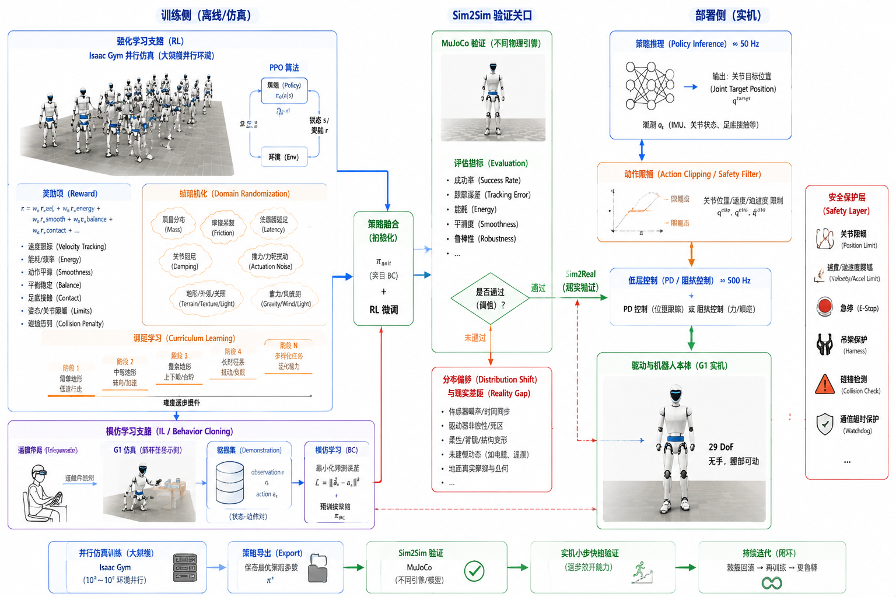

# 5.3 学习控制与模仿学习

## 先看一个现场问题

G1 的行走策略在训练仿真器里跑了几千轮，奖励曲线漂亮，换个仿真器验证时步态僵硬、轻微前倾，上实机后两脚打架直接摔倒。另一条线上，用遥操作采了 200 次抓杯示范训练的策略，杯子放在训练过的位置抓得很稳，把杯子挪开 10 厘米，机械臂就在空中犹豫抽动，最后停在了一个从未见过的姿态。

现场通常会这样问：

> “仿真里满分的策略，为什么一换环境就垮？示范数据里没出现过的状态，策略会怎么反应？训练时到底该随机化什么？”

学习控制（Learning-based Control）用从数据中训练出的策略（Policy）替代或补充手工设计的控制器。4.5–4.7 节是模型驱动：先建模再求解；本节是数据驱动：先采集或生成经验，再拟合出控制行为。工程上两者几乎总是混合使用——学习策略输出的目标，最终仍由 4.5 节的关节阻抗接口执行。

## 模仿学习：从示范到策略

### 行为克隆

行为克隆（Behavior Cloning, BC）把示范数据（Demonstration）当作监督学习：每条样本是一对"观测、动作" `(observation, action)`，策略学习从状态到动作的映射 `pi(a|s)`。它简单、直接、不需要奖励设计，遥操作采集 + BC 训练是当前操作任务最快出结果的路线。

代价藏在数据分布里。分布偏移（Distribution Shift）指策略执行时的小误差把机器人带进示范数据从未覆盖的状态，而在陌生状态上策略的输出无法预测，误差进一步放大，形成"越走越偏"的正反馈。开头"杯子挪 10 厘米就抽动"，就是策略离开了示范分布。DAgger 类方法的缓解思路是让专家继续标注策略实际访问到的状态，把"策略自己会走到哪里"纳入训练分布。[1]

### 数据从哪来

操作任务的数据通常来自遥操作（Teleoperation）：人通过 VR 手柄、主从臂或外骨骼驱动机器人完成任务，同时记录图像、机器人状态和动作。LeRobot 等开源框架把数据集格式、采集和训练流水线标准化，是本书采用的参考实现之一。[6] 数据格式里动作的维度定义必须与 5.2 节的动作空间一致——换动作空间等于换数据集。

## 强化学习：从奖励到策略

### 基本要素

强化学习（Reinforcement Learning, RL）把控制问题建模为马尔可夫决策过程（MDP）：智能体在状态 `s` 下采取动作 `a`，环境（Environment）返回奖励（Reward）和下一状态，策略 `pi(a|s)` 的目标是让长期累计奖励最大；价值函数（Value Function）估计"当前状态或状态-动作对未来的预期回报"，用于指导策略更新。[2] 人形机器人上最常用的算法是 PPO（Proximal Policy Optimization），配合大规模并行仿真一次训练成千上万个机器人实例。[3][5]

### 奖励设计是最大的自由度，也是最大的坑

奖励函数决定策略学成什么样。奖励黑客（Reward Hacking）指策略找到奖励函数的字面漏洞而非完成任务本身：为了最大化"头部高度"奖励而不迈步，为了最小化能耗而原地站立。好的奖励设计通常包含任务项（速度跟踪、目标位姿）加正则项（能耗、力矩变化率、关节接近限位惩罚、动作平滑），并需要大量观察训练曲线和回放来迭代。

### 域随机化与课程学习

域随机化（Domain Randomization, DR）在训练时随机改变仿真参数——连杆质量、地面摩擦、电机强度、传感器噪声、外力扰动、延迟——让策略无法依赖任何一组具体参数，被迫学会在参数不确定下完成任务。[4] 课程学习（Curriculum Learning）则按难度递进安排训练：先平地低速，再逐渐加坡度、推力和复杂地形。两者配合，是当前腿式机器人策略鲁棒性的主要来源。

## Sim2Sim 与 Sim2Real

仿真到现实的差距（Reality Gap）来自三类差异：

- **动力学差异**：接触模型、减速器摩擦与回差、执行器响应。仿真器之间也有差异，所以先在另一个仿真器里验证（Sim2Sim）——例如在 Isaac Gym 训练、到 MuJoCo 里部署——能用很低成本暴露"策略过拟合了训练仿真器"的问题；[5][7]
- **传感器差异**：噪声、量化、零偏、安装误差（对应 4.4 节的估计误差来源）；
- **延迟差异**：观测、推理、通信、执行各级的延迟在实机上更长且抖动更大。

弥合手段按性价比排序：域随机化是最通用的保险；系统辨识（4.3 节的参数辨识）把真实质量、摩擦和执行器特性测回来，直接缩小动力学差距；执行器模型（Actuator Model）把电机的非线性响应显式建进仿真；延迟建模把固定延迟和随机抖动注入训练。[5]

## G1：从训练到部署的一条链路

以 `unitree_rl_gym` 的 G1 行走为例，训练到部署的完整链路是：[7]

```text
Isaac Gym 大规模并行训练（PPO + 域随机化）
    → Sim2Sim 验证（MuJoCo 中跑同一策略）
    → 部署：策略网络以 50 Hz 级频率输出各关节目标位置
    → 低层按固定的 kp/kd 增益执行 PD 跟踪（4.5 节）
```

注意这条链路里学习策略的边界：策略只决定"关节目标往哪走"，力矩级的稳定性、限幅和异常保护仍由低层和 3.6 节的安全链路承担。策略输出必须做限幅和变化率限制，未经 Sim2Sim 验证的策略不上实机，实机首跑必须有吊架或人工保护。

操作任务的链路对称：遥操作采集（LeRobot 格式）→ BC/扩散策略训练 → 输出 5.2 节的末端增量或关节动作 → 经全身控制和关节阻抗执行。两条链路共享同一条纪律：学习模块的失效模式是"输出无法预测"，所以所有学习输出的下游都必须有模型驱动的保护层兜底。



图：以 G1 `g1_29dof` 无手、腰部可动模型为例，概览并行仿真训练（PPO、奖励项、域随机化、课程学习）、遥操作示范采集、Sim2Sim 验证关口，以及策略输出关节目标位置经限幅后由低层 PD 执行的部署链路和安全保护层。图中频率为典型量级示意；具体训练配置与频率以所使用的示例工程为准。

## 参考资料

[1] Ross, S., Gordon, G., & Bagnell, D. “A Reduction of Imitation Learning and Structured Prediction to No-Regret Online Learning.” *AISTATS*, 2011. DAgger 与分布偏移问题的经典分析。<https://arxiv.org/abs/1011.0686>

[2] Sutton, R. S., & Barto, A. G. *Reinforcement Learning: An Introduction*, 2nd ed. MIT Press, 2018. MDP、策略、价值函数与强化学习基础，全书开放获取。<http://incompleteideas.net/book/the-book-2nd.html>

[3] Schulman, J., et al. “Proximal Policy Optimization Algorithms.” *arXiv*, 2017. PPO 算法原文。<https://arxiv.org/abs/1707.06347>

[4] Tobin, J., et al. “Domain Randomization for Transferring Deep Neural Networks from Simulation to the Real World.” *IEEE/RSJ IROS*, 2017. 域随机化的奠基工作。<https://doi.org/10.1109/IROS.2017.8202133>

[5] Hwangbo, J., et al. “Learning Agile and Dynamic Motor Skills for Legged Robots.” *Science Robotics*, 2019. 腿式机器人 RL 训练、执行器模型与 Sim2Real 的代表工作。<https://doi.org/10.1126/scirobotics.aau5872>

[6] Hugging Face. *LeRobot: Making AI for Robotics More Accessible*. 本文使用提交 `fbb811fca92504439792b97d216f0d00c2268382`，用于核对机器人数据集格式、遥操作采集与模仿学习流水线。<https://github.com/huggingface/lerobot/tree/fbb811fca92504439792b97d216f0d00c2268382>

[7] Unitree Robotics. *unitree_rl_gym: G1 robot description and RL example*. 官方 G1 强化学习示例；本文使用提交 `276801e46c5d433564f24658bac64f254b7d2d4b`，用于核对 G1 行走策略训练、Sim2Sim 与部署链路结构。<https://github.com/unitreerobotics/unitree_rl_gym/tree/276801e46c5d433564f24658bac64f254b7d2d4b>
