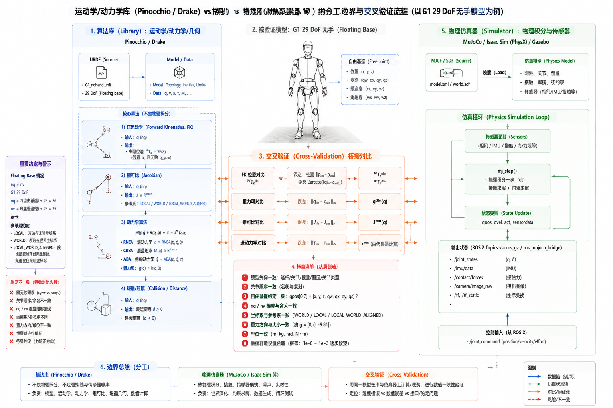

# 6.4 运动学与动力学工具库

## 先看一个现场问题

团队手写了一个 G1 腿部正运动学，和仿真器里的脚端位置差了几度——四元数分量顺序和坐标系约定不一致。改用库之后，重力补偿力矩算出来了，机器人手臂还是下垂——逆动力学调用时忘了浮动基座占掉的 6 个速度维度，`tau` 的索引整体错位。雅可比矩阵调用时选了 LOCAL 参考系，下游代码却按 WORLD 系消费，力矩映射方向整个反掉。

现场通常会这样问：

> “这些运动学动力学算法为什么还要自己算？仿真器不是已经算了吗？库和仿真器的边界到底在哪？”

仿真器（6.1–6.3 节）回答"给定控制输入，世界如何演化"；运动学与动力学库回答另一类问题——"给定当前状态，正逆运动学、雅可比、质量矩阵、逆动力学是多少"。它们是嵌进你自己代码里的算法库（Library），输出的是量，不是世界。控制器、规划器、估计器里需要的矩阵和向量，就来自这类库。

## Pinocchio：刚体动力学算法库

### 模型与数据

Pinocchio 从 URDF 加载模型，构建 `Model`（结构：关节、惯量、几何）和 `Data`（一次计算的缓存与结果）。[1][2] 对带浮动基座的 G1，`model.nq` 与 `model.nv` 不相等：四元数让位置多出一个数，这就是开头 `tau` 索引错位的来源——任何拼接状态向量的代码都要分清这两个维度（回扣 4.3 节）。

### 正运动学与雅可比

正运动学（`forwardKinematics`）更新所有连杆和坐标系（Frame）的位姿；雅可比用 `computeJointJacobian` 或 Frame 级接口计算。最大的使用陷阱是参考系约定：同一个雅可比可以表达在 LOCAL、WORLD 或 LOCAL_WORLD_ALIGNED 系下，选错约定，结果在数值上"看起来差不多"，用到力矩映射（4.2 节）上方向就错了。调用方和被调用方必须显式约定参考系，这是 4.1 节坐标纪律在 API 层的延续。

### 动力学三件套

Pinocchio 实现了刚体动力学的三类经典递归算法，名字对应 4.3 节的三类计算：[4]

- **RNEA**（Recursive Newton-Euler Algorithm）：逆动力学，给定 `q, v, a` 算所需力矩；令 `a=0` 并只保留重力，即得重力项 `g(q)`——重力补偿（4.5 节）的标准取法；
- **CRBA**（Composite Rigid Body Algorithm）：计算质量矩阵 `M(q)`；
- **ABA**（Articulated Body Algorithm）：正动力学，给定力矩算加速度。

### 碰撞与几何

Pinocchio 可加载 URDF 的 collision 几何并计算连杆对距离和碰撞状态，供规划器（4.7 节）做自碰撞检查。网格级检查快且缓存友好，适合放进规划内层循环。

## Drake：动力学、优化与控制一体

Drake 的定位比 Pinocchio 更宽：多体动力学（MultibodyPlant）、接触与约束、系统框图（Diagram，把控制器、估计器、环境连成信号流图），以及数学优化（MathematicalProgram）和轨迹优化（Direct Collocation 等）都在同一个框架里。[3] 4.7 节"任务目标 + 约束 + 代价"的轨迹优化，在 Drake 里可以直接落成代码。

两个库的分工：要一个快、轻、可嵌入实时循环的动力学计算内核，选 Pinocchio；要把动力学、约束、优化和控制设计放进一个研究原型，选 Drake。二者都以 URDF/SDF 建模，模型的核对纪律与仿真器导入相同。

图：以 G1 `g1_29dof` 无手、腰部可动模型为例，对比运动学/动力学库（URDF → Model/Data → FK、Jacobian、RNEA/CRBA/ABA、碰撞检查）与物理仿真器（MJCF → 仿真循环）的分工，以及 FK 位姿、重力项、雅可比、逆动力学四项交叉验证和约定排查清单。图中结构用于解释工具边界；接口名称与语义以各库版本为准。

## 参考资料

[1] Carpentier, J., et al. “The Pinocchio C++ Library: A Fast and Flexible Implementation of Rigid Body Dynamics Algorithms and Their Analytical Derivatives.” *IEEE/SICE SII*, 2019. Pinocchio 的设计与算法实现。<https://doi.org/10.1109/SII.2019.8700380>

[2] stack-of-tasks. *pinocchio: A fast and flexible implementation of Rigid Body Dynamics algorithms*. 本文使用提交 `e2b0d97ab714f8727bf176e2585c679b5be2a125`，用于核对 Model/Data、FK、雅可比与 RNEA/CRBA/ABA 接口。<https://github.com/stack-of-tasks/pinocchio/tree/e2b0d97ab714f8727bf176e2585c679b5be2a125>

[3] Tedrake, R., & the Drake Development Team. *Drake: Model-Based Design and Verification for Robotics*. 多体动力学、系统框图与轨迹优化框架。<https://drake.mit.edu>

[4] Featherstone, R. *Rigid Body Dynamics Algorithms*. Springer, 2008. RNEA、CRBA、ABA 三类算法的标准教材。

[5] Unitree Robotics. *unitree_rl_gym: G1 robot description*. 官方 G1 URDF/MJCF 模型；本文使用提交 `276801e46c5d433564f24658bac64f254b7d2d4b`，作为库与仿真器交叉验证的统一模型来源。<https://github.com/unitreerobotics/unitree_rl_gym/tree/276801e46c5d433564f24658bac64f254b7d2d4b/resources/robots/g1_description>
