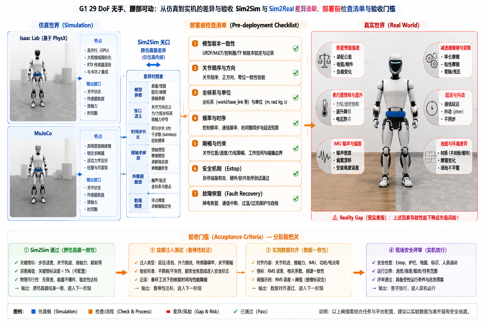

# 6.5 从仿真到真实系统

## 先看一个现场问题

策略在 MuJoCo 里通过了 Sim2Sim 验证，上实机后 G1 走了三步就往前栽。回放日志发现：实机的关节响应比仿真慢了十几毫秒，策略按"指令立即生效"的假设输出了下一拍目标；同一块电池电量下降到一半后，峰值扭矩明显变小，原来能恢复的扰动恢复不了；实验室的木地板换成了瓷砖，脚底打滑，支撑假设直接失效。

现场通常会这样问：

> “仿真里全过了，上实机还差什么？到底有哪些差异是仿真给不了的？上真机之前，到底要检查完哪些项才算准备好了？”

本节把 5.3 节的 Sim2Sim/Sim2Real 从学习策略视角换成系统工程视角：策略训练关注"策略是否鲁棒"，系统部署关注"接口、时序、参数和保护是否全部对齐"。[1][2]

## Sim2Sim：先过仿真器之间的关

在 Isaac Lab 训练、到 MuJoCo 验证（6.1、6.2 节）之所以有价值，是因为两个仿真器的差异暴露的是最容易修复的一类问题。差异清单按出现频率排序：

| 差异项 | 典型表现 | 处理 |
| --- | --- | --- |
| 模型参数 | 质量、惯量、关节限位不一致 | 以官方源文件为唯一基准逐项核对（2.5 节的模型管理） |
| 接口语义 | `ctrl` 是力矩还是位置、单位、关节顺序 | 写适配层并加单元测试 |
| 时间步长 | 策略频率、控制分频、积分步长不同 | 显式声明每层频率，对齐时间戳 |
| 接触求解 | 软接触参数、摩擦模型、求解迭代数 | 接触行为以实验标定为准，不跨仿真器搬参数 |

Sim2Sim 全过只能说明"策略不依赖某个仿真器的特性"，它是上实机的必要条件，远非充分条件。

## Sim2Real：真实系统的差异清单

实机多出的是仿真器里根本不存在或高度理想化的因素：

- **质量与惯量**：电池、线束、装配误差和磨损让真实参数偏离模型，4.3 节的参数辨识是缩小差距的正路；
- **摩擦**：减速器摩擦随温度和磨损变化，低速爬行（4.5 节）在实机上比仿真明显；
- **执行器**：响应延迟、力矩饱和、温升降额（3.2 节）——开头"电池半电后扰动恢复不了"就是降额与饱和的体现；
- **延迟与抖动**：传感、通信、计算、执行各级延迟（3.4、3.5 节）在实机上更长且不稳定，策略若按零延迟训练会直接失稳；
- **噪声**：编码器量化、IMU 零偏与漂移（4.4 节）；
- **地面**：材质、平整度、倾斜度和湿度改变摩擦与接触几何，仿真里的无限大刚性平面在实机上不存在。[1][2]

弥合手段与 5.3 节相同——域随机化、系统辨识、执行器模型、延迟建模；系统视角额外强调的是：每一项差异都要有实测数据支撑，"应该差不多"不是验收依据。

## 部署前检查清单

G1 上实机前，按这张清单逐项签字确认，任何一项存疑都不上电：

1. **模型版本**：部署代码使用的模型文件名、DoF、腰部与手部配置，与真机硬件一致（2.5 节模型管理）；
2. **关节顺序**：部署代码的关节索引与 SDK 消息顺序一致，按名字核对而不是凭记忆；[3]
3. **坐标系与单位**：四元数顺序、旋转轴正负、弧度/角度、力矩单位（4.1 节）；
4. **频率**：策略频率、控制频率、状态读取频率和通信周期全部实测确认（3.5 节）；
5. **限幅**：策略输出限幅、关节位置/速度/力矩限幅与 3.6 节的保护参数一致；
6. **急停**：物理急停和软件急停都在链路上实测触发过一次；
7. **故障恢复**：掉线、超时、NaN、传感器失效时的降级行为已演练（3.6 节），恢复流程明确谁有权重新上电。

清单之外的工程纪律：实机首跑用吊架或人工扶持；新策略先低速小幅度再逐步放开；每一次上实机的代码、模型、参数和固件版本都要留档（对应 7.1 节的版本管理）。

## 验收门槛：什么算"可以上真机"

一个可辩护的部署门槛包含四层证据：Sim2Sim 在两个以上仿真器通过；限幅与保护链路经过故障注入测试（7.2 节）；关键差异项（延迟、摩擦、执行器响应）有实测数据并与训练随机化范围对齐；现场安全评审通过（7.3 节）。四层缺任何一层，部署决策都应能给出书面理由。这套门槛的意义在于把"感觉可以了"换成"证据齐了"。

图：以 G1 `g1_29dof` 无手、腰部可动模型为例，概览 Isaac Lab 与 MuJoCo 之间的 Sim2Sim 关口及差异项、上实机前的七项检查清单、真实系统中的差异来源（质量惯量、摩擦、执行器饱和与温升、延迟抖动、噪声、地面材质），以及四层验收门槛。图中清单与正文一致；具体参数以实测和对应 SDK 版本为准。

## 参考资料

[1] Tobin, J., et al. “Domain Randomization for Transferring Deep Neural Networks from Simulation to the Real World.” *IEEE/RSJ IROS*, 2017. 域随机化与 Sim2Real 差距分析。<https://doi.org/10.1109/IROS.2017.8202133>

[2] Peng, X. B., et al. “Sim-to-Real Transfer of Robotic Control with Dynamics Randomization.” *IEEE ICRA*, 2018. 动力学随机化与实机部署差异的系统研究。<https://doi.org/10.1109/ICRA.2018.8460528>

[3] Unitree Robotics. *unitree_sdk2: G1 robot SDK version 2*. 官方 SDK2 消息定义；本文使用提交 `9754cd153af3da471b0fe5f3aa535e426fb11db3`，用于核对部署时的关节索引、消息字段与模式切换语义。<https://github.com/unitreerobotics/unitree_sdk2/tree/9754cd153af3da471b0fe5f3aa535e426fb11db3/include/unitree/idl/hg>

[4] Unitree Robotics. *unitree_rl_gym: G1 robot description and RL example*. 官方 G1 模型与部署示例；本文使用提交 `276801e46c5d433564f24658bac64f254b7d2d4b`，作为 Sim2Sim 与部署链路的参考实现。<https://github.com/unitreerobotics/unitree_rl_gym/tree/276801e46c5d433564f24658bac64f254b7d2d4b>
