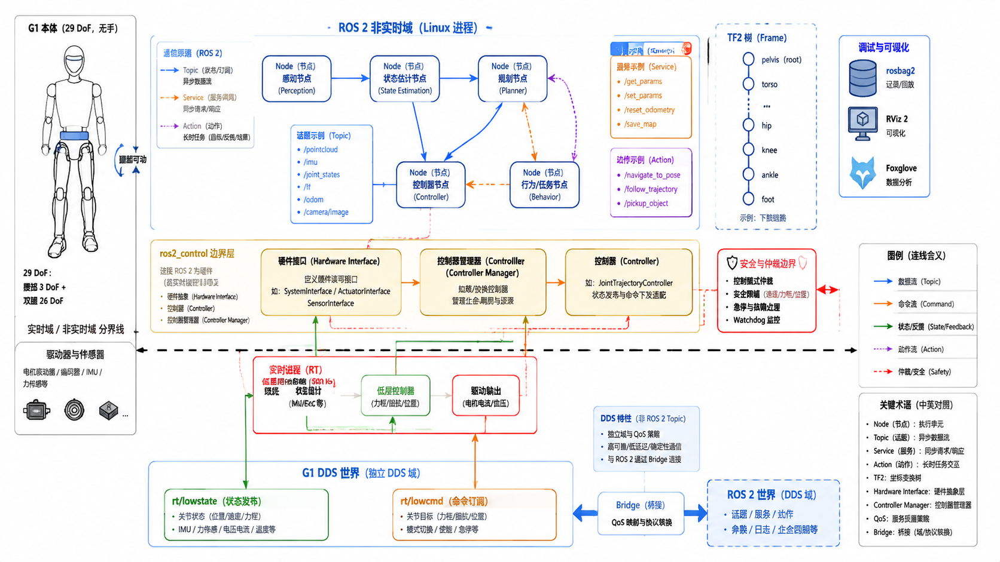

# 6.1 ROS 2 与机器人软件架构

## 先看一个现场问题

团队把状态估计、规划器和控制器分别调试好之后接上 G1：RViz 2 里的模型却趴在地上——TF 树里 `pelvis` 的父坐标系接错了；终端反复报 "extrapolation into the future"——某个节点在用过期时间戳查询坐标变换；机器人偶尔抽一下——排查后发现有两个节点同时往同一个命令 Topic 发数据。每个模块单独测试都是对的，连起来全是问题。

现场通常会这样问：

> “每个节点单独跑都对，为什么连起来就乱？到底谁在发指令、谁说了算？这个坐标变换、这条命令应该归哪个节点管？”

ROS 2（Robot Operating System 2）是机器人领域主流的软件中间件（Middleware）：名字里的"操作系统"容易误导，它实际是一套让独立进程（节点）按约定交换数据、管理生命周期和共享坐标系的框架。[1][5] 本节不展开 ROS 2 语法教程，只回答架构问题：这些原语各自适合什么数据、模块边界应该怎么划、G1 的 DDS 世界和 ROS 2 世界如何衔接。

## 通信原语：按数据形态选型

### 节点与四种交互方式

节点（Node）是独立运行的进程单元。节点之间的交互有四种基本形态，选型的依据是数据形态而不是习惯：[1][2]

| 原语 | 形态 | 典型用途 |
| --- | --- | --- |
| Topic | 持续发布/订阅，多对多，无应答 | 关节状态、IMU、点云等流式数据 |
| Service | 一次请求一次应答 | 查询参数、触发标定等短操作 |
| Action | 长任务：目标 + 持续反馈 + 可取消 | 导航到某点、执行一段轨迹 |
| Parameter | 节点自有的可配置值 | 增益、阈值、坐标系名称 |

把持续流数据塞进 Service 会压垮请求方；把需要确认完成的长任务塞进 Topic 会让调用方无法知道成败。Topic 背后的 QoS（Quality of Service，可靠性、历史深度、延迟预算）直接继承自 DDS 概念，3.4 节已讨论过总线层的对应问题。[1]

### Launch 与生命周期

启动文件（Launch）描述一组节点如何启动、参数如何注入；部分节点还有受管生命周期（Managed Lifecycle）：未配置、未激活、激活、销毁等状态显式转换。它的价值在于把"系统是否就绪"变成可查询的状态，而不是靠启动后 sleep 几秒赌运气。

## TF：坐标变换的单一事实来源

TF2（Transform Library 2）维护一棵随时间变化的坐标变换树：广播器（Broadcaster）持续发布变换，监听器（Listener）把变换缓存进缓冲区（Buffer），任何节点都可以查询"过去某一时刻 A 坐标系到 B 坐标系的变换"。[3]

三个高频故障都和时间有关：

- **时间戳不一致**：用 $t = 0$（最新可用）和用消息自带时间戳查询，结果可能完全不同；4.4 节"时间不是附属字段"在 TF 查询上同样成立；
- **外推错误**：查询的时刻超出缓存范围（过去太久或未来），通常意味着某一路变换的发布频率不足或时钟不同步；
- **树断裂或成环**：`pelvis` 接错父坐标系、两个节点都声称自己是同一个变换的广播者，模型在 RViz 里就会趴下或散开。

坐标命名和约定遵循 REP-103（单位与右手系）和 REP-105（`map`/`odom`/`base_link` 等标准坐标系）。[6] 对 G1，TF 树通常覆盖 `pelvis`、`torso_link`、各关节 link 和 IMU 固定 link（见 4.4 节的模型核对）；关节角到各 link 位姿的正运动学变换由 robot_state_publisher 根据 URDF 和 `JointState` 消息自动完成。

## ros2_control：硬件与控制器之间的标准接口

ros2_control 把"读写硬件"和"控制算法"拆成两层，中间用显式接口连接：[4]

- **Hardware Interface**：每个执行器/传感器声明自己暴露的状态接口（State Interface，如 `position`、`velocity`）和命令接口（Command Interface），由具体的硬件组件（Hardware Component）实现读写；
- **Controller**：控制器只面向接口编程——PID、轨迹控制器不知道也不关心背后是 G1、机械臂还是仿真器；
- **Broadcaster**：一种特殊控制器，只负责把状态接口转成消息发出去，例如 `joint_state_broadcaster`；
- **Controller Manager**：统一管理控制器的加载、激活、切换和硬件资源仲裁——同一时刻一个命令接口只能被一个激活的控制器占用，这从框架层面回答了"谁在发指令"。

资源仲裁是这套架构的核心价值：两个控制器同时写同一个关节，在传统手写代码里是运行时才暴露的隐患，在 ros2_control 里是启动切换时就报错的设计错误。

## 模块划分：一条指令的软件路径

把第四部分的所有内容放进一张架构图，一条指令从任务到关节的路径是：

```text
任务/行为层 → 规划器 → 控制器（WBC/关节）→ 硬件接口 → SDK/总线 → 驱动器
     ↑            ↑          ↑                  ↑
   感知系统   状态估计    状态估计          状态上报（LowState/JointState）
```

划边界的三条原则：

1. **状态只有一个估计来源**：姿态、速度的"权威版本"由状态估计模块（4.4 节）发布，其他模块消费而不是各自重算；
2. **命令只有一个出口**：任何时刻只允许一个模块拥有对底层的命令权，切换（例如导航接管、遥操作接管、安全降级）必须显式，这正对应 ros2_control 的资源仲裁思想；
3. **时间基准全局一致**：所有消息带时间戳，跨模块的融合和控制按测量时间对齐。

频率分层与 5.3 节的表一致：行为层秒级、规划层几十赫兹、控制层百赫兹以上；把这些不同节奏的模块塞进一个进程一个线程，是新人最常见的架构错误。

## 观测与调试：rosbag2、日志与可视化

可观测性是架构的一部分，不是事后补丁：

- **rosbag2**：按 Topic 记录原始消息，回放（Playback）时可以原速、倍速或按时间戳精确复现一次故障。记录的第一原则是先记录再分析——"当时没开 bag"是机器人调试里代价最高的四个字；
- **日志**：节点日志应带级别和时间，关键状态切换、命令仲裁结果和降级触发必须可回溯（呼应 3.6 节的故障语义）；
- **RViz 2**：显示 URDF 模型（RobotModel）、TF 树、关节状态、点云和规划路径，适合检查"机器人认为自己在哪"；
- **Foxglove**：适合时间序列（关节误差、力矩、ZMP 裕量）、IMU 和接触状态的曲线检视与 bag 回放对照。

两者的分工：RViz 2 看空间关系，Foxglove 看时间序列。4.4–4.6 节与 5.3 节每一节的排查清单，最终都落在"这条曲线/这棵树长什么样"上。



图：以 G1 `g1_29dof` 无手、腰部可动模型为例，概览 ROS 2 节点与 Topic/Service/Action 的分工、TF 坐标树、ros2_control 的硬件抽象层，以及 G1 DDS 实时域与 ROS 2 非实时域的分界。图中结构用于解释模块边界与数据流；接口字段语义以对应 SDK 与 ROS 2 版本为准。

## 参考资料

[1] Open Robotics. *ROS 2 Documentation: Concepts*. ROS 2 官方概念文档（节点、Topic、Service、Action、Parameter、QoS）。<https://docs.ros.org/>

[2] Open Robotics. *rclcpp: ROS 2 C++ client library*. 本文使用提交 `05de6c894ec33a36e7837aab3b703353deee0adb`，用于核对节点、Publisher/Subscription、参数和执行器接口。<https://github.com/ros2/rclcpp/tree/05de6c894ec33a36e7837aab3b703353deee0adb>

[3] Open Robotics. *geometry2: TF2 library*. 本文使用提交 `2eccfcd2cc118c7fb92ef553022331f8749c0237`，用于核对 Buffer、Listener、Broadcaster 和时间查询语义。<https://github.com/ros2/geometry2/tree/2eccfcd2cc118c7fb92ef553022331f8749c0237>

[4] ros-controls. *ros2_control: A framework for real-time control of robots using ROS 2*. 本文使用提交 `f1a73f3550c6598ac0691c4ad27211501fcd54e1`，用于核对 Hardware Interface、Controller、Broadcaster 与 Controller Manager 的职责划分。<https://github.com/ros-controls/ros2_control/tree/f1a73f3550c6598ac0691c4ad27211501fcd54e1>

[5] Macenski, S., et al. “Robot Operating System 2: Design, Architecture, and Uses in the Wild.” *Science Robotics*, 2022. ROS 2 设计动机、DDS 基础与工程实践综述。<https://doi.org/10.1126/scirobotics.abm6074>

[6] Open Robotics. *REP 105: Coordinate Frames for Mobile Platforms*. 标准坐标系命名与变换关系约定。<https://www.ros.org/reps/rep-0105.html>

[7] Unitree Robotics. *unitree_sdk2: G1 robot SDK version 2*. 官方 SDK2 接口定义；本文使用提交 `9754cd153af3da471b0fe5f3aa535e426fb11db3`，用于核对 G1 DDS 低层消息与 ROS 2 侧桥接的边界。<https://github.com/unitreerobotics/unitree_sdk2/tree/9754cd153af3da471b0fe5f3aa535e426fb11db3>
