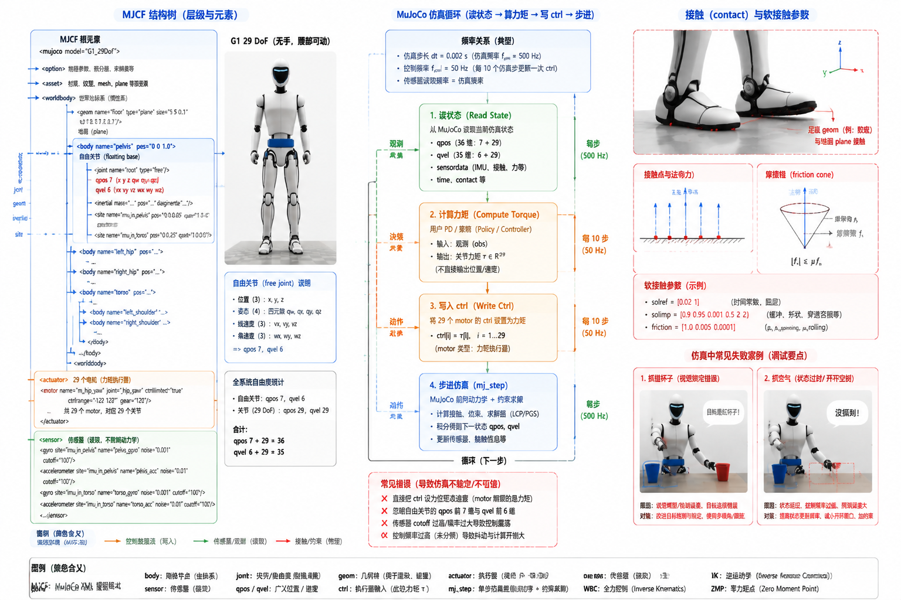

# 6.2 MuJoCo

## 先看一个现场问题

把 G1 的 URDF 直接拖进 MuJoCo：机器人加载出来了，却像布娃娃一样瘫在地上——URDF 里没有执行器定义。换成官方 MJCF 后机器人能站了，但控制循环一发"位置指令"就抽搐——`g1_29dof.xml` 里的执行器是力矩电机，期望的是力矩而不是目标位置。足底接触地面时偶尔还会穿透或弹跳，换了一个场景文件，模型又加载失败，提示找不到网格文件。

现场通常会这样问：

> “同一个 G1，为什么在 MuJoCo 里的表现和文档里不一样？`ctrl` 到底该给位置还是力矩？脚底穿透是模型错了还是参数错了？”

MuJoCo（Multi-Joint dynamics with Contact）是面向接触富集任务的物理仿真器，腿式机器人和操作学习的主流训练/验证环境都建立在它之上。[1] 它的模型描述格式是 MJCF（MuJoCo XML），2.5 节已经对比过 URDF 与 MJCF 的表达能力；本节讲在 MuJoCo 里把一个 G1 模型真正跑起来需要知道的元素、参数和检查点。

## MJCF 的建模元素

### Body、Joint 与 Geom

MJCF 用 `<body>` 的嵌套层级表达运动树，每个 body 内挂 `<joint>`（运动关系）、`<geom>`（碰撞与可视化几何）和 `<inertial>`（动力学参数）。G1 的 `g1_29dof.xml` 中，`pelvis` 上挂着 `floating_base_joint`，类型为 `free`——这就是 4.3 节"qpos 7+29、qvel 6+29"维度关系的来源：自由关节在位置上占 7 个数（3 平移 + 4 四元数），速度上占 6 个数。加载模型后第一件事应是核对 `nq`、`nv`、`nu` 三个维度与预期一致。

Geom 分 visual 和 collision 两类用途，碰撞几何的形状和摩擦参数直接决定足底接触行为。足底穿透或弹跳通常出在接触求解参数上：MuJoCo 用软接触模型，`solref`/`solimp` 控制接触的刚度与阻尼，地面 geom 的 `friction` 决定摩擦锥。这些参数调的是数值行为，与真实地面的摩擦系数之间没有直接等号。

### Actuator：ctrl 的语义由执行器类型决定

开头"发位置指令却抽搐"的根因在这里。`<motor>` 型执行器的 `ctrl` 直接是广义力（对转动关节即力矩）；`<position>` 型执行器内部自带一个 PD，把 `ctrl` 解释为目标位置。`g1_29dof.xml` 定义了 29 个 `<motor>`，每个绑定同名关节，例如 `<motor name="left_hip_pitch_joint" joint="left_hip_pitch_joint"/>`——对 G1 官方 MJCF，`ctrl` 就是关节力矩。

要在这种模型上做"位置控制"，需要在仿真循环外自己实现 PD：用 `qpos/qvel` 读出关节状态，按 4.5 节的阻抗公式算出力矩写入 `ctrl`，这正是 `unitree_rl_gym` 的 MuJoCo 部署示例（5.5 节链路）的做法，也和 G1 真机 `MotorCmd_` 的 `kp`/`kd` 接口语义对齐。[4]

### Sensor：带噪声和滤波的仿真传感器

MJCF 的 `<sensor>` 挂靠在 site 上。`g1_29dof.xml` 为 `imu_in_pelvis` 和 `imu_in_torso` 两个 site 各配置了一个 `<gyro>` 和一个 `<accelerometer>`，且都带 `noise` 和 `cutoff` 属性——例如陀螺仪 `noise="5e-4"`、加速度计 `noise="1e-2"`。这些参数让仿真输出更接近真实传感器特性，4.4 节状态估计和 5.5 节域随机化里"传感器差异"一项，在 MuJoCo 里对应的就是这组参数的调节范围。仿真传感器读数经过零偏和噪声注入后，才可以和 SDK 消息做有意义的对比。

## 场景与模型加载

模型文件只描述机器人本身；地面、光照和相机视角由场景文件提供。本手册保留的 `scene.xml` 结构是：`include` 一个机器人模型文件，定义棋盘格地面平面（`type="plane"` 的 `floor` geom）、方向光和观察视角。注意两点：

- 当前 `scene.xml` 中写的是 `include file="g1_12dof.xml"`，本手册只保留了 `g1_29dof`、`g1_29dof_lock_waist` 和 `g1_29dof_with_hand` 三个变体，使用前需把 include 改成目标模型文件名；
- `<compiler angle="radian" meshdir="meshes"/>` 规定了角度单位和网格目录，移动模型文件时必须保持 `meshes/` 的相对位置不变，否则加载报找不到 STL。

加载后的检查清单：关节数与命名、`nq/nv/nu` 维度、IMU 位置、碰撞 geom 是否齐全、足底初始是否与地面轻微穿透（穿透会在第一步触发接触力冲击）。

## 在 MuJoCo 里做控制实验

前面几章的概念都可以在 G1 MJCF 上直接变成实验：

- **位置/力矩控制对比**：给同一关节分别写固定力矩和 PD 位置跟踪，观察响应差异，直观理解 4.5 节的阻抗接口；
- **踝关节**：按 2.1 节 PR/AB 命名的关节索引做摆动实验，复现 4.5 节的踝摆动示例；
- **重力补偿**：用 `mj_inverse` 或模型重力项算 $g(q)$ 作为前馈力矩，观察机器人是否能"挂"在半空，验证 4.3 节的动力学参数；
- **接触观察**：开启接触力可视化，双支撑到单支撑切换时观察法向力的重新分配，对应 2.4 节的支撑域和 4.6 节的 ZMP；
- **数据记录**：每步从 `mj_data` 取 `qpos`、`qvel`、`sensordata`、接触力和 `ctrl`，带仿真时间戳存盘——格式纪律与 6.1 节 rosbag2 相同，先记录再分析。

## G1 三个 MJCF 变体的差异

| 变体 | 关节执行器 | 腰部 | 手部 | 适用场景 |
| --- | --- | --- | --- | --- |
| `g1_29dof.xml` | 29 | yaw/roll/pitch 可动 | 无 | 行走、平衡、全身控制 |
| `g1_29dof_lock_waist.xml` | 27 可动（腰部 roll/pitch 锁定） | 仅 yaw | 无 | 腿部步态调试、减少变量 |
| `g1_29dof_with_hand.xml` | 43（含双手 14 个手指关节） | yaw/roll/pitch 可动 | 三指 7 DoF/手 | 操作、VLA/WAM（5.4、5.6、5.7 节） |

切换变体时要同步更换的不只是文件名：关节索引顺序、动作向量维度、重力补偿参数和任何按索引写死的代码都要跟着改。锁腰模型中被固定的关节仍以 `fixed` 类型存在于模型树里，代码按名字而不是按位置索引关节，可以避开大部分这类错误。

图 6.2-1 以 G1 `g1_29dof` 无手、腰部可动模型为例，概览 MJCF 的 body/joint/geom 层级、自由关节的 qpos/qvel 维度、IMU site 上的陀螺仪与加速度计，以及"读状态—算力矩—写 ctrl—步进"的仿真循环和足底软接触。接触与噪声参数的取值决定仿真行为，与真实物理量之间没有直接等号。[4]

## 参考资料

[1] Todorov, E., Erez, T., & Tassa, Y. “MuJoCo: A Physics Engine for Model-Based Control.” *IEEE/RSJ IROS*, 2012. MuJoCo 的设计目标与软接触模型原始论文。<https://doi.org/10.1109/IROS.2012.6386109>

[2] Google DeepMind. *MuJoCo Documentation: MJCF XML Reference*. MJCF 元素、执行器类型、传感器与接触参数的官方参考。<https://mujoco.readthedocs.io/>

[3] Google DeepMind. *mujoco: Multi-Joint dynamics with Contact*. 本文使用提交 `44c118d712db5ca5d8c6264e4a21e3086e2ac952`，用于核对 MJCF 语义、`mj_data` 字段与仿真循环 API。<https://github.com/google-deepmind/mujoco/tree/44c118d712db5ca5d8c6264e4a21e3086e2ac952>

[4] Unitree Robotics. *unitree_rl_gym: G1 robot description and RL example*. 官方 G1 模型与部署示例；本文使用提交 `276801e46c5d433564f24658bac64f254b7d2d4b`，用于核对 `g1_29dof.xml` 的 free joint、29 个 `<motor>`、IMU 传感器配置及 MuJoCo 部署中的 PD 力矩计算方式；图 6.2-1 的结构与参数即依据该仓库的 `g1_29dof.xml` 绘制。<https://github.com/unitreerobotics/unitree_rl_gym/tree/276801e46c5d433564f24658bac64f254b7d2d4b>
