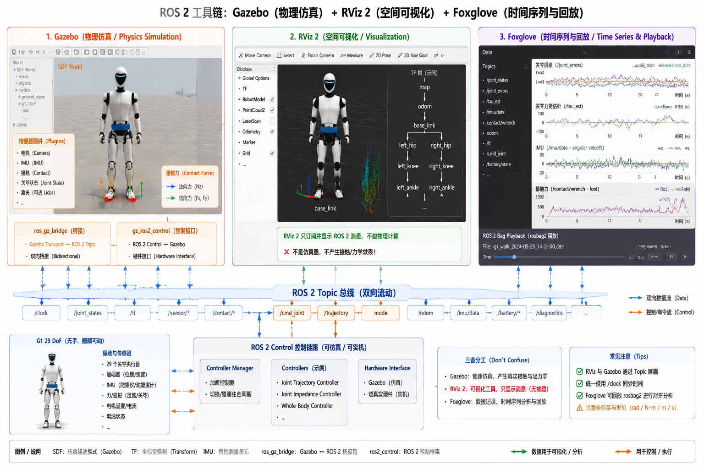

# 6.4 Gazebo、RViz 2 与 Foxglove

## 先看一个现场问题

把 G1 的 URDF 加载进 RViz 2，模型站得笔直、关节拖动都正常；同一个模型放进 Gazebo，一取消暂停就瘫在地上——RViz 里根本没有物理。换过来，Gazebo 里控制器终于加载成功，机器人能站了，但行走时偶尔抽一下；想查原因，rosbag 里只录了关节状态，没录接触力和控制器内部误差，只能看着现象猜。

现场通常会这样问：

> “RViz 里明明是对的，为什么到 Gazebo 里就不行？排查一个步态抖动，到底该看哪个工具？”

这三件工具在 ROS 2 工具链里各管一件事：Gazebo 是物理仿真器，负责"世界怎么演化"；RViz 2 是空间可视化工具，负责"机器人认为自己在哪"；Foxglove 是时间序列与回放工具，负责"信号随时间怎么变"。三者都不产生控制逻辑，混用它们的前提是先把分工想清楚。

## Gazebo：ROS 2 生态的物理仿真

### SDF 与插件

Gazebo 使用 SDF（Simulation Description Format）描述世界（World）和模型（Model），通过插件（Plugin）扩展功能：传感器插件提供相机、IMU、激光雷达和接触传感器，世界插件控制物理和渲染行为。[1][2] SDF 的表达力覆盖闭环机构和传感器挂载，URDF 模型进入 Gazebo 时需要转换，转换后的检查项与 6.3 节的 USD 导入相同：关节方向、限位、惯量、碰撞几何。

### ROS 2 集成与控制器

Gazebo 与 ROS 2 的集成有两层。消息层由 `ros_gz` 桥接：Gazebo 内部的传感器数据被转成 ROS 2 Topic。控制层由 `gz_ros2_control` 承担：它在 Gazebo 里实现 6.1 节 ros2_control 的 Hardware Interface，让同一套控制器配置既能跑仿真又能跑实机。[5] 开头的"加载就瘫"有一类典型原因：模型里的惯量过小或为默认值，或控制器插件未加载，机器人处于无阻尼状态。

### 与 MuJoCo、Isaac 的分工

Gazebo 的价值在 ROS 2 集成生态：TF、ros2_control、Nav2 等组件开箱即用，适合验证软件架构和传感器链路。纯 RL 训练吞吐选 Isaac（6.3 节），部署前的接触验证选 MuJoCo（6.2 节）；Gazebo 居中，是"让算法在 ROS 2 系统里跑起来"的仿真环境。

## RViz 2：看空间，不做仿真

RViz 2 把订阅到的消息画在三维空间里：RobotModel 面板按 URDF 渲染机器人（驱动数据来自 `JointState`），TF 面板显示坐标树，此外还有点云、图像、轨迹和规划路径等显示类型。[3] 它渲染的是消息内容，不计算任何物理——RViz 2 里模型不散架，只说明 URDF 和 TF 是对的，不说明动力学可行。这也是开头"RViz 对、Gazebo 瘫"的全部原因。

RViz 2 的正确用法是当作"机器人内部状态的空间投影"：规划器认为脚在哪、TF 树是否成环、检测到的目标在机器人坐标系的什么位置。它与 6.1 节架构中的可视化角色一一对应。

## Foxglove：看时间，做回放

Foxglove 面向时间序列和日志回放：关节跟踪误差、`tau_est`、IMU 原始数据、接触力、ZMP 裕量、控制器内部残差，按时间轴对齐到同一个界面上；配合 rosbag2 回放，可以把一次故障的完整信号历史逐帧复盘。[4] 它与 RViz 2 的分工在 6.1 节已经定过：空间关系看 RViz 2，时间序列看 Foxglove。

开头"没录接触力只能猜"的教训对应一条纪律：记录 Topic 的清单应按故障排查需求设计，而不是按"现在想看什么"设计。4.5–4.6 节与 5.3 节每节的排查清单，落到工程上就是 Foxglove 里的一组预设面板和 rosbag2 里的一组必录 Topic。

图：以 G1 `g1_29dof` 无手、腰部可动模型为例，对比 Gazebo（物理仿真，SDF 世界、传感器插件、`ros_gz` 桥与 `gz_ros2_control`）、RViz 2（RobotModel、TF 树、点云的空间可视化，不做物理计算）和 Foxglove（关节误差、`tau_est`、IMU、接触力的时间序列与 rosbag 回放）在 ROS 2 消息总线上的分工。图中结构用于解释工具边界；集成方式以各工具版本为准。

## 参考资料

[1] Open Robotics. *Gazebo Documentation*. Gazebo 的 SDF、世界/模型插件与传感器插件官方文档。<https://gazebosim.org/docs>

[2] Koenig, N., & Howard, A. “Design and Use Paradigms for Gazebo, an Open-Source Multi-Robot Simulator.” *IEEE/RSJ IROS*, 2004. Gazebo 的原始论文与架构设计。<https://doi.org/10.1109/IROS.2004.1389727>

[3] Kam, H. R., et al. “RViz: A Toolkit for Real Domain Data Visualization.” *Telecommunication Systems*, 2015. RViz 的设计与定位论文。<https://doi.org/10.1007/s11235-015-0034-7>

[4] Foxglove. *Foxglove Documentation*. 面板、时间序列与 rosbag 回放的官方文档。<https://docs.foxglove.dev/>

[5] ros-controls. *ros2_control: A framework for real-time control of robots using ROS 2*. 本文使用提交 `f1a73f3550c6598ac0691c4ad27211501fcd54e1`，用于核对 Hardware Interface 语义及 `gz_ros2_control` 的集成方式。<https://github.com/ros-controls/ros2_control/tree/f1a73f3550c6598ac0691c4ad27211501fcd54e1>
