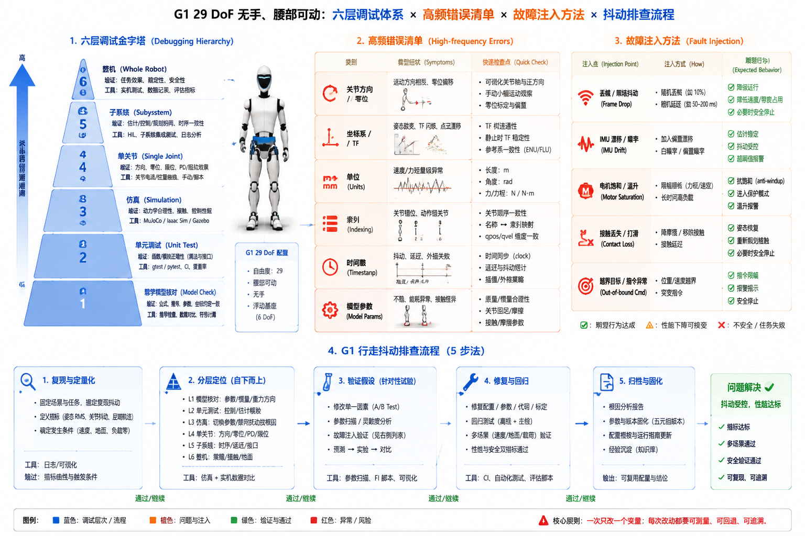

# 7.2 调试、测试与故障排查

## 先看一个现场问题

G1 整机行走测试摔了，日志几十万行，新来的工程师从最后一行往前翻，翻了半天没有结论。旁边的老手先不问日志，而是把任务拆小：单关节扫动一遍，正常；单腿抬起，正常；双腿站立转移重心，抖动出现了。问题最后被定位在接触切换时刻的估计跳变——如果一上来就在整机日志里找，这个故障大概率会淹没在噪声里。

现场通常会这样问：

> “出了问题先看哪里？整机挂了，怎么把它切成能分别验证的小块？哪些错误在仿真里根本不会出现？”

调试（Debugging）的效率取决于层次选择：在越低的层次暴露问题，成本越低、信号越干净。本节给一张调试层次图、一份高频错误清单和一套故障注入方法，G1 的低层消息和仿真日志是贯穿的排查素材。

## 调试的层次

机器人系统的调试可以分成六层，从便宜到昂贵：

| 层次 | 验证内容 | 典型工具 |
| --- | --- | --- |
| 数学模型核对 | 公式、单位、维度、坐标系、正负方向 | 手工推导 + 数值对照（6.5 节） |
| 单元测试 | 单个函数/模块的输入输出 | 测试框架、固定用例 |
| 仿真 | 控制逻辑、时序、接触行为 | MuJoCo/Isaac/Gazebo（6.2–6.4 节） |
| 单关节 | 方向、零位、增益、限幅 | 低层接口 + 曲线记录 |
| 子系统 | 单腿、单臂、腰+腿组合 | 局部任务测试 |
| 整机 | 行走、操作、完整任务 | 吊架保护下的现场测试 |

两条使用原则：每层只验证自己引入的东西——单关节层验证方向和增益，不验证步态；上一层出问题时先回下一层复测，下层通过后再怀疑层间接口。开头老手的做法就是这条原则的直觉版。

## 高频错误清单

按本手册前几章的经验，下表覆盖了大多数"系统连起来就出问题"的错误类别：

| 错误类别 | 典型症状 | 排查入口 |
| --- | --- | --- |
| 关节方向/零位错 | 动作镜像、固定偏差 | 单关节缓慢扫动，对照模型轴向（2.1、4.5 节） |
| 坐标系/TF 错 | 模型趴下、检测偏移一个固定变换 | TF 树与 REP-103/105 约定（4.1、6.1 节） |
| 单位混用 | 弧度/角度、Nm/百分比混淆，动作幅度差数量级 | 日志数值量级核对 |
| 关节索引错 | 指令发到了相邻关节 | 按名字核对索引（6.2 节） |
| 时间戳/频率错 | 抖动、TF 外推错误、控制抽动 | 消息时间与测量时间对齐（4.4 节） |
| 模型参数错 | 重力补偿下垂、补偿过量 | 库与仿真器交叉验证（6.5 节） |

这张清单的价值在于顺序：先查约定类错误（方向、单位、索引、时间），再查算法类错误——约定类错误便宜、高发，且会伪装成算法错误。

## 信号分析：看什么曲线

排查时按问题选信号，而不是把所有 Topic 都打开：

- **位置/速度**：跟踪误差、积分漂移、差分噪声（4.4 节）；
- **力矩**：`tau_est` 的毛刺和饱和往往先于肉眼可见的抖动出现（4.5 节）；
- **温度**：温升趋势暴露长期过载和降额边界（3.2 节）；
- **延迟与丢帧**：控制周期抖动、消息间隔直方图（3.4、3.5 节）；
- **接触力**：接触切换时刻的法向力重分配（2.4、4.6 节）；
- **能耗**：电流积分与电池功率，异常能耗指向摩擦或控制振荡（3.1 节）。

工具上沿用 6.4 节的分工：空间问题去 RViz 2，曲线问题去 Foxglove，复现问题回仿真器。

## 故障注入：主动制造失败

被动等待故障出现，验证的是运气；主动注入故障，验证的才是系统。故障注入（Fault Injection）是在仿真或中间件层人为制造异常，观察系统是否按设计降级或报警：

| 注入故障 | 验证目标 |
| --- | --- |
| 丢帧/消息超时 | 状态估计与控制的 stale 数据处理（4.4 节） |
| IMU 偏置/漂移注入 | 姿态估计的发散检测与报警 |
| 电机饱和 | 抗积分饱和与限幅行为（4.5 节） |
| 接触丢失/误判 | 接触置信度与支撑策略切换（4.6 节） |
| 越界目标 | 目标校验与拒绝（3.6 节） |

注入点应靠近系统边界：仿真里改物理与传感器参数，中间件里拦截消息改时间戳或丢包。每一类注入都应有明确的期望行为（降级、报警、安全停止），否则测试没有判据。这套注入清单同时是 6.6 节验收门槛里"故障注入测试"层的展开。

## G1 排查实战：低层通信与仿真日志

以开头的行走抖动为例，一次完整排查长这样：

1. **仿真复现**：MuJoCo 中回放相同策略与初始条件，抖动若复现，问题在算法侧；不复现，问题在实机接口侧；[3]
2. **低层通信检查**：统计 `rt/lowstate` 的消息间隔和丢帧率，确认 500 Hz 链路没有抖动；[2]
3. **关节状态曲线**：`MotorState_` 的 `q`/`dq`/`tau_est` 逐关节对比，抖动关节的力矩毛刺先于位置异常出现则指向控制，反之指向状态来源；[2]
4. **接触与估计对照**：仿真 `sensordata` 的接触力与状态估计的接触置信度对齐，确认接触切换时刻是否有估计跳变；[3]
5. **结论分层归档**：故障现象、复现条件、注入验证、修复提交五元组记录（7.1 节），供回归测试复用。

图：以 G1 `g1_29dof` 无手、腰部可动模型为例，概览六层调试金字塔（数学模型核对到整机测试）及成本与噪声的递增关系、六类高频约定错误及其症状，以及丢帧、IMU 漂移、电机饱和、接触丢失、越界目标五类故障注入点与期望判据。图中流程与正文一致；具体诊断入口以对应 SDK 与工具版本为准。

## 参考资料

[1] Zeller, A. *Why Programs Fail: A Guide to Systematic Debugging*, 2nd ed. Morgan Kaufmann, 2009. 系统化调试方法与故障定位流程的经典教材。

[2] Unitree Robotics. *unitree_sdk2: G1 robot SDK version 2*. 官方 SDK2 消息定义与低层示例；本文使用提交 `9754cd153af3da471b0fe5f3aa535e426fb11db3`，用于核对 `MotorState_` 字段与 `rt/lowstate` 排查入口。<https://github.com/unitreerobotics/unitree_sdk2/tree/9754cd153af3da471b0fe5f3aa535e426fb11db3>

[3] Google DeepMind. *MuJoCo Documentation*. 仿真传感器数据与日志字段的官方参考；本文对应 third_party 索引中固定提交 `44c118d712db5ca5d8c6264e4a21e3086e2ac952`。<https://mujoco.readthedocs.io/>
