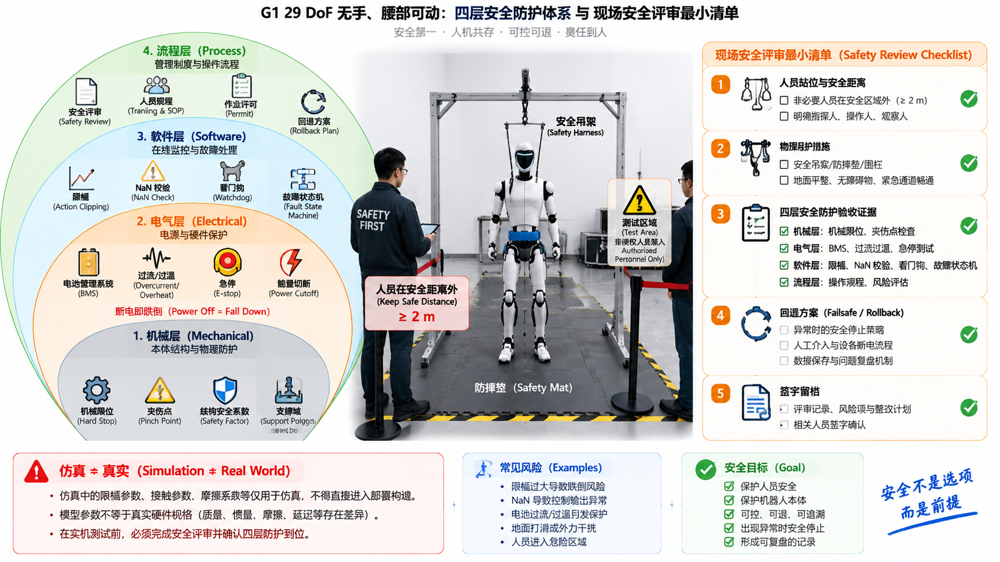

# 7.3 机器人安全

## 先看一个现场问题

调试抓取时，G1 手臂突然甩出，扫到了站在半米外观察的同事——任务空间里没有设置任何人员禁区。另一次事故更安静：控制器算出了一个 `NaN`，沿消息链一路传到关节命令，电机猛地抽了一下才触发保护。还有一次评审时发现，部署构建里直接编译进了仿真代码，限幅常数还是仿真调出来的宽松值；而另一份文档把带手模型的手指负载当成了真实灵巧手的指标。

现场通常会这样问：

> “机器人安全，靠一个急停按钮够吗？哪些看起来是代码问题的东西，其实是安全问题？”

机器人安全（Robot Safety）是一套分层防护体系：机械、电气、软件、流程四层各自独立起效，任何一层失效时其余层仍能兜住。急停按钮只是其中最显眼的一环。[1][2] 3.6 节已经把电气与系统保护讲完，本节做整机综合，并把仿真/实机边界和部署评审这两条"流程层"的线补齐。

## 三层工程防护：机械、电气、软件

### 机械层

机械风险在设计阶段消除，不能指望软件兜底：机械限位（Hard Stop）挡住软件失效后的越界运动；夹伤点（Pinch Point）分布在关节啮合和连杆闭合区域，人员操作规程必须覆盖；结构断裂的裕量来自 2.2 节的安全系数和疲劳校核；重心失稳的物理边界由 2.4 节的支撑域和 4.6 节的平衡约束决定。机械层的失效几乎无法在线补救，所以它的验证发生在设计和评审阶段。

### 电气层

电池、高压、过流、短路、过温和急停构成电气层，3.6 节已有完整体系：BMS 监测与保护、降扭矩、能量切断、故障状态分级。这里只强调一个综合视角：电气保护动作（如断能量）本身有动力学后果——站立中的人形机器人断电即跌倒，保护策略必须把"机器人会以什么姿态倒下"纳入设计，而不是只考虑电路安全。

### 软件层

软件层是日常事故最高发的一层，清单与 3.6 节一致：输出限幅、异常值与 `NaN` 校验、看门狗与超时、进程监控、故障状态机（初始化、运行、降级、故障、恢复）。故障状态机也称安全状态机（Safety State Machine），由一套状态定义和转移条件组成：检测到超速就降扭矩，检测到通信超时就进入保持姿态，检测到急停就切断电源。开头的 `NaN` 事故说明一个原则：异常值检查必须放在消息链的每一跳，指望上游不产生 `NaN` 属于把安全建立在假设上。学习类组件（5.5–5.7 节）的输出更要全部经过这层过滤——会幻觉的组件不能绕过确定性的安全层。

## 仿真与实机的边界

### 仿真代码与实机代码隔离

仿真里宽松的限幅、简化的保护、跳过的检查，一旦随构建进入实机部署就是事故。工程做法：部署构建与仿真构建在构建系统层面分离（不同的编译目标或特性开关），部署侧的安全参数独立成文件并走 7.1 节的版本管理；仿真侧修改保护参数不影响部署侧。6.6 节的部署前检查清单是这条边界的执行形式。

### 模型参数不等于真实硬件

本手册的全部 G1 数值——质量、惯量、关节限位、传感器配置——来自官方公开模型和示例，描述的是模型行为，不构成真实硬件的完整规格证明。带手模型对应某一档灵巧手配置，不默认代表所有真实手型（5.4 节）。任何涉及承载、力矩上限、碰撞安全的决策，必须以官方硬件文档和实测数据为准。这也是 README 交叉验证规范的安全含义：把仿真参数当真实规格使用，本身就是一种安全隐患。

## 流程层：真实部署必须经过现场安全评审

上真机前的最后一层是流程：现场安全评审（Safety Review）。一份最小评审清单：

- 人员规程：调试区人员数量、站位、安全距离、观察员职责；
- 物理保护：吊架、防摔垫、急停按钮实测触发；
- 系统证据：6.6 节验收门槛的四层证据齐全；
- 回退方案：异常时谁按急停、谁断电、恢复后谁有权重新上电；
- 记录：评审结论、遗留风险与签字留档。

工业机器人安全标准（ISO 10218 系列、协作场景的 ISO/TS 15066）提供了风险评估的通用框架；人形机器人缺少同样成熟的专用标准，评审只能更严格，不能更宽松。[1][2]

## 把"应该没事"换成"验证过"

安全最终是一种工作习惯：每次上电前走 6.6 节的检查清单，每次改动后跑 7.2 节的故障注入，每次事故和险情写复盘记录（现象、根因、修复、预防措施），每次版本变更按 7.1 节的五元组留档。这四件事的共同点是提前付出代价；事故的代价从来不提前。

本手册到此覆盖了从系统总览到工程安全的完整链路。如果只能记住一句话：人形机器人是一个会动的、带能量的、由软件控制的系统，对它的每一个假设，都值得用一次实验换成一个事实。

图：以 G1 `g1_29dof` 无手、腰部可动模型为例，概览机械、电气、软件、流程四层防护体系的各自职责与失效兜底关系，以及现场安全评审的最小清单和仿真/实机边界警示。图中结构用于解释防护分层；具体保护配置以官方硬件文档和现场评审为准。

## 参考资料

[1] ISO. *ISO 10218-1: Robots and Robotic Devices — Safety Requirements for Industrial Robots — Part 1: Robots*. 工业机器人安全要求与风险评估框架。

[2] ISO. *ISO/TS 15066: Robots and Robotic Devices — Collaborative Robots*. 人机协作场景的安全准则与风险评估。

[3] Unitree Robotics. *unitree_sdk2: G1 robot SDK version 2*. 官方 SDK2 接口定义；本文使用提交 `9754cd153af3da471b0fe5f3aa535e426fb11db3`，用于核对模式切换与保护接口的边界。<https://github.com/unitreerobotics/unitree_sdk2/tree/9754cd153af3da471b0fe5f3aa535e426fb11db3>

[4] Unitree Robotics. *unitree_rl_gym: G1 robot description*. 官方 G1 URDF/MJCF 模型；本文使用提交 `276801e46c5d433564f24658bac64f254b7d2d4b`，作为"模型参数不等于真实硬件"论断的模型来源说明。<https://github.com/unitreerobotics/unitree_rl_gym/tree/276801e46c5d433564f24658bac64f254b7d2d4b/resources/robots/g1_description>
